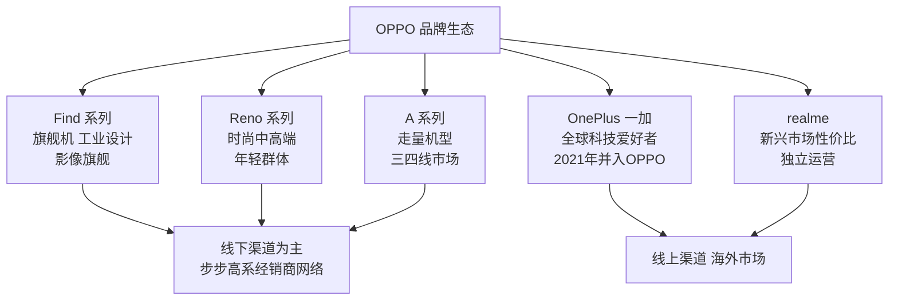

# OPPO

OPPO 是由陈明永主导、于2004年从[[步步高]]体系中独立运营的消费电子品牌，总部位于广东东莞，后迁至深圳。OPPO 与同源品牌[[vivo]]共享步步高时代积累的渠道网络和本分文化底色，在智能手机时代发展为中国出货量前列的品牌，并孵化出 OnePlus、realme 等多个面向不同市场的子品牌。

## 从步步高到独立品牌

OPPO 最初以步步高旗下的 DVD 播放器品牌存在，2004年开始独立运营。陈明永是[[段永平]]在步步高时期培养的核心管理层，在段永平2001年移居美国后接手 OPPO 的经营。

2008年，OPPO 正式进入手机市场，以功能机切入，主打音乐播放功能。2011年前后，随着 Android 智能手机快速普及，OPPO 发布 Find 系列旗舰，凭借工业设计和摄像头体验打开中高端市场。

## 核心技术：VOOC 闪充

OPPO 在技术上最具影响力的投入是 **VOOC 闪充**（Voltage Open Loop Multi-step Constant-Current Charging）。2014年，OPPO 在 Find 7 上推出 VOOC 技术，以低电压大电流方案解决快充发热问题，充电速度大幅超越当时主流水平。

"充电五分钟，通话两小时"成为 OPPO 在市场上广为人知的宣传语，也是品牌最具辨识度的记忆点之一。此后 VOOC 持续迭代为 SuperVOOC，并将技术授权给 OnePlus、realme 等品牌使用。

## 产品矩阵

## 渠道战略

OPPO 继承了步步高线下渠道体系，并将其系统化为可复制的经销商管理模式：统一门店形象、严格价格管控、导购激励设计。在一二线城市，OV 系（OPPO 与 vivo）门店密度极高；在三四线城市和乡镇市场，渗透率超过绝大多数竞争对手。

这一线下壁垒在小米以线上渠道崛起后，成为 OPPO 抵御价格竞争的关键优势。渠道给经销商提供的利润空间，是维持线下体系稳定的核心机制。

## 子品牌策略

2013年，OnePlus（一加）以独立品牌成立，面向全球科技爱好者提供接近原生 Android 的旗舰体验，初期以邀请制销售为特色。2021年，OnePlus 宣布与 OPPO 深度整合，共享研发和供应链资源，保留独立品牌运营。

2018年，realme 从 OPPO 剥离独立运营，定位新兴市场性价比，重点布局印度、东南亚市场，是 OPPO 在海外与小米 Redmi 系列直接竞争的工具品牌。

详见母公司历史 → [[步步高]]；同源品牌 → [[vivo]]；创始股东 → [[段永平]]
