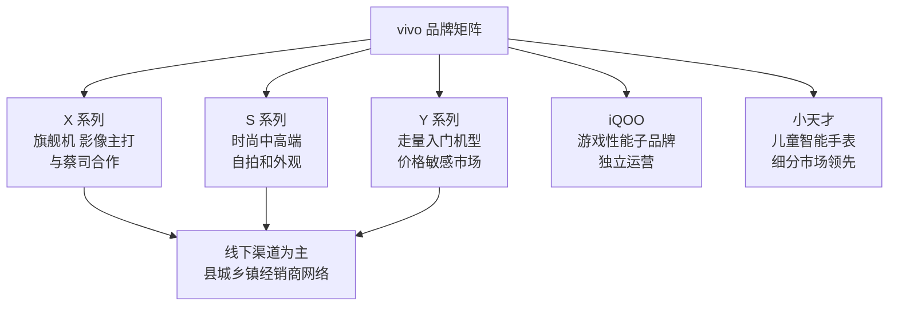

# vivo

vivo 是由沈炜主导、于2009年从[[步步高]]体系中独立运营的消费电子品牌，总部位于广东东莞。与同源品牌[[OPPO]]共享步步高时代积累的线下渠道网络与本分文化，vivo 在智能手机市场长期稳居中国出货量前五，也是全球出货量排名靠前的手机品牌之一。

## 从步步高到独立品牌

vivo 的前身是步步高旗下的 MP3/MP4 播放器业务部门。沈炜是[[段永平]]在步步高时代培养的核心管理团队成员，在段永平2001年移居美国后主导了该业务线。

2009年，vivo 品牌正式独立并切入手机市场。初期产品定位为音乐手机，强调音频体验，包括内置 Hi-Fi 芯片、与专业音频品牌合作等，与当时市场上竞争激烈的功能机厂商形成差异化。2011年，vivo 发布首款 Android 智能手机，随后在智能手机快速普及阶段逐步建立了完整的产品矩阵。

## 产品定位与品牌策略

vivo 的核心消费者定位是对影像和音乐体验有需求的中高端用户，以及追求时尚外观的年轻群体。这一定位在产品命名和营销上均有体现：冠名综艺节目、赞助热门选秀、与明星代言人深度绑定。

## 渠道与竞争壁垒

vivo 与[[OPPO]]共享步步高时代建立的经销商网络，覆盖大量一二线城市以外的县城与乡镇市场。两家公司共同维护线下渠道的价格稳定性，这是对抗小米线上价格战的核心壁垒。

vivo 线下渠道的深度体现在：经销商绑定度高、门店陈列与装修标准统一、导购培训体系完善。这一模式在智能手机增量市场阶段发挥了巨大作用，在存量竞争阶段依然保持韧性。

## iQOO 的独立化运营

2019年，vivo 推出游戏性能子品牌 iQOO，面向对性能和帧率有高需求的用户群体。iQOO 逐步实现独立运营，拥有独立的品牌形象和发布节奏，与 vivo 主品牌形成互补而非蚕食关系。

## 影像与蔡司合作

vivo X 系列旗舰机与蔡司（Zeiss）建立了光学技术合作，在镜头标定与色彩调校层面引入蔡司品牌认证。这一合作从影像素质和品牌信任度两个维度强化了 X 系列的高端定位，也是 vivo 从音乐手机定位向影像手机定位转型的标志性动作。

详见母公司历史 → [[步步高]]；同源品牌 → [[OPPO]]；创始股东 → [[段永平]]
