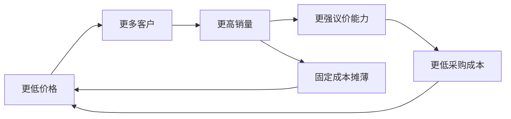
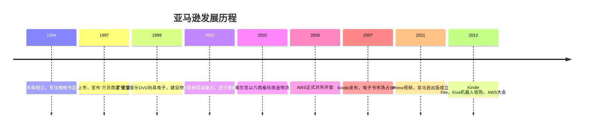

# 亚马逊

亚马逊（Amazon）1994年由杰夫·贝佐斯在西雅图贝尔维尤的车库创立，最初以网络书店起步，此后演变为全球最大的电子商务平台和云计算服务提供商。2012年全职及兼职员工数量达88,400人，同比增长57%。

---

## 核心商业逻辑

亚马逊的商业模型以一个反直觉的前提为基础：**低价不是利润压缩的结果，而是效率改善传递给消费者的产物。**

这个飞轮（Flywheel）逻辑由贝佐斯亲手画在餐巾纸上，指导了亚马逊二十年的所有重大决策：Prime两天送达（用利润补贴运费）、Kindle 9.99美元定价（低于出版商允许价）、AWS按使用量计费（打破IT资本开支模式）。

---

## 发展阶段

---

## 核心业务板块

**零售与第三方市场（Marketplace）**
第三方卖家2012年占总销量39%，全球超200万家商户。亚马逊从每笔销售提取6%~15%佣金，同时监控热销品后自行入场销售。内部员工将这种关系比作"海洛因"——初期销量爆发，随后亚马逊压价竞争，但平台巨大的流量让卖家无法离开。

**亚马逊网络服务（AWS）**
起源于贝佐斯内部的一封电子邮件命令：所有团队必须通过API暴露服务，否则被解雇。这一强制令无意间将亚马逊IT架构改造成了可对外出售的云计算服务。AWS 2006年正式对外开放，成为亚马逊利润率最高的业务。

**Kindle生态**
2007年发布Kindle，将电子书市场占有率从0推至90%。2012年推出Kindle Fire，以低于成本的价格销售，目的是将用户锁定在亚马逊生态而非苹果或谷歌生态。

**Prime会员**
两天免费送达服务。Prime的真正价值不是物流补贴，而是建立购物习惯的粘性——Prime会员的购买频次和金额显著高于非会员。

---

## 组织创新

**两个披萨团队：** 任何团队规模不能大到两个披萨喂不饱。防止协调成本膨胀，保持创业公司的执行速度。

**6页文件，禁止PPT：** 所有提案须以叙述性散文呈现。会议开始时沉默阅读，然后讨论。贝佐斯认为PPT遮蔽逻辑漏洞，散文迫使清晰思考。

**问号邮件：** 贝佐斯将客户投诉转发给员工，只附"?"。内部称为"Sev-B升级"，触发全员暂停手头工作的紧急响应。

**OP1/OP2年度审查：** 每年两次，各团队提交6页战略文件，贝佐斯亲自审阅。每份文件第一页是"要旨"——指导日常决策的基本原则，让团队无需随时监督即可快速行动。

**14条领导原则：** 包括"客户至上"、"勤俭节约"、"敢于谏言服从大局"等，被新员工反复学习，成为亚马逊文化的DNA载体。

---

## 与供应商的张力

亚马逊与制造商关系是其商业模式内在矛盾的集中体现。亚马逊的定价算法会自动寻找网络上的最低价格，屡次打破制造商的最低广告价格（MAP）要求。当品牌商退出时，亚马逊会借助清仓库存服务（Warehouse Deals）继续销售翻新品，或从第三方获得货源，使货架永远不会空。

德国刀具品牌三叉（Wüsthof）两度与亚马逊决裂，又两度回归——第一次是被低价和独立刀具店的利益绑架，第二次是无法放弃2亿活跃用户。维尔克的预测被验证：任何退出的供应商，最终都会回来。

---

## 竞争哲学

贝佐斯极少在内部讨论竞争对手，但对任何新兴威胁都异常警觉。他在会议室放一把空椅子代表客户，而非竞争对手。

对网飞（Netflix）：2000年代多次试图收购，未能成交，随后推出Prime视频直接竞争。对苹果：2003年提案合作销售音乐，被乔布斯拒绝；随后因iPod颠覆CD市场而决心推出Kindle。对出版商：当对方拒绝控制电子书定价时，亚马逊在纽约成立出版社，直接与传统出版体系竞争。

贝佐斯的策略一以贯之：先寻求合作，被拒或受阻后自行建设，用长期耐心等待时机。

---

## 文化的代价

亚马逊的高强度文化有极高的人才流失率。员工描述内部为"角斗士文化"——长期处于绩效压力和问号邮件触发的消防演习中。管理层的50人以上团队须定期"强制排名"并开除末位员工。

但离开的前员工普遍认为，在亚马逊工作是职业生涯中最富成效的阶段。留下来的人，往往是那些喜欢在持续对抗环境中工作的人。商业社交平台上充斥着离职后又回来的"飞镖"——那些在其他公司发现自己效率更低、思维更模糊的前亚马逊人。
