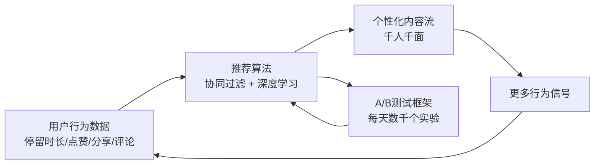
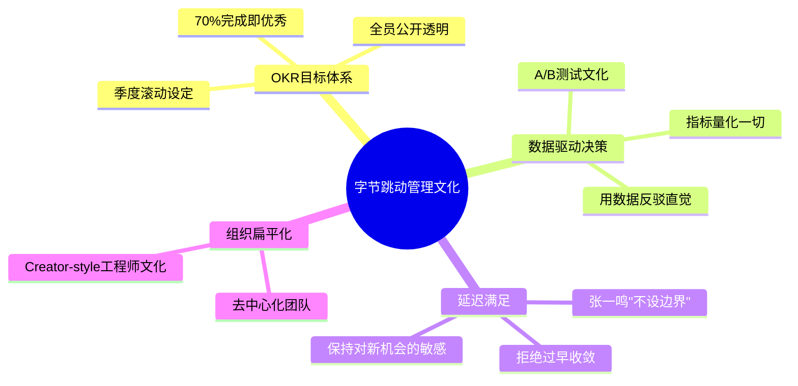
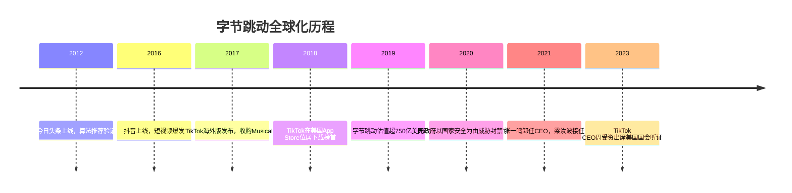

# 字节跳动

字节跳动（ByteDance）是由[[张一鸣]]于2012年创办的中国科技公司，总部位于北京。公司以算法驱动的内容分发技术为核心，旗下产品覆盖资讯、短视频、长视频、教育、游戏及企业协作等多个领域。代表性产品今日头条、抖音、TikTok均在各自市场形成主导地位，使字节跳动成为全球估值最高的私营科技公司之一。

---

## 算法即产品：核心技术哲学

字节跳动的本质不是一家内容公司，而是一家**以算法为基础设施的分发平台** 。张一鸣将这一哲学概括为：机器比编辑更了解用户。

这一"数据飞轮"模型在今日头条上首先被验证：不依赖人工编辑，仅凭用户行为信号驱动内容分发，日活用户迅速突破千万。[[产品与算法思维]]在字节跳动的产品体系中得到了最系统的工程化实践。

---

## 产品矩阵的演化

字节跳动的产品扩张遵循"算法可迁移"的逻辑——同一套推荐基础设施可以驱动不同形态的内容产品。

| 产品 | 上线时间 | 形态 | 核心市场 |
|------|----------|------|---------|
| 今日头条 | 2012年 | 图文资讯聚合 | 中国 |
| 抖音 | 2016年 | 短视频 | 中国 |
| TikTok | 2017年 | 短视频（海外版） | 全球 |
| 西瓜视频 | 2016年 | 中长视频 | 中国 |
| 飞书 | 2019年 | 企业协作工具 | 全球 |
| 剪映 | 2019年 | 视频剪辑工具 | 全球 |

抖音是字节跳动最重要的增长转折点。2016年上线后，短视频形态与算法推荐的结合产生了远超图文的用户停留时长，彻底重构了移动端内容消费习惯。TikTok将这一模式推向海外，成为中国互联网公司在全球范围内最成功的出海产品。

---

## OKR与数据驱动的管理文化

字节跳动是中国互联网公司中最系统地引入OKR管理方法的企业之一。张一鸣将OKR与公司"Context, not Control"的管理哲学结合：管理者负责提供足够的信息和背景，而不是直接下达指令。

张一鸣本人将"延迟满足感"视为自己最重要的性格特质，这也体现在字节跳动不急于商业变现、优先做大用户规模的早期战略选择上。

---

## 全球化与监管挑战

TikTok的全球扩张使字节跳动成为第一家真正意义上影响主流西方市场的中国互联网公司，同时也带来了前所未有的监管压力。

TikTok的监管争议折射出数据主权与算法影响力在地缘政治博弈中的核心地位，也标志着中国互联网出海进入了一个全新的复杂阶段。

更多算法与产品思维详见 → [[产品与算法思维]]
