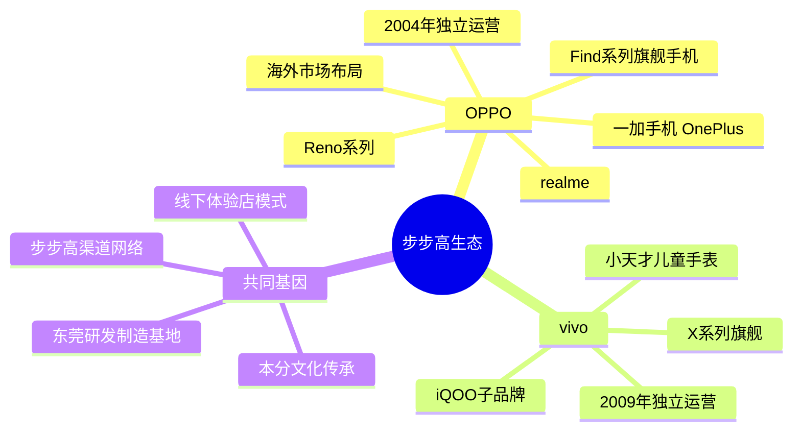

# 步步高

步步高电子（BBK Electronics）是由[[段永平]]于1995年在广东东莞创立的消费电子企业。公司以VCD/DVD播放器、无绳电话、点读机等产品著称，长期深耕中国三四线城市市场。更重要的是，步步高孕育并催生了[[OPPO]]与[[vivo]]两大独立手机品牌，构成中国消费电子行业最具传承性的企业生态之一。

---

## 从小霸王出走：创业的起点

步步高的创立直接源于段永平离开[[小霸王]]的决定。1989年至1995年，他将[[小霸王]]电子工业公司从年销售额不足千万的小厂打造为年销逾10亿元的学习机市场领导者，却因股权结构问题始终无法获得与贡献相称的回报。1995年，段永平带领核心团队南下东莞，白手起家创办步步高。

这一段创业经历奠定了他此后对"股权公平"与"人才激励"的高度重视——步步高的核心团队成员从创立之初便持有公司股份，这在1990年代的中国企业中极为罕见。

---

## 产品线与市场定位

步步高刻意选择与[[小霸王]]差异化的产品路线，避开游戏机市场，转而聚焦家庭影音与通信设备：

```mermaid
flowchart TD
    A[步步高品牌矩阵] --> B[步步高VCD/DVD\n家庭影音，90年代主流娱乐]
    A --> C[步步高无绳电话\n国内最大无绳电话品牌之一]
    A --> D[步步高点读机\n"哪里不会点哪里"\n深耕教育类消费]
    A --> E[步步高复读机\n英语学习设备]
    B --> F[渠道下沉\n三四线城市经销商网络]
    C --> F
    D --> F
    E --> F
    F --> G[品牌认知度与渠道壁垒]
```

步步高的渠道策略极具前瞻性：在一二线城市竞争白热化时，公司深耕县城与乡镇市场，以庞大的经销商网络构建起难以复制的渠道壁垒。这一渠道能力后来成为[[OPPO]]与[[vivo]]在智能手机时代线下渠道优势的直接来源。

---

## "本分"：公司文化的基因

步步高最核心的企业价值观是"本分"——段永平将其定义为"做应该做的事，不做不该做的事，不占别人的便宜，不损害别人的利益"。

这一价值观在公司治理中有具体体现：
- **不追风口** ：拒绝追逐短期热点，坚持做有长期价值的产品
- **不赚快钱** ：宁可牺牲短期利润，维护品牌与渠道的长期信任
- **激励对齐** ：确保员工利益与公司长期利益一致，避免短视行为

[[段永平投资哲学]]中"本分"作为管理层筛选标准的思想，正是在步步高的实践中被系统化提炼出来的。

---

## 孕育OPPO与vivo

步步高最深远的历史贡献，是作为孵化器催生了两家独立的智能手机巨头：



[[OPPO]]与[[vivo]]并非步步高品牌的延伸，而是完全独立的企业实体，各自拥有独立管理团队与股权结构。然而两家公司共享步步高时代积累的渠道资源、人才网络与企业文化底色，在智能手机市场崛起后长期稳居中国出货量前列。

---

## 段永平的退出与企业传承

2001年，[[段永平]]移居美国，逐步退出步步高的日常经营管理，将企业交由沈炜（[[vivo]]）、陈明永（[[OPPO]]）等培养多年的职业经理人掌舵。这一平稳的权力交接本身就是"本分文化"的实践：创始人不恋栈，管理层有充分授权，企业依靠文化与制度而非个人驱动。

段永平此后以投资者身份持续观察步步高系企业的发展，并通过"大道无形我有型"雪球账号公开分享对这些企业的判断。他对管理层"本分"程度的持续关注，也成为其价值投资体系中企业文化评估的重要组成部分。

更多段永平的企业哲学详见 → [[段永平投资哲学]]
