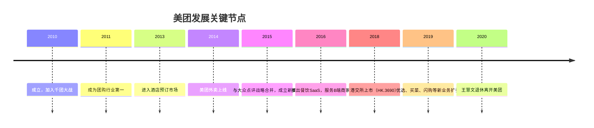

# 美团

美团（Meituan，港交所代码：HK.3690）是中国规模最大的本地生活服务平台，业务涵盖餐饮外卖、到店团购、酒店旅行、出行服务及零售配送等多个领域。公司由[[王兴]]与[[王慧文]]联合创办于2010年，总部位于北京。2018年9月，美团在香港联合交易所主板上市，市值一度突破万亿港元。

---

## 千团大战的胜出逻辑

美团诞生于2010年团购浪潮的顶峰期。彼时，受美国Groupon模式的启发，国内涌现出逾4000家团购网站，史称"千团大战"。在这场惨烈的淘汰赛中，美团的核心优势并非烧钱速度，而是系统能力与执行效率。

```mermaid
flowchart TD
    A[千团大战 4000+竞争者] --> B{胜出关键因素}
    B --> C[随时结款系统\n商家信任基础]
    B --> D[数据化运营\n早于对手建立技术壁垒]
    B --> E[聚焦执行\n王兴"避免过早优化"]
    C --> F[口碑积累 → 商家黏性]
    D --> F
    E --> F
    F --> G[2011年成为团购行业第一]
    G --> H[2015年与大众点评合并]
```

王慧文主导的后台系统让美团能为商家提供"随时结款且算账清楚"的服务，在竞争对手普遍拖欠账款时率先建立起商家信任。[[王兴]]则坚持"不要过早优化"的战略纪律，将资源集中在最核心的增长指标上。2011年，美团成为全国团购市场第一，此后大批竞争者相继倒闭或被并购。

---

## 从团购到本地生活生态

胜出千团大战后，美团的扩张路径遵循"供需关系第一"的产品逻辑——每进入一个新品类，都先判断供需结构，再决定打法。

| 业务线 | 切入时间 | 战略意义 |
|--------|----------|---------|
| 团购（核心） | 2010年 | 流量入口，建立商家与用户双边网络 |
| 猫眼电影 | 2012年 | 占据高频娱乐消费场景 |
| 酒店预订 | 2013年 | 拓展住宿类高客单价业务 |
| 美团外卖 | 2014年 | 最高频的本地生活场景，形成蜂窝型规模效应 |
| 美团打车 | 2017年 | 出行入口，补全本地服务闭环 |
| 美团买菜/闪购 | 2019年起 | 即时零售，延伸供给链 |

外卖业务是美团生态的核心引擎。[[王慧文]]提出"蜂窝型规模效应"概念——外卖配送网络的优势不能跨城市叠加，每座城市甚至每个片区都必须独立建立密度，这使得外卖成为极难被远程攻破的本地壁垒。

---

## 公司文化与管理哲学

美团的组织文化深受[[王兴]]商业观的塑造。他反复强调，公司的本质是"找到合适的人、足够的钱、正确的方向"，其余皆属执行。这一精简的CEO定义在美团形成了强调执行力与人才密度的内部文化。

[[创业与商业]]哲学在美团的实践中尤为明显：王兴视每一次业务扩张为"慢就是快"的长期布局，不轻易跟风补贴战，而是优先建立系统壁垒。

---

## 合并、上市与竞争格局



2015年，美团与大众点评宣布战略合并，新公司"新美大"整合了到店评价与到店团购两大流量入口，奠定了美团在本地生活市场的主导地位。2018年的香港IPO是美团发展史上的重要里程碑，其招股书中"Food + Platform"的战略定位揭示了王兴对美团终局的构想——以餐饮为核心，将平台能力横向延伸至一切本地服务。

更多产品设计思想详见 → [[供需关系与产品设计]]；更多创业理念详见 → [[创业与商业]]；关于美团早期社区基因，参见 → [[饭否文化与社区]]
