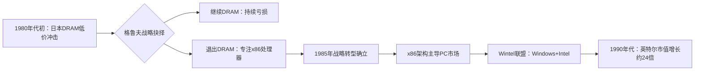

# 英特尔

英特尔（Intel Corporation）是美国半导体公司，1968年由罗伯特·诺伊斯（Robert Noyce）和戈登·摩尔（Gordon Moore）创立于加利福尼亚州圣克拉拉。诺伊斯与摩尔此前均来自仙童半导体（Fairchild Semiconductor），英特尔创始团队还包括时任研发主管的[[安迪·格鲁夫]]。

## 创立与早期

英特尔最初专注动态随机存储器（DRAM）业务。1971年，公司推出全球首款商用微处理器 Intel 4004，标志着微处理器时代的开启。但此后十余年，DRAM 仍是主要收入来源。

1979年，[[安迪·格鲁夫]] 出任总裁，主导了英特尔随后最关键的战略转变。

## 格鲁夫时代的转型

### DRAM 危机与战略转折点

1980年代初，日本半导体厂商（东芝、NEC、日立等）以更低成本大规模生产 DRAM，英特尔市场份额迅速萎缩，多个季度亏损。格鲁夫与摩尔进行了那次后来被反复引用的对话：格鲁夫问，如果董事会换掉我们，新 CEO 会怎么做？摩尔回答，他会放弃内存业务。格鲁夫说，那我们为什么不自己做这个决定？

1985年，英特尔宣布退出 DRAM 市场，将全部资源押注 x86 微处理器。格鲁夫将这类时刻命名为"战略转折点"（Strategic Inflection Point），指某种竞争力量发生十倍级变化、迫使企业根本性转型的节点。

### Intel Inside 品牌战略

1991年，英特尔启动 **Intel Inside** 品牌计划。英特尔向 PC 厂商提供补贴，条件是在产品上粘贴 Intel Inside 标志。这一做法将一个消费者原本不可见的零部件品牌直接带入购买决策，是 B2B 厂商向 B2C 品牌转化的经典案例。

### OKR 的起源

格鲁夫在英特尔内部推行一套名为 **iMBO（Intel Management by Objectives）** 的管理体系，这是后来被广泛传播的 [[OKR]]（目标与关键结果）的原型。核心设计包括：员工可自行设定约半数目标、目标全员公开透明、达成70%即为优秀而非失败。

1974年，约翰·杜尔（John Doerr）加入英特尔，亲历了 iMBO 体系的运作。1999年，他将这套方法带入谷歌，此后扩散至亚马逊、领英等公司。格鲁夫在《[[格鲁夫给经理人的第一课]]》（High Output Management，1983年）中对这一体系做了系统阐述。

## 奔腾危机

1994年，用户发现奔腾处理器存在浮点运算错误。格鲁夫初期认为该问题仅影响少数科学计算用户，拒绝全面召回。舆论持续发酵，IBM 宣布暂停采购奔腾处理器，英特尔股价下跌。英特尔最终花费 **4.75亿美元** 召回所有缺陷处理器，此后格鲁夫将这次危机写入《只有偏执狂才能生存》，作为互联网时代危机公关规则已彻底改变的证据。

## 关键时间轴

| 年份 | 事件 |
|------|------|
| 1968 | 诺伊斯、摩尔、格鲁夫联合创立英特尔 |
| 1971 | 发布全球首款商用微处理器 Intel 4004 |
| 1979 | 格鲁夫出任总裁 |
| 1985 | 宣布退出 DRAM，全面转向 x86 微处理器 |
| 1987 | 格鲁夫出任 CEO |
| 1991 | 启动 Intel Inside 品牌营销计划 |
| 1993 | 推出 Pentium（奔腾）处理器 |
| 1994 | 奔腾浮点运算漏洞危机，召回成本 4.75 亿美元 |
| 1997 | 格鲁夫被《时代》杂志评为年度人物 |
| 1998 | 格鲁夫卸任 CEO |
| 2000 | 英特尔市值约 5000 亿美元，达到峰值 |

## 管理遗产

格鲁夫将英特尔的管理实践写成两本著作：《[[格鲁夫给经理人的第一课]]》系统阐述了 OKR 和高产出管理体系；《只有偏执狂才能生存》将战略转折点理论推向大众。两书成为硅谷管理文化的核心读本，被谷歌、亚马逊、领英等公司列为必读材料。

详见 → [[安迪·格鲁夫]]、[[OKR]]、[[格鲁夫给经理人的第一课]]
