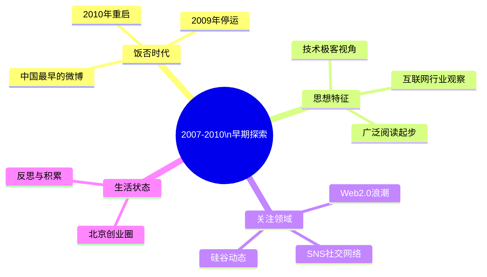

# 2007-2010 早期探索

这一时期的王兴，是饭否（Fanfou）的创始人，也是中国第一代社交媒体平台的建设者。他的帖文呈现了一个技术出身的连续创业者在Web 2.0热潮中摸索产品方向、积累人脉、感受互联网浪潮的真实状态。

## 创业状态与饭否起步

2007年王兴加入饭否时，正处于校内网已出售、新项目待定的间隙。他的早期帖文充满了创业者的旺盛精力，对工作时间的态度是"恨不得一周可以工作八天"（2007-06-02）。他主动使用饭否帮助推广产品功能，教用户如何使用@提及功能（2007-07-19），回复关于产品改进的建议，并在产品出现设计缺陷时坦然承认并表示"痛心疾首"。

他提出的产品经理定义："脑子里装了vmware，可以随时切换到不同的用户情境中去"（2007-07-25），至今仍被引用，折射出他在早期就建立了清晰的产品思维框架。他的早期产品原则包括"不贰过"（不让用户在同一缺陷处重复受挫），以及他对骨架与灵魂的区分："好骨架难，好灵魂更难。骨架或许可以抄，灵魂却借不来，只能一点一滴聚元气。"

他的数学直觉也在帖文中留有痕迹。2007年5月他发了一条只有数字的消息："1.03^52=4.7, 1.05^52=12.6, 1.1^52=142"（2007-05-31），用数学说明复利效应，却没有附任何解释，符合他一贯的克制风格。同期他在读 *Founders at Work*（2007-07-26），这本记录早期互联网创始人的口述史成为他这一年最常引用的书目之一。

## 海内：真人网络的短暂尝试

2007年下半年，王兴在运营饭否的同时，推出了另一个产品[[海内]]。[[海内]]定位为真人实名社交网络，要求用户使用真实姓名和头像，不用真名则功能受限（无法加好友、建群组等）。他描述设计逻辑："我希望经过一段时间后来的都是愿意用真名的用户，因为如果不愿意用真名的话，一个用户为什么要来海内而不去别的网站呢？"（2007-11-15）

海内的上线时间约在2007年11月。王兴在饭否上为海内预热，解释产品理念，并亲自拉用户过来体验。他清楚地把饭否和海内定位为不同产品："饭否不能满足我的很多需求，又有很多人要求饭否保持简单，所以……"（2007-11-15）。海内的实名原则在当时的中国互联网环境中颇为超前，但产品最终未能持续发展。

## SNS热潮中的清醒判断

2007年，SNS（社交网络）热潮在中国互联网界达到高峰。大量创业者打算复制Facebook，王兴直接评价："非死不可啊非死不可"（2007-07-25）。他对垂直社区的兴起持观察态度，对母婴社区、女性社区等细分方向有关注，但并未盲目跟进。他观察到当时饭否上已汇聚了包括校内、占座、底片、5加1、ChinaY 等诸多 SNS 领域同行（2007-06-20），说明饭否早期用户中互联网从业者占了相当比例。

这一时期他有一个关键的思维实验：2004年他曾彻夜未眠，认为中文维基百科将被封锁，"所以应该在国内做一个改进版的中文维基百科"（2007-06-24）。这段往事揭示了他在早期对内容平台的思考，以及他将想法落地时要求的那种"理由充分"的紧迫感。

## 知识结构的形成

2007-2009年是王兴知识体系形成的关键时期。他系统阅读商业和经济学书籍，并用 Kindle 购买了 *The Essential Drucker*（2008-12-30）。2009年初他买入 Clay Shirky 的 *Here Comes Everybody*，认为 Shirky 是"关于互联网最有想法的人之一"（2009-01-22）。他发现科斯经济学对 IT 行业的解释力（2009-02-19）。他在这一时期建立了对红杉资本的认识，引用 Michael Moritz 的访谈并对其坦率个性感到欣赏（2007-08-07）。他也在此期间建立了对媒体功能的基本判断："从商业角度定义，有广告收入的都是媒体"（2009-01-12），并开始减少早晨看新闻的时间（2009-02-23）。

他在国家图书馆第一次参加全国高校社团大会（2007-08-26），在五道口雕刻时光咖啡馆（后改为桥咖啡）附近工作，在美国总结了在哥伦比亚大学附近的那次创业学习经历。这些场景构成了他知识社交化的背景。他还参加了 2007 年 11 月的中文网志年会，在 microblogging 分组讨论中发言，事后自评"说话太实在了，没有充分利用这个机会为饭否做广告"（2007-11-03）。

## 饭否的关停与重启

2009年7月，饭否因政策原因被关停，停运超过500天。关停前一天（2009-07-07），王兴在饭否写道："被饭否和谐还是饭否被和谐，这是一个并不舒服但却必须做的选择"，这是停运前最后几条公开帖文之一，措辞隐晦而无奈。

王兴在饭否重启后（2010年9月）发出第一条帖文："过去未去，未来已来"（2010-09-06），虽然只有七个字，却像是对整个停运期间的沉默的一次总结。

饭否重启后，王兴立刻投入到社区维护中：更换短信特服号（旧号失效，改为13489133650）、恢复绑定功能、修复各项服务，并于2010年12月正式拿到 ICP 证（2010-12-07）。他欢迎新老用户，对平台的态度明确："饭否不是微博。"（2010-11-14）他对饭否的比较定位清晰："饭否无聊不无聊，完全取决于你在饭否上关注什么样的人"（2008-12-21）。

## 美团的酝酿

2010年3月，美团正式上线（王兴在2011年提到美团"一周年"推出过期包退政策）。饭否重启后的帖文已经出现了"美团"的字样，2010年11月他提到"居然在和邓亚萍的人民搜索抢人"，显示两者在时间线上有短暂的重叠期。这一时期王兴在两个平台的创始人身份并行，也是他从单纯的产品创业者向规模化商业运营者转型的起点。他同时观察 3Q 大战（360 vs 腾讯），从竞争策略角度详细分析双方得失（2010-11），显示出他的商业判断力已超出自家产品范畴。

## 时代特征

这一时期王兴帖文的风格特点：
- 大量回复和互动，社区感强
- 对技术和产品有直接的操作性观察
- 阅读以英文资料为主，对海外互联网趋势保持密切关注
- 语气相对轻松，常有玩笑，有更多生活片段的记录
- 频繁引用名言（Drucker、Churchill、Darwin、Jobs），形成语录积累习惯
- 2010年重启后语气明显转向务实，帖文开始更多涉及管理与招聘

| 时间 | 重要帖文 |
|------|--------|
| 2007-05-31 | "1.03^52=4.7, 1.05^52=12.6, 1.1^52=142" |
| 2007-07-25 | "一个好的产品经理就像脑子里装了vmware，可以随时切换到不同的用户情境中去。" |
| 2007-08-30 | "一转眼我来北京已经十年了。十年前的傍晚，火车跑在华北平原上时，我第一次看到了地平线上的日落。" |
| 2008-12-18 | "说到知识工作者的生产工具，以前我觉得是CPU和内存重要，后来是显示器、键盘和鼠标重要，现在觉得椅子更重要了。The peripheral is central." |
| 2008-12-25 | "在工作中度过了圣诞平安夜。5年前的今夜，我在收拾行李，准备第二天上飞机，回国创业。" |
| 2009-02-19 | "越发觉得科斯Coase真是天才的经济学家。最近几十年IT技术给社会带来的很多变化都可以用他的理论来分析。" |
| 2009-07-07 | "被饭否和谐还是饭否被和谐，这是一个并不舒服但却必须做的选择。" |
| 2010-09-06 | "过去未去，未来已来" |
| 2010-09-16 | "我不喜欢大脑高速运转的感觉。如果说我还有过一些好想法的话，它们都是在感觉无所事事的时候冒出来的。" |
| 2010-11-14 | "爱生活，爱饭否。" |
