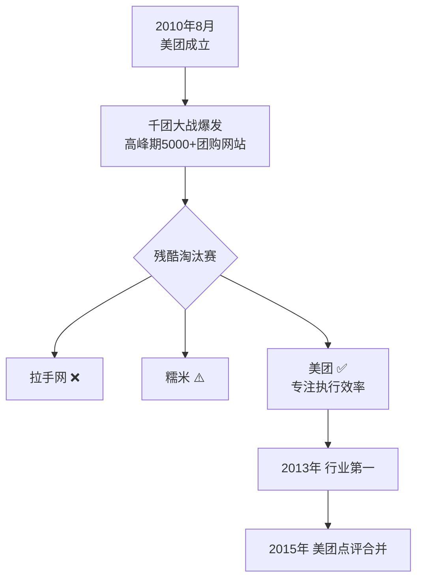

# 2011-2015 美团崛起

这一时期是王兴商业生涯的决定性阶段。美团从团购热潮中脱颖而出，经历了"千团大战"的残酷淘汰，并逐步从团购平台扩张为本地生活服务平台。王兴的饭否帖文在这一时期呈现出更强的历史感和战略意识，个人生活的记录减少，思想性内容增多。

## 团购热潮与竞争白热化

2011年是团购行业最混乱的时期。CNNIC数据显示，截至2010年底，全国共有1875万网民（占4.1%）使用团购，而美国的团购网站数量已超过400家（2011-03-26）。对于当时声势最大的外来竞争者，王兴在2011年2月直接写道："groupon中国的不靠谱程度居然超出了我的预期，这太令我惊讶了。"（2011-02-16）这一判断早于多数观察者。

美国汽车工业的历史提供了他理解千团大战结局的参照系："上个世纪初，美国的汽车公司逐渐从1800家减少到3家。听起来也和'千团大战'差不太多嘛。只是速度稍微慢一点。"（2014-12-25）

他在2011年推出美团"过期包退"政策（2011-03-07），被认为是区分美团与大量劣质团购平台的关键一步。一位同行在2011年公开表达了困惑："对手比你们早做这么多，又是铺天盖地的广告，你们是如何在这么短的时间内做到几乎平分秋色的？答曰：始终专注做实事。"（2011-04-15）

王兴此时期的帖文极少直接提及竞争对手，但他在关于竞争的理论性表述中留下了清晰的立场："竞争竞争，何为竞，何为争？同向为竞，相向为争。"（2013-05-23）他在帖文中偶尔涉及美团内部事务，例如转发员工篮球活动信息、回复用户对产品的投诉，始终保持着创始人亲自参与的风格。

## 从CEO的角度思考组织

这一时期，王兴的思考重心从产品创始人转向CEO。他在2011年引用并认同的CEO职责定义成为他公开表述中最具代表性的表达之一："设定公司的愿景和总体战略并传达给所有利益相关方，招募并留住最最优秀的人才，确保始终有足够的现金。"（2011-01-24）

他对德鲁克"CEO真正的战场是客户不是管理"的判断也表示接受（2014-01-12）。他在2013年提到"数据显示，在美团网的所有员工里，我比96.3%的人更年长"（2013-02-06），这句话既是玩笑，也折射出他对团队年轻化的自豪与责任。

他在2012年推荐了一篇《如何减少公司政治》的博文，并评价作者霍洛维茨"功力简直不输他的搭档神人马克·安德森"（2011-01-27）。他在"美团之星"评选后写下："我觉得这些候选人中的多数在各自岗位上的表现都比我在CEO这个岗位上的得分高。"（2014-12-25）

## 阅读广度的扩张

从2011年起，王兴的阅读开始大规模扩展至历史、社会科学和传记领域，远超早期的技术和商业读物。他购入马歇尔传记，关注林登·约翰逊传记，阅读《美国种族简史》，在kindle上读《了不起的盖茨比》，在长椅上半天读完半本书（2013-05-04）。这一时期的阅读量和广度都达到了他饭否生涯的最高点。

他的历史兴趣也在这一时期成型。他开始将历史中的结构性对比（郑和vs.哥伦布、华盛顿vs.乾隆、美国南北战争vs.太平天国）作为理解现实的参照系。

## 旅行与国际化视野

这一时期的王兴开始大量旅行，包括台湾、东京、俄罗斯、缅甸、土耳其，以及定期的国内出差。旅行带来的不只是感官体验，也是知识验证。他读了弗里德曼关于土耳其地缘重要性的论述后，主动将土耳其列入旅游计划（2015-11-25）。他去台湾旅行，留下了对高铁、城市感受和历史遗迹的具体记录。

他在2014年与比尔·盖茨共进午餐后写道"可惜收获不大"（2014-06-18），语气是坦率而非谦逊。他与苹果联合创始人沃兹尼亚克的合影只发了一条简短帖文（2014-01-11）。

## 关键业务里程碑

美团在2013年实现了一个象征性突破。2013年12月31日22点13分至14分之间，王兴在饭否上发帖："美团网首次单日交易额突破一亿元！谢谢所有支持美团的消费者！谢谢和美团合作的所有商户！谢谢美团所有兄弟姐妹们！2014年我们一起纵情向前！"这是美团将团购平台的执行效率转化为可量化成果的标志之一。

猫眼电影在这一时期从美团电影频道演变为独立产品品牌。王兴的帖文中多次出现对猫眼电影功能的介绍，包括网上选座和自动取票机（2014-11-04），以及他本人为技术bug道歉并说明在等app store审核的帖文（2014-10-13）。

2015年10月，美团与大众点评完成合并。同年11月10日，王兴在饭否发帖："今天下午刚刚发出内部全员邮件，结束联席CEO状态，我担任CEO，张涛转任董事长。"

在一个体现团队价值观的细节上，前同事创业所做产品的腰封上印着"既往不恋，纵情向前"（2014-11-27），这是美团在2011年就确立的公司口号，已渗透到周边人员的品牌表达中。

## 零售哲学与O2O判断

王兴对零售本质的判断趋于简洁。2015年他在拜访一位前辈后记录下对方的说法："零售要想成只有一条路，聪明人花傻力气。"（2015-05-20）他本人在此之后也表达了类似的认同。

他对O2O概念的观察带有一贯的旁观者视角。他在2014年注意到《经济学人》一期封面文章的主题是"O2O改变色情服务业"（2014-08-09），以此说明O2O模式的普遍性已被主流媒体广泛认可。他还观察到"创业"这件事"在国内已经流（烂）行到一定地步了，中文里需要一个跟wantrepreneur对应的词了"（2014-07-07）。

## 对互联网格局的判断

这一时期王兴对互联网行业格局的判断趋于成熟。他在2012年准确预判"中国:物联网 ≈ 微软:平板电脑"（2012-01-12），在2013年看到三星和苹果利润超过全行业109%后引用了"Be No. 1 or No. 2, or dead"的法则（2013-11-15）。

他在2014年判断"中国互联网企业开拓海外都将是巨大的一波浪潮"，认为中美以外的市场将进入"G2争霸的时代"（2014-07-13）。这一判断在此后几年被美团、字节跳动等公司的海外扩张所印证。

## 时代气质

这一时期王兴帖文的风格特点：
- 互动减少，思想性内容增多
- 对阅读内容的深度评价更为频繁
- 对竞争和战略的判断趋于沉稳
- 对长期主义的表达更为明确
- 对中国社会变革的预感开始出现

| 时间 | 重要帖文 |
|------|--------|
| 2011-01-24 | "CEO最重要的三项工作：设定公司的愿景和总体战略……招募并留住最最优秀的人才，确保始终有足够的现金。" |
| 2013-03-04 | "道生一，一生二，二生三，三生万物……谨以此混搭纪念美团网上线三周年。" |
| 2013-05-23 | "竞争竞争，何为竞，何为争？同向为竞，相向为争。" |
| 2013-07-05 | "我爱中国……我爱创业……我爱在中国创业，因为有激动人心的机会和激情四射的团队。" |
| 2015-03-04 | "人们总是高估两年能发生的变化，总是低估五年能发生的变化。我迫不及待的想要创造下一个五年了。" |
| 2015-11-28 | "战略上打持久战，战术上打歼灭战。" |
