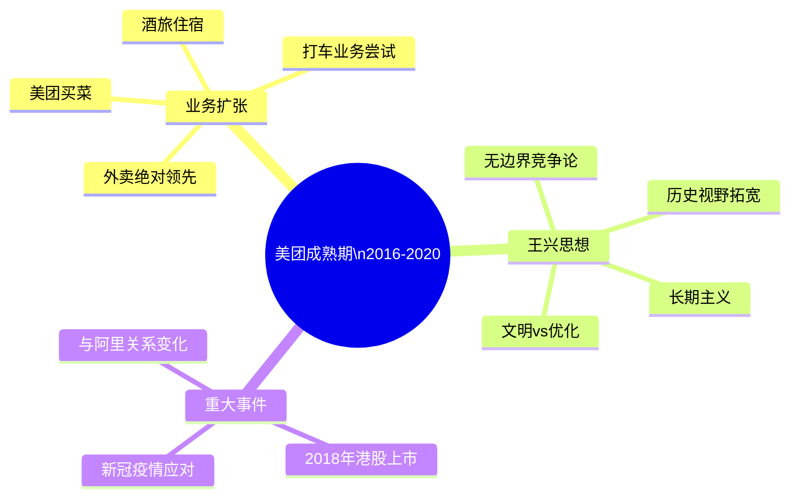

# 2016-2020 成熟期

这一时期王兴的饭否帖文呈现出不同于早期的质地：议题更宏观，历史视野更长，对商业本质的思考更抽象。美团在此期间与大众点评合并（2015年末），并于2018年在香港上市。王兴的个人思考也从一个成长期创业者的务实判断，演变为一个大型企业掌舵人对文明、时代和长期价值的关切。

## 美团合并后的行业判断

2016年伊始，王兴留下了对过去三年互联网行业的精炼总结："2014年，该上市的上市；2015年，该合并的合并；2016年，该倒掉的倒掉。"（2016-01-08）这句话不只是回顾，也是对整个行业淘汰周期的宏观预判。

他对这一时期互联网竞争格局的判断是规模化的：BAT之间在概念战上的输赢（"互联网+"vs."从IT到DT"）、小米与苹果在不同人群中的定位差异（"屌丝经济vs.粉丝经济"）、乐视跨行业扩张的荒诞（在互联网之光展台看到没有脚蹬的自行车展品）（2016-11-16），这些观察都以冷静的旁观者角度呈现。

他对市场经济的基本信仰在这一时期以更哲学化的方式表达："我不常逛超市，但每逛一次就感叹一次商品之琳琅满目，进而感叹资本主义（或曰市场经济）之强大。"（2016-07-10）

## 文明与优化的辩证

2016年10月，王兴发出了一句标志性的英文帖文："Civilization is more than optimization."（2016-10-10）这句话不是借用，而是他自己的判断，揭示了他对科技公司在这一时期流行的"效率优先"叙事的保留态度。他认为文明的内涵超出了效率，这也可以解释他为何在帖文中长期保持对历史、文学、艺术的关注，而不只是商业逻辑。

他在同期写道，BAT以互联网颠覆一切的姿态对待文化创作是"很浅薄的"，因为只要中文存在，李白就不会被遗忘；而那时还有多少人知道微软或谷歌"真是很难说"（2016-02-08）。

## 历史阅读的深化

成熟期的王兴在历史阅读上投入明显增多。他在2017年3月写道："今天临睡前读到的《帝国、邦国与民族国家的想象》这篇长文让我大开眼界。"（2017-03-12）他开始关注伊朗-伊拉克战争的地缘起源（萨达姆废除《阿尔及尔协定》），关注法国大革命中化学家拉瓦锡断头台上的科学精神，关注张三李四典故的历史来源（2016-07-08）。

这些历史兴趣不再只是信息的积累，而是成为他理解当下局势的工具。他对近百年前土耳其凯末尔世俗化改革的理解，就是通过近期中东乱局的新闻重新激活的（2015-09-08）。

## 人物观察的格局扩大

这一时期，王兴与更多国际性人物有接触或交流，包括美国三大互联网公司之一的创始人（2017-02-07）、科学家饶毅（2016-07-05）、投资人DST的Yuri Milner等。他对这些人的观察，常着眼于其思维方式和人格特质，而非地位或财富。

他在2018年引用图灵奖得主Hennessy & Patterson的获奖新闻时写道，"这就是一流公司的所作所为"（2018-03-22）——因为谷歌赞助了图灵奖。这反映了他对一流公司应承担更大社会知识责任的期许。

## 对新技术的审慎态度

这一时期，人工智能、区块链和新能源汽车成为行业热点。王兴对这些新技术的态度保持审慎。AlphaGo事件中，他的关注点不在技术突破本身，而在公众讨论的质量（2016-03-09）。对马斯克的特斯拉，他的判断是："不能用造火箭的思路造家用电动车。这对超一流人才马斯克来说也依然是个严峻的考验。"（2018-02-07）

他对区块链/加密货币则借用刘慈欣的科幻视角，指出这是"在科幻小说里都没出现过的东西"（2018-08-19），暗示其新颖性背后的不确定性。

## 帖文风格的演变

成熟期的王兴发帖频率有所降低，内容密度却有所提高。他的帖文越来越多地引用他人的话或书中的段落，并附上自己的判断或关联。个人生活的琐事记录减少，但偶发的幽默观察仍有出现（例如对"撸猫资本CEO"的短评）。

| 时间 | 重要帖文 |
|------|--------|
| 2016-01-08 | "2014年，该上市的上市；2015年，该合并的合并；2016年，该倒掉的倒掉。" |
| 2016-02-08 | "只要中文还存在，李白就不会被遗忘……那时还有多少人知道或记得微软或谷歌真是很难说。" |
| 2016-10-10 | "Civilization is more than optimization." |
| 2017-02-25 | "你知道吗？www.relentless.com 是指向亚马逊的。" |
| 2018-02-07 | "不能用造火箭的思路造家用电动车。这对超一流人才马斯克来说也依然是个严峻的考验。" |
| 2018-03-22 | "Hennessy & Patterson 因为 RISC 得了这届图灵奖……这就是一流公司的所作所为。" |
