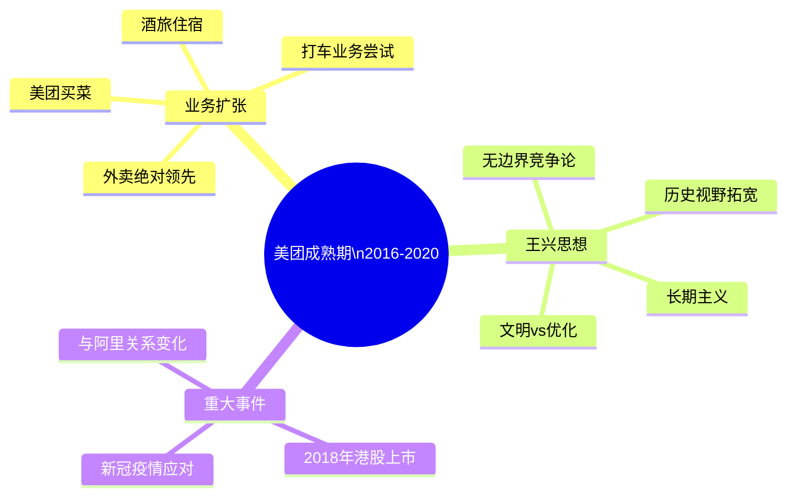
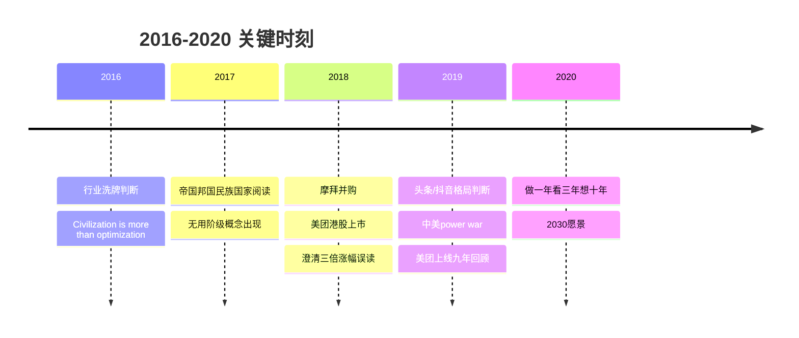

# 2016-2020 成熟期

这一时期王兴的饭否帖文呈现出不同于早期的质地：议题更宏观，历史视野更长，对商业本质的思考更抽象。美团在此期间与大众点评合并（2015年末），并于2018年在香港上市。王兴的个人思考也从一个成长期创业者的务实判断，演变为一个大型企业掌舵人对文明、时代和长期价值的关切。

## 美团合并后的行业判断

2016年伊始，王兴留下了对过去三年互联网行业的精炼总结："2014年，该上市的上市；2015年，该合并的合并；2016年，该倒掉的倒掉。"（2016-01-08）这句话不只是回顾，也是对整个行业淘汰周期的宏观预判。

他对这一时期互联网竞争格局的判断是规模化的：BAT之间在概念战上的输赢（"互联网+"vs."从IT到DT"）、小米与苹果在不同人群中的定位差异（"屌丝经济vs.粉丝经济"）、乐视跨行业扩张的荒诞（在互联网之光展台看到没有脚蹬的自行车展品）（2016-11-16），这些观察都以冷静的旁观者角度呈现。

他对市场经济的基本信仰在这一时期以更哲学化的方式表达："我不常逛超市，但每逛一次就感叹一次商品之琳琅满目，进而感叹资本主义（或曰市场经济）之强大。"（2016-07-10）

## 文明与优化的辩证

2016年10月，王兴发出了一句标志性的英文帖文："Civilization is more than optimization."（2016-10-10）这句话不是借用，而是他自己的判断，揭示了他对科技公司在这一时期流行的"效率优先"叙事的保留态度。他认为文明的内涵超出了效率，这也可以解释他为何在帖文中长期保持对历史、文学、艺术的关注，而不只是商业逻辑。

他在同期写道，BAT以互联网颠覆一切的姿态对待文化创作是"很浅薄的"，因为只要中文存在，李白就不会被遗忘；而那时还有多少人知道微软或谷歌"真是很难说"（2016-02-08）。

## 历史阅读的深化

成熟期的王兴在历史阅读上投入明显增多。他在2017年3月写道："今天临睡前读到的《帝国、邦国与民族国家的想象》这篇长文让我大开眼界。"（2017-03-12）他开始关注伊朗-伊拉克战争的地缘起源（萨达姆废除《阿尔及尔协定》），关注法国大革命中化学家拉瓦锡断头台上的科学精神，关注张三李四典故的历史来源（2016-07-08）。

这些历史兴趣不再只是信息的积累，而是成为他理解当下局势的工具。他对近百年前土耳其凯末尔世俗化改革的理解，就是通过近期中东乱局的新闻重新激活的（2015-09-08）。

## 人物观察的格局扩大

这一时期，王兴与更多国际性人物有接触或交流，包括美国三大互联网公司之一的创始人（2017-02-07）、科学家饶毅（2016-07-05）、投资人DST的Yuri Milner等。他对这些人的观察，常着眼于其思维方式和人格特质，而非地位或财富。

他在2018年引用图灵奖得主Hennessy & Patterson的获奖新闻时写道，"这就是一流公司的所作所为"（2018-03-22），因为谷歌赞助了图灵奖。这反映了他对一流公司应承担更大社会知识责任的期许。

## 对新技术的审慎态度

这一时期，人工智能、区块链和新能源汽车成为行业热点。王兴对这些新技术的态度保持审慎。AlphaGo事件中，他的关注点不在技术突破本身，而在公众讨论的质量（2016-03-09）。对马斯克的特斯拉，他的判断是："不能用造火箭的思路造家用电动车。这对超一流人才马斯克来说也依然是个严峻的考验。"（2018-02-07）

他对区块链/加密货币则借用刘慈欣的科幻视角，指出这是"在科幻小说里都没出现过的东西"（2018-08-19），暗示其新颖性背后的不确定性。

## 帖文风格的演变

成熟期的王兴发帖频率有所降低，内容密度却有所提高。他的帖文越来越多地引用他人的话或书中的段落，并附上自己的判断或关联。个人生活的琐事记录减少，但偶发的幽默观察仍有出现（例如对"撸猫资本CEO"的短评）。

| 时间 | 重要帖文 |
|------|--------|
| 2016-01-08 | "2014年，该上市的上市；2015年，该合并的合并；2016年，该倒掉的倒掉。" |
| 2016-02-08 | "只要中文还存在，李白就不会被遗忘……那时还有多少人知道或记得微软或谷歌真是很难说。" |
| 2016-10-10 | "Civilization is more than optimization." |
| 2017-02-25 | "你知道吗？www.relentless.com 是指向亚马逊的。" |
| 2018-02-07 | "不能用造火箭的思路造家用电动车。这对超一流人才马斯克来说也依然是个严峻的考验。" |
| 2018-03-22 | "Hennessy & Patterson 因为 RISC 得了这届图灵奖……这就是一流公司的所作所为。" |

## 摩拜并购与美团 IPO

2018年4月，美团宣布收购摩拜单车。王兴当天写道："摩拜是少有的真正的中国原创，是难得的有设计感的品牌，有着巨大的社会价值，将和美团一起开创更辉煌的未来。"（2018-04-04）这是他极少数公开对被收购资产表达溢美之辞的例子，一方面出于真心认可其设计价值，另一方面也有公开对外宣示整合信心的意图。

2018年美团在香港上市前，媒体引用过一个说法，称他表示"美团上市要翻三倍"。王兴专门在饭否上澄清："现在很多媒体太不严谨，老把一些我没说过的话塞我嘴里。我没说过「美团上市要翻三倍」，这么无脑的话像是我的风格吗？我说过的是，如果美团三年后没有涨三倍，那我会觉得自己的工作做得很失败。"（2018-04-12）这一澄清同时传达了两层信息：对媒体不严谨的不满，以及对公司长期价值的自信。

上市后，一位前辈对他说："公司上完市，你们就应该踏踏实实专心做业务，着眼长期，不要太关注短期股价波动。股市是个类似赌博的游戏，你们这些公司不是开赌场的，也不是庄家，连来玩牌的人都不是，你们只是玩家手里的牌。"（2019-04-30）王兴转发并保留了这段话，态度认同。

## 头条与字节跳动的崛起

王兴对[[字节跳动]]崛起的判断集中体现在2019年初的一条帖文里："头条/抖音抓住了 facebook 干了而腾讯没干和谷歌干了而百度没干的机会。"（2019-01-24）这是他将[[张一鸣]]的算法推荐系统放在全球竞争坐标中做出的精简评估，既承认其战略位置的价值，也点出了腾讯与百度各自的战略失误。他没有直接评价字节跳动对美团的威胁，但此条帖文上下文均在讨论信息流与平台竞争格局，隐含了清醒的竞争意识。

2019年5月，他在谈行业格局时还提出："是时候用 HAT 代替 BAT 了。华为是中国当之无愧首屈一指的高科技企业。"（2019-05-19）这一判断将华为纳入第一梯队，调整了他对中国科技力量格局的认知。

## 人工智能与自动驾驶

王兴对 AI 的讨论横跨这一时期的始终。2017年3月，他转发了"随着人工智能的进展，人们开始讨论一个新概念：无用阶级"（2017-03-04），提出了一个超越乐观叙事的严肃命题。2019年初，他转述了一位懂行朋友对自动驾驶的判断："三五年内哪家都没戏，长期来看，如果一定要挑一家公司，我选华为。"（2019-01-10）这段转述表明他对近期商用化持保留态度，倾向于工程化能力强的公司而非纯软件公司。

2019年5月，他在另一条帖文中写道："Deepmind 很可能是比 google 更伟大的一家公司。"（2019-05-03）这是他对 AI 研究机构长期价值的一次正面判断，关注点不在商业化路径，而在知识边界上的突破。

## 公司规模感与长期视野

2018年初，他写道："我做美团已经8年多了，超过了从1937年卢沟桥事变算起的八年抗战；我回国开始创业已经14年多了，超过了从1931年九一八事变算起的十四年抗战。却仿佛只是一眨眼。"（2018-01-02）这是王兴罕见的以宏大历史刻度来丈量个人创业历程的时刻，折射出他对时间的独特感知。

2019年3月，美团上线满九年时，他写道："最近一年重新理解、更加理解「要做有积累的事」了。Eat Better, Live Better 这个使命很难，但是值得长期努力。"（2019-03-04）比起早年强调执行效率，这一时期他更多表达了对积累和复利的信仰。

2020年初，他提出了一个更长期的决策框架："做一年，看三年，「想」十年。真正考验 vision 的是2030及以后。"（2020-01-04）

## 全球视野的扩展

成熟期的王兴出行范围扩大，视野也随之扩展。他访问了新加坡、印度（计划多次）、阿联酋、伊朗、西班牙等地，并在帖文中频繁比较各国治理逻辑、文化差异与发展路径。他观察到"新加坡人认为 geography, demographics, technology 这三样东西决定了一个国家的未来"（2017-02-26），将这一框架与他对中国的观察相互印证。

他对中美关系格局的判断在2019年趋于清晰。他评论中兴制裁与贸易战时写道："这不是一场 trade war，是 power war。"（2019-05-18）他认为美国对中兴的制裁是针对关键技术卡位的战略行动，而非单纯的贸易争端。

