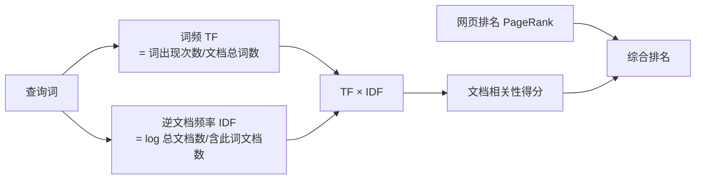

# TF-IDF

TF-IDF（Term Frequency / Inverse Document Frequency，词频-逆文档频率）是信息检索领域最重要的发明之一，用于度量**一个词对文档主题的贡献程度**。被公认为信息检索中最重要的基础发明，至今仍是搜索引擎相关性排名的基石。

---

## 问题：如何度量网页与查询的相关性？

给定查询"原子能的应用"，搜索引擎找到数百万个包含相关词的网页。如何排序？

**朴素方案：词频（TF）**
词频 = 该词在文档中出现的次数 / 文档总词数。词频越高，相关性越强。

**问题 1：** 虚词（"的"、"是"）词频极高，但对主题毫无贡献。

**解决：** 删除停用词（Stopwords）——"的"、"是"、"和"等几十个高频虚词，计算时不考虑。

**问题 2：** 删除停用词后，通用词（"应用"）的权重仍然过高。"原子能"在很少网页中出现（高区分度），"应用"在几乎所有网页中出现（低区分度）。直觉上"原子能"对排名的贡献应该更大。

**解决：IDF（逆文档频率）**

---

## IDF 的定义与计算

IDF（Inverse Document Frequency）= log(D / Dw)

- D：总文档数（如 10 亿中文网页）
- Dw：包含词 w 的文档数

| 词 | Dw | IDF = log(10亿/Dw) |
|----|-----|---------------------|
| "的"（虚词）| 10 亿 | log(1) = **0** |
| "应用"（通用词）| 5 亿 | log(2) = **0.7** |
| "原子能"（专业词）| 200 万 | log(500) = **6.2** |

在网页中找到一个"原子能"的匹配，相当于找到 **9 个"应用"的匹配**。

---

## TF-IDF 公式

文档与查询的相关性 = Σ TFᵢ × IDFᵢ（对所有查询词求和）

结合 PageRank（网页质量）与 TF-IDF（相关性），搜索引擎的综合排名大致为：**相关性得分 × 网页质量分**。

---

## 历史：一个被长期忽视的贡献

IDF 由剑桥大学**斯巴克-琼斯（Karen Sparck Jones）** 于 1972 年提出，论文题目：《关键词特殊性的统计解释及其在文献检索中的应用》。

**遗憾：**
- 她没有从理论上解释为什么权重是对数函数 log(D/Dw) 而非其他函数
- 没有在这个方向继续深入研究
- 结果：许多人引用 TF/IDF 时不引用她的论文，绝大多数人甚至不知道她的贡献

**康奈尔大学的萨尔顿（Salton）** 在此后多次撰文讨论 TF-IDF 的应用，信息检索的世界最高奖也以他的名字命名，很多人误以为 TF-IDF 是他发明的。

直到 2004 年，文献学学报创刊 60 周年之际重印了斯巴克-琼斯的原文，才为她正名。同期，罗宾逊用香农信息论解释了 IDF 的数学本质——IDF 实际上是**词概率分布的交叉熵（KL Divergence）的特例**。信息检索的相关性度量，又回到了信息论。

---

## 余弦相似度与新闻分类

TF-IDF 不仅用于查询相关性，也用于文档间的相似度计算。每篇文章可以表示为一个 64000 维的 TF-IDF 向量（词汇表中每个词的权重）。两篇文章的相似度 = 两个向量夹角的余弦值：

- 余弦值 = 1：文章完全重复（用于去重）
- 余弦值接近 1：文章相似（用于新闻聚类）
- 余弦值接近 0：文章无关

**中学几何中的余弦定理，直接用于 Google 新闻的自动分类。**

---

## 奇异值分解（SVD）的进一步优化

直接用 TF-IDF 向量比较 100 万篇文章（50 万维向量），计算量无法接受（5000 亿次比较，需 15 年）。

奇异值分解（SVD）将大矩阵分解为三个小矩阵，压缩到原来的 1/3000，同时保留主要语义信息。SVD 能同时完成：

1. 近义词分类（"汽车"与"轿车"归为一类）
2. 文章主题分类（同一主题文章聚合）

Google 中国张智威博士团队实现了 SVD 的并行化算法，被认为是 Google 中国对世界的一个技术贡献。
