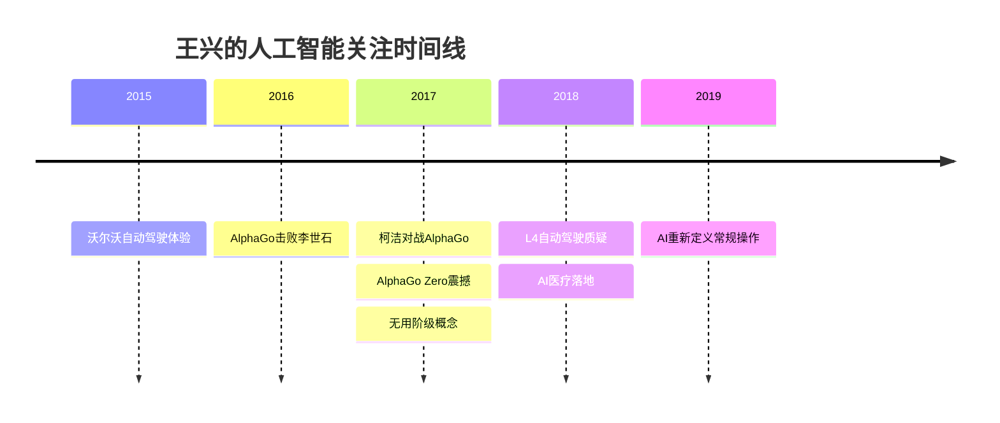

# 人工智能观察

[[王兴]]在饭否上对人工智能的观察横跨2015至2020年，始终保持清醒的技术判断，既不无条件跟风热点，也不回避技术变革的深远影响。

## AlphaGo 与认知方式的反思（2016）

2016年3月，AlphaGo 击败李世石后，王兴发现舆论反应比 AI 本身更值得关注。他写道："我不太懂围棋，也不太懂人工智能，但是看 AlphaGo 初战赢了李世石之后网上七七八八的评论，我很遗憾的发现很多人连基本的思考逻辑都不懂。"（2016-03-09）他专门区分了两类讨论者：读过 AlphaGo 团队在《自然》期刊上发表的论文的人，和没读过的人，暗示大多数评论属于后者。

他援引威廉·吉布森的名言"The future is already here. It's just unevenly distributed."作为对这一事件意义的注脚，认为 AlphaGo 的意义不在于超越人类本身，而在于揭示了一个已经到来但尚未被普遍感知的未来（2016-03-09）。

## 无用阶级与自动化（2017）

2017年4月，他注意到一个新概念的出现："随着人工智能的进展，人们开始讨论一个新概念：无用阶级。"（2017-04-15）他对此并未做乐观或悲观的直接表态，而是将其作为一个值得关注的社会变量记录下来。

同年，他转引了一条关于自动化渗透率的信息，指出"自动化设备（机器人）应用最早、渗透率最高的，就是烟草行业，其次才是汽车等"（2017-04-04），以此提醒人们技术变革的实际路径与大众印象之间的落差。

他对于汽车行业的自动驾驶宣传保持冷静：当汽车行业专家指出特斯拉"主要就是会吹"，而"要是真比生产线上的机器人应用程度，特斯拉连江淮汽车都比不上"时，他选择转发这个反直觉的观点（2017-06-15）。

## 深度学习与梦境（2017）

2017年，一位从事人工智能研究的朋友告诉他"从深度学习的原理反过来可以解释人为什么必须做梦"（2017-08-16）。这一跨学科联系令他着迷，体现了他对理论框架之间意外连接的持续敏感。

## AlphaGo Zero 的冲击（2017）

AlphaGo Zero 发布后，他写道："AlphaGo Zero 还是挺震撼的。相比之下，几千年来的人类围棋手们都太可怜了。"（2017-10-19）Zero 版本完全不依靠人类棋谱的自学方式，是对人类知识积累价值的根本性挑战，这一点令他印象深刻。

他此前对 AlphaGo 击败柯洁（2017年5月）的反应则更注重人的一面："我不太懂围棋，也不太懂人工智能，但我喜欢柯洁的真率：'不是什么双赢，输了就是输了，很难过。'"（2017-05-27）

## 自动驾驶的技术边界（2018）

2018年，他转发了一位分析人士对自动驾驶技术的判断：L4级无人驾驶"按照现有技术的架构是不具有理论上实现的可能性的，至少还需要一次比深度学习更大的技术革命"；宣称"全自动驾驶"的是"别有用心"（2018-03-05）。这一判断与他一贯的清醒态度一致：不因概念热潮而放弃技术实质的判断。

他此前在2015年已亲身体验了沃尔沃在普通高速上的自动驾驶，并提出了实质性问题："到底是机器靠谱还是人靠谱？"（2015-03-26）

## 云计算差距的历史感知（2017）

他对国内企业面对 Amazon 云计算的差距，做出了一个历史感强烈的比喻："每次听说 Amazon 的云计算服务推出新功能或看到基于它的应用越来越丰富，我的心就一沉，那种感觉就像清朝末年一个留着辫子的中国人走出国门，看到人家的蒸汽机、火车、轮船。在这种革命性的科技方面，我们总是落后。"（2017-01-12）李开复同期说"人工智能在腾飞前夜"，而王兴的关注点已落在执行层面的差距上。

## AI 重新定义"常规操作"（2019）

2019年，他转引了一个关于保龄球的类比，以此解释 AI 的意义："就像 AlphaGo 一样，人工智能确实能突破常规限制脑洞大开，为什么保龄球一定要丢到轨道上滑过去？直接算好轨迹大点力气从空中飞过去把瓶子全砸倒不也挺好吗？"（2019-06-11）这种对"常规操作"假设的打破，在他看来是 AI 的核心价值所在。

## Backlinks

- [[王兴]]
- [[哲学与认知]]
- [[科技与互联网]]
- [[历史类比思维]]

- [[必然]]（KK 对 AI 的理论框架：异类智能、知化趋势）
