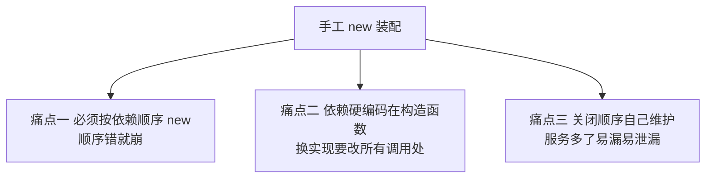
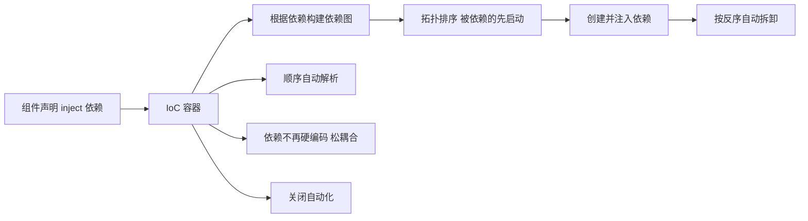

# 依赖注入与控制反转

控制反转（Inversion of Control，IoC）与依赖注入（Dependency Injection，DI）是后端框架组织服务的核心思想。一个后端进程内跑着一批长期存在的能力：HTTP 服务器、数据库连接、配置中心、日志器等。它们怎么创建、谁先谁后、互相怎么找到、进程关闭时怎么按序拆掉，是后端框架要回答的问题。

---

## 手工装配的三个痛点

没有框架时，服务靠手工 new 并按依赖顺序排列。

例如 logger、db、server 三者，必须先 new logger，再 new db（依赖 logger），再 new server（依赖两者）；关闭时还要反着来。服务增到几十个时，手工维护无法持续。

---

## 控制反转：把创建权交给容器

控制反转指创建对象的控制权从调用方反转给框架。调用方不再自己 new、不再排顺序，只声明"我需要哪些能力"，由容器负责创建与排序。依赖注入是实现控制反转的具体手段：容器把依赖注入给声明它的组件。

三个痛点因此消解：顺序由容器拓扑排序自动算出；组件只声明依赖名字、不关心谁实现，换实现无需改调用方；每个组件声明自己的清理逻辑，容器在卸载时按依赖反序自动调用。

---

## 常见容器的差异

| 框架 | 装配时机 | 典型场景 | 卸载能力 |
|------|---------|---------|---------|
| NestJS / Spring | 启动时装配一次，之后基本不变 | Web 后端 API 服务器 | 一般不强调运行时卸载单个模块 |
| Cordis | 运行中可随时热插拔 | 长期运行、插件可增删的宿主 | 核心能力：任意时刻销毁一个插件，级联清理 |

NestJS 与 Spring 是"启动装一次"的静态容器；[[Cordis插件架构]]专精运行时动态热插拔与级联安全卸载，更像 VS Code 扩展宿主。三者共享同一套 IoC 思想，差异在于生命周期是否动态。

---

## 与前端 Context 的区别

React 的 Context 只是值透传，没有"等依赖就绪才运行"的语义，也没有依赖注入。真正的 IoC 容器会保证被依赖的服务先就绪、再运行消费方，并在服务消失时把依赖它的组件一并卸掉。这一点在纯视图框架里没有对应物。
