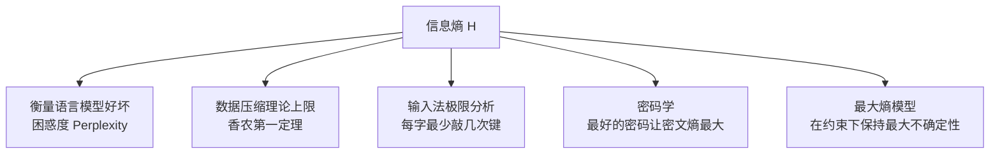

# 信息熵

信息熵（Information Entropy）由香农（Claude Shannon）于 1948 年在论文《通信的数学理论》中提出，是信息论的基础概念。它解决了一个根本问题：**信息量如何量化？**

---

## 核心直觉：不确定性 = 信息量

一条信息的信息量，等于它消除的不确定性的大小。

- 已知明天太阳从东方升起 → 信息量极小（几乎必然发生）
- 得知某支冷门球队赢得世界杯 → 信息量极大（极不确定）

**度量方法：** 对 32 支球队猜冠军，每次猜"前半还是后半"，最多猜 5 次确定答案。这条消息的信息量 = 5 比特（bit）。一个比特 = 消除一次二选一的不确定性。

---

## 信息熵公式

对于一个有 N 种可能结果的随机变量，每种结果概率为 p₁, p₂, ..., pN：

```
H = -(p₁·log₂p₁ + p₂·log₂p₂ + ... + pN·log₂pN)
```

**关键性质：**
- 各结果等概率时，熵最大（最不确定）
- 某个结果概率为 1 时，熵为 0（完全确定，无信息量）
- 32 支球队等概率时，H = log₂32 = 5 比特；若概率不等（热门队更可能夺冠），H < 5

---

## 汉字的信息熵

常用汉字约 7000 个（二级国标）。若等概率，每字需 13 比特（log₂7000 ≈ 13）。但汉字分布极不均匀：

- 不考虑上下文的独立概率：每字约 **8–9 比特**
- 考虑上下文相关性（语言模型）：每字约 **5 比特**

因此一本 50 万字的中文书，信息量约 250 万比特，压缩后约 320KB。直接用双字节国标编码存储约需 1MB，是压缩文件的 3 倍，差值称为**冗余度** （redundancy）。

汉语在所有语言中冗余度相对较小——与"汉语是最简洁的语言"的直觉一致。

---

## 语言模型复杂度（Perplexity）

贾里尼克（Jelinek）用信息熵定义了衡量语言模型好坏的指标：**困惑度（Perplexity）**。

困惑度可以理解为：在这个语言模型下，句子中每个位置平均有多少个词可供选择。越小越好。

以李开复的 Sphinx 语音识别系统为例：

| 语言模型 | 困惑度 |
|--------|--------|
| 无语言模型（零元）| 997 |
| 二元模型（只看共现，不看概率）| 60 |
| 二元模型（考虑概率）| 20 |

困惑度从 997 降到 20，语音识别错误率大幅降低。

---

## 互信息与相对熵

信息熵的两个重要引申概念：

**互信息（Mutual Information）：** 衡量两个随机事件的相关性。北京下雨 vs. 空气湿度 → 互信息大；北京下雨 vs. 火箭队胜负 → 互信息接近零。用于机器翻译中消除词义歧义（Bush 是总统还是灌木丛？）。

**相对熵（KL Divergence）：** 衡量两个概率分布的相似程度。两个完全相同的分布，KL 散度为 0。本质上，TF/IDF 中的 IDF 就是特定条件下词概率分布的交叉熵——信息检索又回到了信息论。

---

## 应用场景



香农第一定理（无损编码定理）：任何编码方案的平均编码长度，不可能低于信息熵给出的下界。拼音输入法理论极限：不考虑上下文约 2.1 键/字，考虑语言模型约 1.3 键/字。
