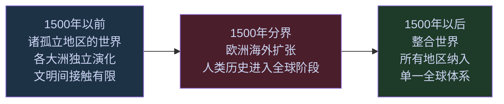
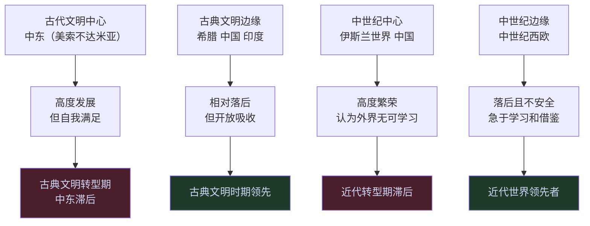
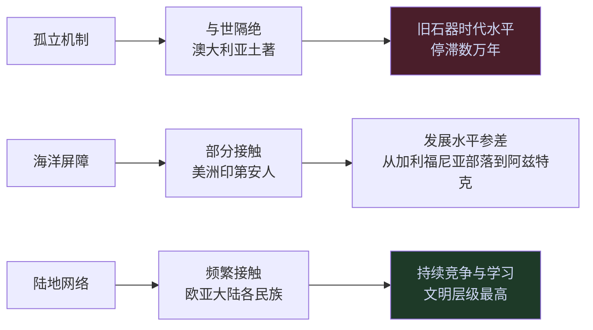
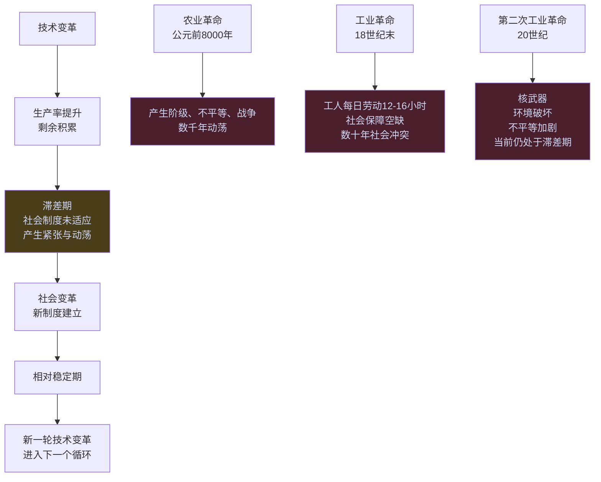
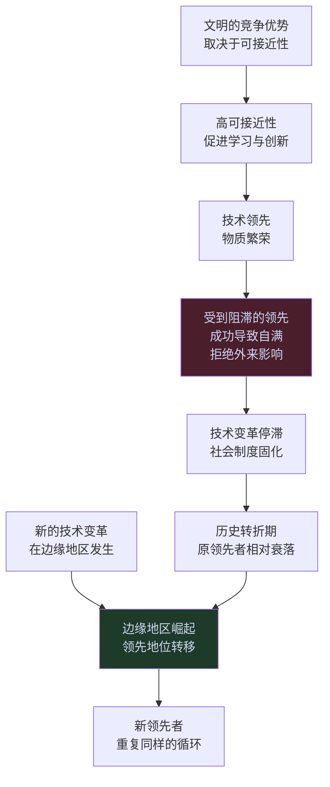

# 全球史观与文明演化

本词条提炼斯塔夫里阿诺斯（L. S. Stavrianos）在《全球通史》中建立的宏观历史分析框架。这套框架以"全球史观"为基本视角，拒绝西方中心论，试图从地理、技术与社会制度的互动关系中解释文明兴衰的规律。

---

## 全球史观的基本视角

斯塔夫里阿诺斯认为，19世纪以来占主流的历史叙事以"民族国家史"和"欧洲中心论"为底色，无法理解20世纪以后形成的真正全球性世界。全球史观的核心主张是：

- 以整个人类为研究单位，而非单一民族或文明
- 承认各文明在各自历史阶段的平等地位
- 拒绝"文明进步"的线性叙事，承认历史路径的多元性
- 以文明间的交互关系（而非单一文明的内部逻辑）作为解释历史变迁的主要变量

斯塔夫里阿诺斯将全部人类历史分为两大阶段，以1500年为分界：

这一划分打破了传统的"古代-中世纪-近代"三分法。斯塔夫里阿诺斯认为，"中世纪"是一个具有欧洲地方性的概念，无法适用于描述全球历史的阶段。

---

## 论断一：1500年分界线

1500年是人类历史上唯一真正的全球性断裂点。

1500年以前，尽管欧亚大陆内部（经由丝绸之路、海上贸易）存在一定联系，但美洲、澳大利亚、撒哈拉沙漠以南非洲等地区与欧亚大陆几乎完全隔绝，各自在与世隔绝的状态中独立演化。

1500年以后，西欧人利用帆船与航海技术，将过去相互孤立的各大陆整合进一个相互依存的全球体系。这一整合过程不仅是商业和政治的，也是生态的（物种交换）和文化的（思想传播）。

斯塔夫里阿诺斯指出，这一转变并非欧洲人的"文明优越性"所致，而是源于西欧在特定历史时刻恰好处于多重有利条件的交汇处：宗教战争的余温、商业激励、相对落后带来的开放性，以及从伊斯兰与中国借用后再创新的多项技术。

---

## 论断二：受到阻滞的领先

斯塔夫里阿诺斯将这一规律称为"受到阻滞的领先"（Retardation of the Advanced），核心表述是：

**在历史的重大转折期，领先的文明反而最难适应变化；落后的边缘地区，由于包袱更轻、压力更大，反而更容易突破。**

历史案例：

- 公元前3500年至前1000年，中东是古代文明的中心；在向古典文明的转型期，中东反而滞后，而处于边缘的希腊、印度、中国成为古典文明的主导者。
- 公元500年至1500年，中国和伊斯兰世界是高度发达的文明中心；在向近代的转型期，它们因自我满足而不适应，落后于当时相对贫弱的西欧。

斯塔夫里阿诺斯引用中国案例时写道，中国人认为从"长鼻子野蛮人"身上不可能学到什么重要东西；而奥斯曼帝国的学者舍勒比则在17世纪明确警告：正是因为"基督教异教徒"学会了利用地理知识，他们才发现了新大陆，土耳其人必须打破对外来知识的封闭。

这一法则在今天同样适用：组织成功越大，路径依赖越深，转型代价越高。

---

## 论断三：可及性原则

斯塔夫里阿诺斯引用人类学家弗朗兹·博厄斯的研究，提出了理解文明发展差异的核心变量：**可接近性（Accessibility）** 。

> "一个社会群体，其文化的进步往往取决于它是否有机会吸取邻近社会群体的经验……大体上，文化最原始的部落也就是那些长期与世隔绝的部落。"

可接近性的作用机制有两个方面：
1. **正向机制** ：接触越多，可借鉴的经验越多，技术和制度创新的速度越快。
2. **压力机制** ：接触意味着竞争，如果不能适应和学习，就会面临被同化或消灭的威胁，这种压力本身驱动变革。

以此框架，斯塔夫里阿诺斯解释了为何1500年时欧洲探险者发现的世界呈现出如此巨大的文化差异：澳大利亚土著处于旧石器时代，美洲印第安人处于不同发展阶段，而欧亚大陆各文明则高度发展。这一差异不反映基因差异，而反映地理隔绝程度的差异。

斯塔夫里阿诺斯还举出反例：西塞罗曾在公元前1世纪评价英国人"非常愚蠢"，无法成为雅典人家庭的一员；11世纪西班牙的一位穆斯林评价比利牛斯山以北的民族"缺乏灵敏的头脑"——而这些"愚蠢"的北欧人，正是后来引领近代文明的民族。他们在古典时期之所以落后，与1500年后美洲印第安人落后的原因完全相同：地理隔绝导致的文化接触不足。

---

## 论断四：技术变革先于社会变革

这是贯穿全书的核心焦虑，也是斯塔夫里阿诺斯对人类现代危机的核心诊断。

**历史的重复性规律是：技术变革总是先行，社会变革总是滞后，这一滞差期是人类历史上最动荡的时期。**

斯塔夫里阿诺斯认为，20世纪的两次世界大战、核武器威胁、全球不平等加剧，都是第二次工业革命引发的技术-社会滞差期的表现。2.8万件核武器被制造出来，但管理这种力量的国际制度还没跟上。

全书结尾，他以弗朗西斯·培根和爱因斯坦的话作为落脚点：科学的目的应该是"生命的利益和效用"，科学成果应该"造福人类，而不致成为祸害"——这是对"技术-社会滞差"问题的伦理回应。

---

## 论断五：西方的悖论

斯塔夫里阿诺斯的最后一个重要论断，是对"西方衰落"命题的重新诠释：

**20世纪，西方政治霸权确实在衰退；但这一衰退过程恰恰伴随着西方现代性的全球胜利。西方政治帝国倒塌了，但西方科学革命、工业革命和政治革命的遗产，通过反抗西方的各种运动得到了全球传播。**

每一场反对西方殖民主义的独立运动，使用的思想工具都是民族主义、自决权、社会主义或自由民主——这些概念全部起源于欧洲。土耳其凯末尔彻底改造旧帝国的方式，是采用欧洲的世俗化、法典化和政教分离原则。中国的共产主义革命，使用的是欧洲马克思主义的语言框架。

斯塔夫里阿诺斯将这一现象描述为"欧洲三大革命的全球传播"：
- 科学革命：创造了理解和操控自然的方法
- 工业革命：提供了空前的物质生产能力
- 政治革命（英国革命、美国革命、法国革命）：确立了民族国家、个人权利和政治参与的观念

---

## 文明兴衰的综合模型

将上述五个论断整合，可以得出斯塔夫里阿诺斯的文明兴衰综合模型：

这一模型解释了为什么历史上的文明领先地位会周期性转移：中东 → 希腊/印度/中国 → 伊斯兰世界/中国 → 西欧 → （当前）。每一次转移，都符合"受到阻滞的领先"和"可接近性原则"的双重逻辑。

---

## 全球史观的方法论意义

斯塔夫里阿诺斯的全球史观有几个具体的方法论含义：

**拒绝单一视角的历史叙事** 。传统历史书写倾向于从"成功者"的视角叙述，但失败者的路径同样包含重要信息。理解伊斯兰帝国为何在巅峰期停止扩张，与理解西欧为何在边缘期开始扩张，同等重要。

**关注文明间的交互，而非文明内部的逻辑** 。印度佛教传入中国，阿拉伯数字从印度传入欧洲，中国的活字印刷术传入欧洲后触发的思想革命——这些跨文明传播事件的历史意义，往往超过文明内部的政治事件。

**时间尺度的放大** 。把中国近代落后的起点放在1840年，就会把问题归因于清朝的偶发性腐败。把时间尺度放大到1500年，就会看到这是一个结构性的长期趋势，需要结构性的解释。

---

## 相关词条

- [[全球通史]] — 这一框架的来源书籍，包含更多具体历史案例
- [[历史与文明]] — 王兴对相关历史问题的观察（郑和与哥伦布的对比等）
- 文明兴衰规律 — 从多部历史著作提炼的文明兴衰机制对比
