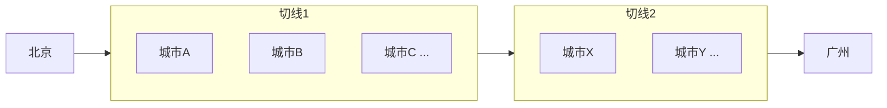

# 动态规划

动态规划（Dynamic Programming，简称 DP）是一种算法思想：**将一个复杂的最优化问题，分解为若干相互重叠的子问题，通过求解子问题的最优解，推导出全局最优解。** "规划"一词在数学上的含义是"优化"，与编程无关。

最直观的应用：导航系统的最短路径规划，以及拼音输入法的汉字选择——两件看似毫无关系的事，背后是完全相同的数学模型。

---

## 核心原理：最优子结构

**最短路径的最优子结构性质：** 若北京→广州的最短路径经过郑州，则北京→郑州这段，必然也是北京→郑州所有路径中最短的。

**证明（反证法）：** 假设存在北京→郑州更短的路径，用它替换原来那段，就能得到北京→广州更短的全程路径——这与"原路径已是最短"矛盾。

这个性质使得我们可以从局部最优推出全局最优。

---

## 导航系统：最短路径问题

**暴力穷举的复杂度：** 中国城市数量 N 个，所有可能路径数约为 N! 级别——每增加一个城市，复杂度翻倍，计算机也无法承受。

**动态规划的方法：** 在地图上横切一刀，确保任何北京→广州的路径都会经过这条切线上的某个城市。先找出北京到切线上所有城市的最短路径，然后将切线向广州推移，重复这个过程：



**复杂度对比（每条切线平均 10 个城市，全程 15 段）：**

| 方法 | 计算量 |
|------|--------|
| 穷举所有路径 | 10¹⁵（千万亿次）|
| 动态规划 | 10 × 10 × 15 = 1500 次 |

相差约万亿倍。

---

## 拼音输入法：相同的数学

将拼音转汉字看作一个图：每个拼音对应多个候选汉字，相邻汉字间的边权重 = 两词共现的语言模型概率（取对数后变为距离）。

输入"wo ai zhong guo"，图中可能有：

```
我/喔/窝  →  爱/埃  →  中/钟/众  →  国/郭/果
```

寻找"最合理的句子" = 在这张图中寻找"最短路径"（概率最大的路径）。算法同样是动态规划。

**同一数学模型的两个应用：**

- 导航：最小化物理距离或时间
- 输入法：最大化语言模型概率（等价于最小化负对数概率）

---

## 维特比算法

动态规划在 HMM（隐含马尔可夫模型）中的具体实现，称为**维特比算法** （Viterbi Algorithm）。

维特比算法用于：语音识别（从声学观测序列找最可能的词序列）、中文分词（从字序列找最可能的词序列）、词性标注。

三个经典算法中，维特比算法是应用最广的数字通信算法之一（另一个是 IBM 的 BCJR 算法）。

---

## 与贪心算法的区别

**贪心算法** 每一步都选局部最优，不回头。在最短路径中，贪心可能陷入局部最优：先走一步近路，结果后续全是远路。

**动态规划** 系统地考虑所有子问题，通过递推保证全局最优。代价是需要存储中间结果（空间换时间）。

动态规划的本质是：**用对子问题的记忆（memoization），避免重复计算，将指数级复杂度降到多项式级。**

---

## 延伸

动态规划广泛应用于计算生物学（DNA 序列比对）、金融（期权定价）、机器翻译（束搜索近似动态规划）。吴军在《数学之美》中用导航和输入法这两个日常例子，揭示了"看似不同的问题背后数学模型完全相同"的数学之美。
