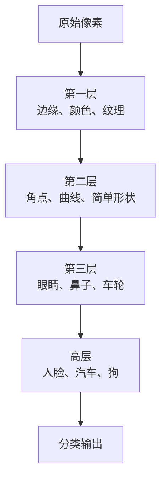
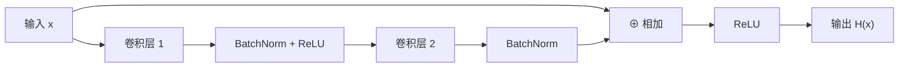
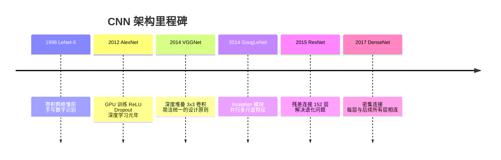

# 卷积神经网络

卷积神经网络（Convolutional Neural Network，CNN）是处理图像等网格结构数据的核心架构。它的发展历史是深度学习整个复兴叙事的缩影：从被忽视的学术理念，到 2012 年的惊天一击，再到影响整个人工智能产业的基础技术。

## 为什么需要专门的架构

处理图像不能简单地把像素展开成向量送入全连接网络。原因是：
- **维度爆炸**：200×200 的彩色图像有 120000 个像素值，全连接层参数量不可控
- **忽视空间结构**：相邻像素之间存在强相关性，展开后这种结构被破坏
- **缺乏平移不变性**：猫在图片左边还是右边，应该得到同样的识别结果

卷积层通过两个设计解决这些问题：**局部连接**（每个神经元只与输入的局部区域相连）和**权重共享**（同一个卷积核在整张图上复用，大幅减少参数量）。

## CNN 的层次化表征

CNN 的核心直觉是学习**层次化的特征**：

AlexNet 的第一层学到的特征抽取器，在可视化后看起来与人工设计的方向滤波器（SIFT、HOG）高度相似。这不是巧合——这些特征对于图像理解确实有价值，只是 CNN 能从数据中自动发现它们，并在更高层学到人类难以显式设计的抽象特征。

## 2012：ImageNet 与深度学习奇点

在 AlexNet 出现之前，计算机视觉领域的标准流程是：人工设计特征提取器（SIFT、SURF、HOG、词袋模型），然后用支持向量机等传统分类器。以 Yann LeCun、Geoffrey Hinton、Yoshua Bengio 为代表的少数研究者一直相信特征应该被学习，但长期不受主流重视。

**两个缺失要素**，在 2012 年前后同时就位：

**数据**：2009 年，斯坦福李飞飞团队发布 ImageNet 数据集——100 万张图像，1000 个类别。借助谷歌图像搜索预筛选和亚马逊 Mechanical Turk 众包标注，这个规模在此前无法想象。此前的研究通常在几百到几千张图片上进行。

**硬件**：GPU 的矩阵并行计算能力与卷积运算的需求高度匹配。NVIDIA GPU 拥有大约 100-1000 个小型处理单元，浮点性能比 CPU 高出 100 倍以上，内存带宽高出 10 倍。Alex Krizhevsky 意识到，卷积和矩阵乘法都可以在 GPU 上并行化，用两块 GTX 580 实现了可行的大规模训练。

2012 年 ImageNet 挑战赛，AlexNet 以悬殊优势夺冠，错误率从前一年的约 26% 降至 15.3%。这一结果震惊了整个计算机视觉界，标志着深度学习时代的开始。

## AlexNet 的关键设计决策

AlexNet 在 LeNet 的基础上做了几处关键改动：

**ReLU 取代 sigmoid**：sigmoid 函数在输出接近 0 或 1 时梯度接近零，导致反向传播无法有效更新参数。ReLU（Rectified Linear Unit）在正区间的梯度恒为 1，训练更稳定，也更容易初始化。这是让深层网络可训练的关键前提。

**Dropout 正则化**：对全连接层随机丢弃 50% 的神经元。强迫网络学习冗余表示，使任何单个神经元不能过度依赖特定的输入。

**数据增强**：对训练图像随机翻转、裁剪、变色。有效扩充了数据集，减少过拟合。

## ResNet：解决深度退化问题

理论上，更深的网络应该更强大——至少可以把后面的层初始化成恒等映射，得到与浅层网络等同的性能。但实践中，随着层数增加，训练误差反而上升，这被称为**退化问题（degradation problem）**。

2015 年，何恺明团队提出残差网络（ResNet），用一个简洁的思路解决了这个问题：

**残差思想**：不直接让网络学习 H(x)，而是学习残差 F(x) = H(x) - x。原始输入通过跳跃连接（skip connection）直接加到输出。当最优解接近恒等映射时，只需让 F(x) 趋近于零，比从头学习恒等映射容易得多。

这个设计允许训练 152 层甚至更深的网络，并在 ImageNet 2015 挑战赛上再次刷新记录。何恺明的论文《Deep Residual Learning for Image Recognition》是深度学习历史上引用最多的论文之一。

## 主要 CNN 架构演化

**DenseNet** 是 ResNet 的逻辑延伸。如果 ResNet 将 f(x) 分解为 x + g(x)，那么 DenseNet 将函数展开为更多项，把每一层的输出连接（concatenate）到后续所有层，最大化特征复用。

## 卷积的直觉

卷积核的本质是一个模板匹配器：在输入特征图的每个位置，计算局部区域与模板的相似程度（互相关运算）。一个学到水平边缘检测功能的卷积核，会在有水平边缘的位置产生高激活值。

多个卷积核并行作用，生成多个特征图（feature maps），每个特征图捕捉输入的一种特定模式。深层 CNN 就是通过逐层堆叠这种操作，从像素到语义逐级构建表征。

池化层（Pooling）在保留局部最重要的激活值的同时，减小特征图的空间维度，降低计算量，并引入一定的位移不变性。
