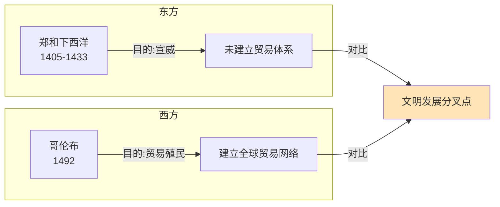

# 历史与文明

王兴对历史的兴趣是认知性的，而非感伤性的。他通过比较历史上不同文明、不同时代的选择与结果，寻找可以用于理解当下的规律。这一方法使他的历史帖文兼具信息密度和思辨深度。

*图：郑和与哥伦布的航行几乎同期，却走向了截然不同的历史轨迹*

## 郑和与哥伦布：航海动机的分岔

在王兴反复提及的历史对比中，郑和与哥伦布的航海是最有代表性的一个。他的核心观察是：郑和航海是亏钱的，哥伦布航海是赚钱的，"我越来越觉得这点差别很重要，虽然决定后来五百年世界格局的那段历史远比这复杂许多"（2014-01-23）。这一判断背后是他对制度激励与历史结果之间关系的关注。

他还注意到，郑和从泉州驶往东非的海上航线"早在汉朝就开拓出来了"，这一事实令他联想到文明规模游戏的复杂性（2016-05-06）。

## 中西发展路径的比较

王兴对中西方发展差距的看法不以1840年为起点。他在2012年写道："在国外越看博物馆越有这个感觉：咱们国家并不是到了1840年鸦片战争前后才落后。鸦片战争只是果，因是在之前五百年乃至一千年就种下了。我们早就在科学、艺术等各方面都落后了。"（2012-01-24）他对"四大文明古国"和"四大发明"的固执执念持批评态度，认为这与"总以为老子天下第一的韩国人一样可笑"。

他观察到一个时间线上的对照："美国开国总统华盛顿和中国自称'文治武功十全老人'的乾隆帝是同一年去世的（1799年），美国南北战争的结束和中国太平天国运动被镇压前后相差不过一年（1865年）。每次想到这里就心情复杂，差距咋就这么大呢。"（2012-04-16）

## 人类进化视角下的历史叙事

王兴偶尔将历史拉伸至进化论的时间尺度。他在2013年写道，从人类进化史的角度，"我们每个人都是loser的后代"——因为真正的"高富帅"猿人占据了森林，而被挤到边缘的"屌丝"们为了活下去，才被迫开始直立行走，从而进化出智人（2013-05-18）。这一解读虽戏谑，但揭示了他对人类文明起源于"生存压力驱动创新"这一逻辑的接受。

## 货币与金融的历史起源

王兴发现了一个他认为很重要的历史细节："我国古代并没有官方铸造的金币银币，这和西方文明不同。"（2013-06-19）这一差异在他看来影响深远，与中国金融市场后来的发展路径有关。

他对1971年布雷顿森林体系终结有清晰的认识："人类社会就整体进入了一个前所未有的阶段：货币量失去物理限制了。印钱，一言不合就印钱。印了四十几年了，我认为没有人真的很有把握这条路应该怎么走下去，包括各国政要和各类学霸。"（2016-06-30）

## 科举制度的历史地位

王兴在2016年写道，他越来越理解为什么"在人类文明历史上科举是一个伟大而重要的发明"，并认为《影响人类历史进程的100名人排行榜》将隋文帝列入是有道理的——他"在秦始皇之后重新统一了中国，而且发明了科举制度"（2016-11-15）。他的判断标准是科举对社会流动性和精英选拔机制的长期影响。

## 地缘政治与国家命运

王兴对地缘政治的关注始于读书，落地于旅行。他在看了弗里德曼《未来一百年》后，将土耳其列为旅游目的地，"有了一点感性认识"（2015-11-25）。他对近百年前土耳其凯末尔推动世俗化改革的理解，也是在看了近年中东乱局后才逐渐"体会到其伟大"。

他在游览俄罗斯后的历史感悟是：这个民族对人类文明贡献最令他难以忘怀的是"俄罗斯方块"（2014-10-09），其中带着对俄罗斯文明输出方式的调侃。

## 历史中的人物命运

王兴对历史中个人命运的观察带有悲悯意味。他为计算机启蒙老师林爱卿写道："她为我和其他很多同学开启了通向电脑之门，改变了我们的一生。"（2011-09-11）他在得知外祖父曾来过高雄时写下简短一句："我外祖父63年前来过这里。"（2011-10-04）他记录父亲讲述的家乡大松树在1958年大炼钢铁时被全部砍去的往事（2017-04-29），把历史的重量放在了具体的感官记忆里。

## 历史课本的局限

王兴对学校历史教育有明确的批评立场，但切入点不是意识形态，而是认知框架的缺失："我最近对以前在学校学的历史课更加不满了，倒不是因为意识形态，而是因为它没有跟我讲明白人类这一万来年的文明史是多么野蛮残酷，'亡国灭种'是多么常见。"（2013-05-12）这一批评指向历史教育的功能性缺陷：未能建立真实世界的感知，而只传递了筛选过的叙事。
