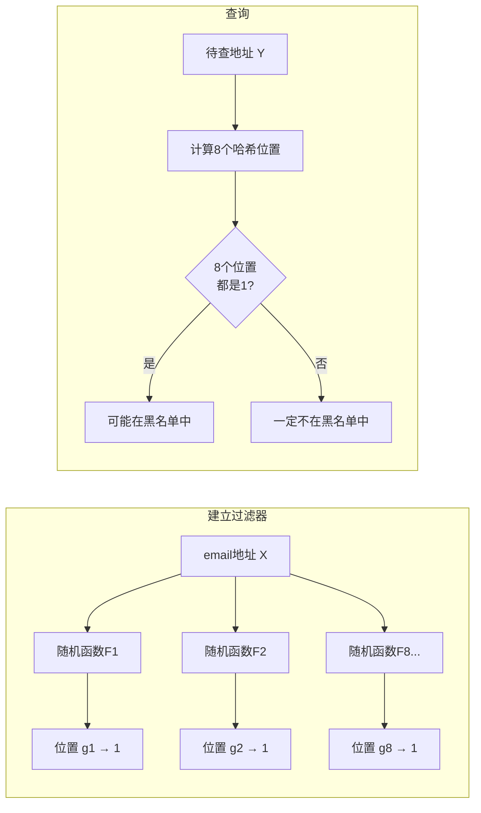

# 布隆过滤器

布隆过滤器（Bloom Filter）由巴顿·布隆（Burton Bloom）于 1970 年提出。用于解决一个极高频的工程问题：**判断某个元素是否属于一个大集合**。

核心权衡：**用极少的空间和极快的速度，换取极小概率的误判。**

---

## 问题背景

判断一个元素是否在集合中，最直接的方式是哈希表（Hash Table）：快速准确，但占用大量内存。

**实际规模：** Yahoo、Gmail 等邮件服务商需要过滤发垃圾邮件的地址。全球至少有几十亿个垃圾邮件发送地址（发送者不断注册新地址）。

用哈希表存储 1 亿个 email 地址 ≈ **1.6 GB 内存**（每个地址 8 字节指纹 + 哈希表 50% 效率 = 16 字节）。几十亿地址 → 上百 GB，普通服务器无法承受。

布隆过滤器的解决方案：只需哈希表 **1/8 到 1/4 的空间**。

---

## 工作原理

**建立过滤器（以 1 亿个 email 地址为例）：**

1. 建立一个 16 亿位（2 亿字节）的二进制向量，全部初始化为 0
2. 对每个 email 地址 X，用 8 个不同的随机函数（F₁…F₈）各生成一个哈希值，映射到 16 亿位中的 8 个位置
3. 将这 8 个位置全部置为 1

**查询（判断地址 Y 是否是垃圾地址）：**

用相同的 8 个函数计算 Y 的 8 个位置。若这 8 个位置**全部为 1**，则判定 Y 在黑名单；若有任何一个为 0，则 Y 一定不在黑名单。

---

## 关键性质

**不会漏报（No False Negatives）：** 真正在黑名单中的地址，8 个位置一定都是 1，绝不会被漏掉。

**可能误报（False Positives）：** 一个不在黑名单中的地址，可能碰巧对应的 8 个位置都被其他地址置为了 1，被误判为垃圾邮件。在上述 1 亿地址的例子中，误判率 < **万分之一**。

**不支持删除：** 无法从布隆过滤器中删除某个元素（将某个位置置 0 会影响其他共用该位置的元素）。

**补救方案：** 建立一个小的白名单，存储可能被误判的正常地址。

---

## 空间效率

| 方案 | 存储 1 亿地址需要的空间 |
|------|----------------------|
| 哈希表（直接存储）| 1.6 GB |
| 布隆过滤器（误判率 0.01%）| 约 200–400 MB |
| 节省比例 | 4–8 倍 |

信息指纹（Fingerprint）是布隆过滤器的基础工具：将任意长度的字符串映射为固定长度的随机整数（如 128 位），实现方式是伪随机数生成器（PRNG）。网络爬虫用信息指纹存储已访问网址，避免重复下载——存储 200 亿个网址，直接存需要 2TB 以上，用 128 位指纹只需约 300GB。

---

## 密码学延伸

信息指纹的不可逆性（无法从指纹推出原始信息），正是网络加密所需要的特性。常用标准：MD5（128 位）和 SHA1（160 位）。

SHA1 曾被认为无漏洞，后被中国数学家**王小云**证明存在碰撞攻击漏洞（即可以人为构造两段不同信息拥有相同指纹）。但这与黑客直接攻破用户账户是两回事，实际危害有限。

---

## 本质

布隆过滤器展示了**概率型数据结构**的设计哲学：在确定性（100% 准确）不可得、或代价过高时，用极小的误判率换取数量级的资源节省。这种"以极小误差换取极大效率"的思维，在工程设计中广泛适用。
