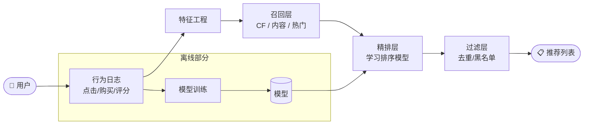
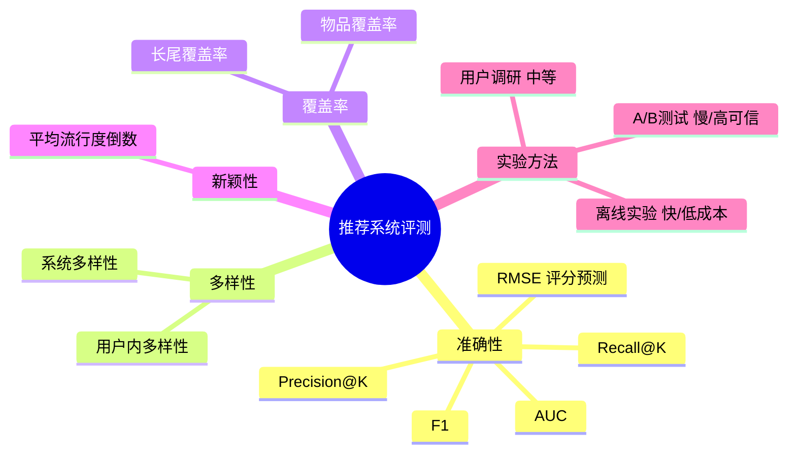

# 推荐系统概论

推荐系统是解决信息过载问题的核心工具，它通过分析用户的历史行为和兴趣，主动将用户可能感兴趣的物品呈现给用户，从而联系信息消费者与信息生产者，实现双赢。


*图：协同过滤基本原理——用户A与用户C偏好相似，将C喜欢但A未看过的物品推荐给A*

## 推荐系统整体架构



## 什么是推荐系统

### 基本定义

推荐系统是一种自动联系用户和物品的工具。它能够在信息过载的环境中帮助用户发现令他们感兴趣的信息，也能将信息推送给对它感兴趣的用户。

### 与搜索引擎的区别

搜索引擎和推荐系统都是解决信息过载的方案，但两者定位互补：

| 维度 | 搜索引擎 | 推荐系统 |
|------|----------|----------|
| 需求明确性 | 用户有明确需求，主动输入关键词 | 用户需求模糊，系统主动推送 |
| 启动方式 | 用户主动查找 | 系统被动推荐 |
| 典型场景 | 知道想找什么 | 不知道想看什么 |
| 代表公司 | 谷歌 | 亚马逊、Netflix |

搜索引擎满足用户有明确目的时的主动查找需求；推荐系统则在用户没有明确目的时帮助他们发现感兴趣的内容。两者对用户来说是互补的工具。

### 长尾效应

推荐系统的重要价值在于发掘物品的**长尾** （Long Tail）。传统的热门排行榜只推荐热门物品，而推荐系统通过深入挖掘用户的个性化需求，可以将长尾商品精准地推荐给需要它的用户，帮助商家发现那些被埋没在长尾中的好商品的价值。

推荐算法的三种基本范式：
- **社会化推荐** （Social Recommendation）：好友推荐
- **基于内容的推荐** （Content-based Filtering）：推荐与用户历史喜好内容相似的物品
- **协同过滤** （Collaborative Filtering）：推荐与用户兴趣相似的一群用户喜欢的物品

## 个性化推荐的主要应用场景

### 电子商务

亚马逊被称为"推荐系统之王"。其推荐系统在各类产品中的主要应用包括：
- **个性化商品推荐列表** ：基于物品的协同过滤（item-based method），给用户推荐与其之前喜欢的物品相似的商品
- **相关推荐列表** （"Customers Who Bought This Item Also Bought"）：展示购买同一商品用户的共同购买行为
- **打包销售** （Cross Selling）：推荐协同购买的商品组合并提供折扣

亚马逊的推荐系统贡献了约 20%～35% 的销售额。

### 视频与电影网站

Netflix 在 2006 年启动著名的 **Netflix Prize** 比赛，悬赏 100 万美元提升推荐算法精度 10%，极大地推动了推荐系统研究的发展。其数据集包含 40 万用户对 2 万部电影的上亿条评分记录。Netflix 宣称有 60% 的用户通过推荐系统找到感兴趣的内容。

YouTube 的实验表明，个性化推荐的点击率是热门视频列表的两倍。

### 个性化音乐

Pandora 是个性化音乐推荐的代表。音乐作为多媒体内容难以直接分析语义，因此引入 UGC 标签系统和用户行为数据来构建兴趣模型。个性化音乐推荐需要满足两个前提条件：存在信息过载，且用户大部分时候没有特别明确的需求。

### 社交网络

Facebook 的好友推荐使用社交图谱（Social Graph），亚马逊也利用 Facebook 好友关系给用户推荐商品。社会化推荐的优势是可以增加推荐的信任度：尼尔森调查显示 90% 的用户相信朋友的推荐。

### 个性化广告

个性化广告是推荐系统商业价值最高的领域之一。通过分析用户的浏览行为和兴趣构建用户画像，将广告精准投放给目标用户群，显著提高广告转化率。

## 推荐系统的评测体系

推荐系统评测有三种实验方法，实际部署一个新算法需要依次完成这三个步骤。

### 三种实验方法

**1. 离线实验（Offline Experiment）**

从日志系统获取用户行为数据，划分训练集和测试集，在训练集上训练模型并在测试集上评测。

```
优点：不需要用户参与，速度快，可大量测试算法
缺点：无法获取点击率、转化率等商业指标；离线指标与商业指标存在差距
```

典型离线实验设计（以协同过滤为例）：
```python
def SplitData(data, M, k, seed):
    test = []
    train = []
    random.seed(seed)
    for user, item in data:
        if random.randint(0, M) == k:
            test.append([user, item])
        else:
            train.append([user, item])
    return train, test
# 进行 M 次实验，每次选不同的 k，取平均值作为最终指标
```

**2. 用户调查（User Study）**

让真实用户在测试系统上完成任务，观察行为并回收问卷。

```
优点：可获取用户主观感受指标（满意度、惊喜度等），风险低
缺点：成本高，难以大规模进行，测试环境与真实环境存在差异
```

**3. 在线实验（AB Testing）**

将用户随机分组，对不同组采用不同算法，统计真实在线指标（点击率、转化率等）。

```
优点：直接获取真实商业指标
缺点：周期长；需要复杂的流量分配系统保证不同层之间正交
```

### 三种实验方法对比

| 实验方法 | 成本 | 周期 | 可信度 | 主要局限 |
|---------|------|------|--------|---------|
| 离线实验 | 低 🟢 | 小时级 🟢 | 中 🟡 | 无法反映真实用户行为变化 |
| 用户调研 | 中 🟡 | 天级 🟡 | 中 🟡 | 样本偏差，用户行为不真实 |
| 在线A/B测试 | 高 🔴 | 周级 🔴 | 高 🟢 | 需要流量，有线上风险 |

### 核心评测指标

**准确率（Precision）与召回率（Recall）**

令 R(u) 为推荐列表，T(u) 为测试集中用户实际喜欢的物品集合：

```
Recall  = Σ|R(u) ∩ T(u)| / Σ|T(u)|
Precision = Σ|R(u) ∩ T(u)| / Σ|R(u)|
```

```python
def PrecisionRecall(test, N):
    hit = 0
    n_recall = 0
    n_precision = 0
    for user, items in test.items():
        rank = Recommend(user, N)
        hit += len(rank & items)
        n_recall += len(items)
        n_precision += N
    return [hit / (1.0 * n_recall), hit / (1.0 * n_precision)]
```

**覆盖率（Coverage）**

描述推荐系统对长尾物品的发掘能力，定义为推荐系统能推荐出的物品占总物品的比例：

```
Coverage = |∪ R(u)| / |I|
```

更精细的覆盖率可用信息熵或基尼系数度量，用以评测推荐系统是否具有马太效应（强者更强、弱者更弱）。

**多样性（Diversity）**

推荐列表中物品之间的不相似程度，通常用物品特征向量之间的平均余弦距离来度量。

**新颖性（Novelty）**

推荐结果是否包含用户不熟悉的物品。可通过推荐列表中物品的平均流行度来度量——流行度越低，新颖性越高：

```python
def Popularity(train, test, N):
    # 用对数流行度的平均值度量；值越低代表推荐越新颖
    ret += math.log(1 + item_popularity[item])
```

**用户满意度（User Satisfaction）**

最重要但无法离线计算的指标，只能通过用户调查问卷或在线实验（点击率、停留时间、转化率）获取。

**评分预测精度：RMSE 与 MAE**

专门用于评测评分预测任务（见 [[评分预测与模型融合]]）：

```python
def RMSE(records):  # records[i] = [u, i, rui, pui]
    return math.sqrt(
        sum([(rui - pui)** 2 for u, i, rui, pui in records])
        / float(len(records)))
```

RMSE 对预测偏差的惩罚更严格（平方项），Netflix Prize 主要采用 RMSE 作为评测指标。

## 推荐系统评测体系总览



## 推荐系统的整体架构

### 数据层

- **显性反馈** （Explicit Feedback）：用户明确表示喜好，如评分、点赞
- **隐性反馈** （Implicit Feedback）：用户行为数据，如浏览、购买、停留时长

| 特征 | 显性反馈 | 隐性反馈 |
|------|----------|----------|
| 兴趣表达 | 明确 | 不明确 |
| 数量 | 较少 | 庞大 |
| 正负反馈 | 都有 | 只有正反馈 |

### 算法层

推荐系统由多个**推荐引擎** 组成，每个引擎负责一类特征和一种推荐策略：

1. **特征生成模块** ：从用户行为中提取特征向量（行为种类、时间、频次、物品热门度）
2. **特征-物品相关推荐模块** ：根据特征向量查离线相关表，生成候选物品列表
3. **过滤与排序模块** ：过滤已消费物品、对候选集重排序，生成最终推荐列表

推荐引擎支持的三种联系用户和物品的方式：
- 通过用户喜欢的物品（ItemCF 思想）
- 通过兴趣相似的用户（UserCF 思想）
- 通过物品内容属性或用户注册信息

### 工程层

- 大规模离线行为数据存储在分布式文件系统（如 HDFS）
- 需要实时存取的行为存储在数据库和缓存中
- 离线计算的相关表通过 MySQL 存储，在线服务加载到内存

详细算法原理见 [[协同过滤算法]]，工程实践细节见 [[推荐系统工程实践]]。
