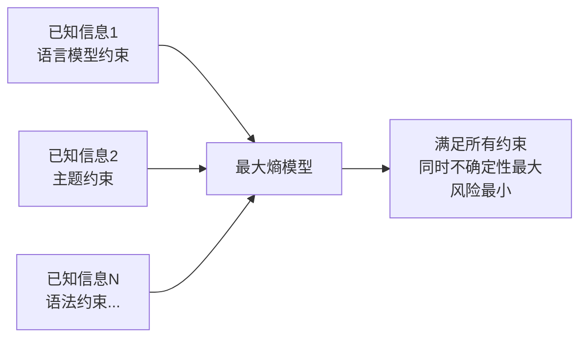

# 最大熵原理

最大熵原理（Maximum Entropy Principle）的表述：**在满足所有已知约束的前提下，选择熵最大（不确定性最大）的概率分布作为预测。** 即：对未知的部分不做任何主观假设，把风险降到最小。

日常版本：**不要把所有的鸡蛋放在一个篮子里。**

---

## 核心直觉：不做主观假设

吴军在 AT&T 实验室讲最大熵时用过一个色子实验：

> 对一个一无所知的普通色子，每面朝上的概率是多少？

所有人回答：等概率，各 1/6。理由：在完全不知道的情况下，这是风险最小的猜测——不主观假设它像韦小宝的色子一样灌了铅。

> 告知：这个色子的四点朝上概率是 1/3。其余各面的概率是多少？

直觉答案：除四点（1/3）之外，其余五面各取 2/15（等份剩余概率）。

两次猜测都没有添加任何主观假设——而这两个答案，恰好符合最大熵原理的精确数学解。

---

## 数学定义

给定约束条件（已知信息），在满足这些约束的所有概率分布中，选择信息熵最大的那个：

```
最大化 H(p) = -Σ p(x) · log p(x)
满足：Σ p(x) · fi(x) = ci  （已知约束）
     Σ p(x) = 1
```

匈牙利数学家希萨（Csiszar）证明：对于任何一组不自相矛盾的约束，最大熵模型**不仅存在，而且唯一** ，形式均为**指数函数**。

---

## 在 NLP 中的应用

拼音"wang-xiao-bo"转汉字，可能是"王小波"（作家）或"王晓波"（台湾学者）。仅靠语言模型无法确定，需要综合两类信息：

1. **语言模型信息** ：前后词的搭配概率
2. **主题信息** ：全文是讨论文学还是两岸关系

最大熵模型能同时满足这两个约束，无需主观决定哪种信息权重更高：



在实际应用中，Google 机器翻译、词性标注、句法分析均用到最大熵模型。

---

## 训练算法的演进

最大熵模型的**形式最美，训练最难**。

| 算法 | 提出者 | 特点 |
|------|--------|------|
| GIS（通用迭代算法）| Darroch & Ratcliff（1970s）| 原始算法，不稳定，速度慢 |
| IIS（改进迭代算法）| 达拉皮垂兄弟，IBM（1980s）| 速度提升 1–2 个数量级，才使最大熵实用 |
| 吴军快速算法 | 吴军，博士论文 | 在 IIS 基础上再缩短 2 个数量级 |

吴军在黑板上推导一小时，导师验证两天，确认算法正确。即便如此，训练一个完整的语言模型，仍需并行使用 20 台最快的 SUN 工作站，运行三个月。

> 世界上能有效实现这些算法的人，也不到一百人。

---

## 从 NLP 到金融

IBM 的达拉皮垂（Della Pietra）孪生兄弟在贾里尼克离开 IBM 后，离开学术界加入**文艺复兴技术公司** （Renaissance Technologies），用最大熵等数学工具做股票预测。

股票涨跌有几十甚至上百个影响因素——最大熵模型恰好能找到同时满足成千上万种约束的分布，不对未知因素做主观假设。

文艺复兴旗舰基金 1988 年至写作时，年均净回报率 **34%** ；同期巴菲特的伯克希尔哈撒韦总回报约 16 倍。

---

## 与其他方法的对比

最大熵原理被称为"信息处理中的椭圆模型"——形式最简单、理论最完美，但实现最复杂。它是统计学中的最优解，其他近似方法都是"小圆套大圆"的补丁。

朴素贝叶斯模型是最大熵模型的特例（假设特征条件独立时两者等价）；隐含马尔可夫模型、贝叶斯网络与最大熵也有紧密数学联系。
