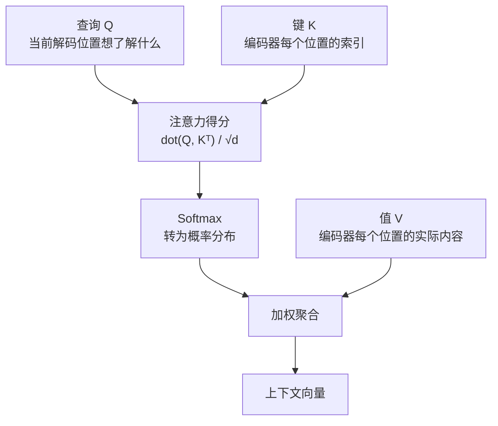
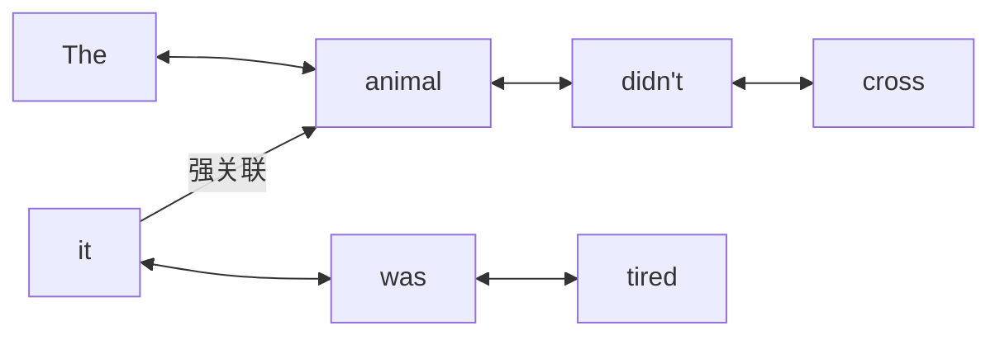
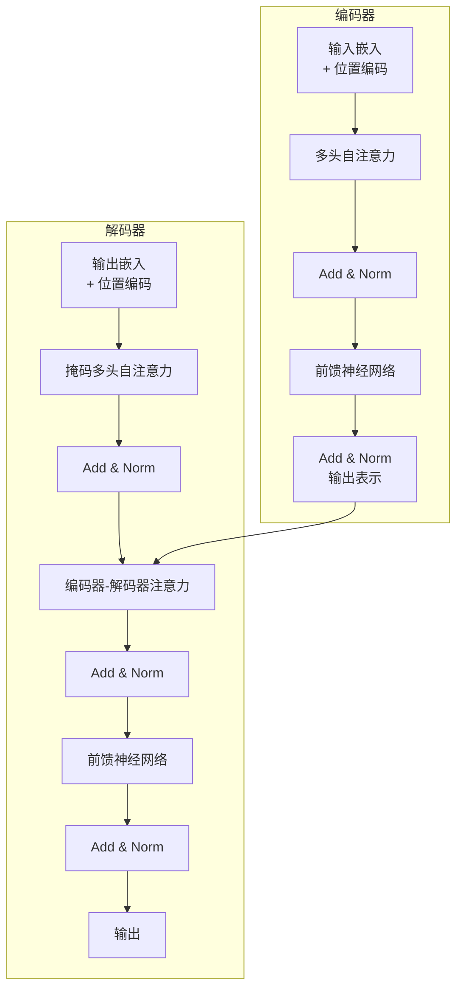
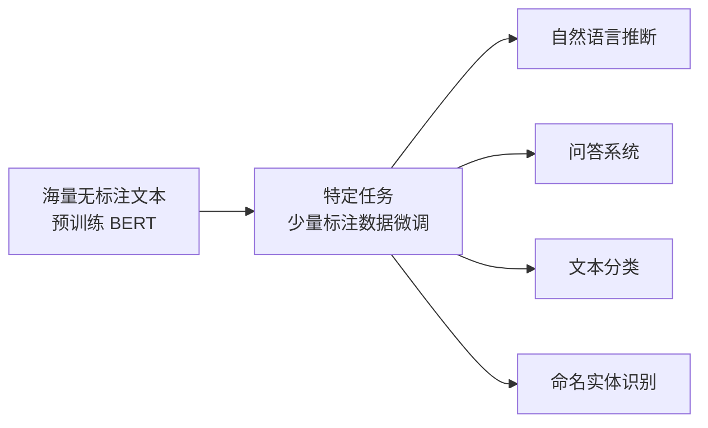

# 注意力机制与Transformer

注意力机制（Attention Mechanism）和 Transformer 架构是过去十年深度学习最重要的技术进展之一。它们彻底改变了自然语言处理，并扩展到视觉、语音、强化学习等几乎所有领域。GPT 系列和 BERT 都建立在 Transformer 之上。

## 问题的根源：信息瓶颈

循环神经网络（RNN）的机器翻译流程是这样工作的：编码器逐步读入源语言句子，最终将所有信息压缩进单一的固定维度隐状态向量；解码器从这个向量开始，逐词生成译文。

这个设计有一个致命弱点：句子越长，越早的词越容易被遗忘。将"她去了那家她上周五和最好的朋友一起去过的咖啡店"这句话压缩进一个 256 维向量，再要求解码器精确还原每个细节，是过于苛刻的要求。

## 注意力机制的直觉

**生物学类比** ：人类阅读时，眼睛不会以固定精度扫描整页文字，而是在重要的地方聚焦，忽略不相关的部分。注意力机制给模型赋予了类似的能力。

**注意力的解法** ：不把所有信息压进一个向量，而是让解码器在每一步翻译时，直接访问编码器输出的所有位置，按相关性加权聚合信息。

## Query-Key-Value 框架

注意力机制的精确定义通过 Query、Key、Value 三元组来表达：



类比：
- **Query** = 搜索引擎的搜索词（我想要什么）
- **Key** = 文档的索引词（这里有什么）
- **Value** = 文档的实际内容（具体是什么）

点积注意力计算 Q 与每个 K 的相似度，除以维度的平方根（防止内积值过大导致梯度消失），经 Softmax 归一化后得到权重，再对 V 加权求和。

## 自注意力：词语直接对话

上述机制用于编码器-解码器之间的跨序列注意力。自注意力（Self-Attention）将同样的机制用于序列内部：Q、K、V 全部来自同一个序列。

**直觉** ："The animal didn't cross the street because **it** was too tired." 中，"it" 指代 "animal" 还是 "street"？自注意力让"it"直接与序列中所有词交互，学习到"it"和"animal"之间的强关联。



自注意力的关键优势：任意两个位置之间只需一步计算（路径长度为 O(1)），而 RNN 中相距 n 步的两个词需要信息传递 n 次。这使得长距离依赖的捕捉容易得多。

## Transformer 架构

2017 年，Vaswani 等人发表论文《Attention Is All You Need》，提出完全基于自注意力的 Transformer，彻底抛弃了卷积和循环结构。



**多头注意力（Multi-Head Attention）** ：并行运行多组 Q/K/V 投影，让模型同时从不同角度关注序列。有的头关注语法关系，有的关注语义关系，最终拼接输出。

**位置编码（Positional Encoding）** ：自注意力本身对位置无感——打乱词序不影响计算。因此需要显式注入位置信息。Transformer 使用正弦和余弦函数编码位置，不同频率对应不同维度，同时编码了绝对位置信息和相对位置信息（任意固定偏移量 δ 都可以通过线性变换从当前位置得到）。

**残差连接 + 层归一化** ：每个子层之后都用 Add & Norm 包裹，继承了 ResNet 的设计，使梯度更容易流动，训练更稳定。层归一化（Layer Norm）对每个样本的特征维度归一化，比批归一化（Batch Norm）更适合变长序列。

## RNN vs CNN vs 自注意力

| | 顺序操作 | 最大路径长度 | 计算复杂度（序列长n） |
|---|---|---|---|
| RNN | O(n) | O(n) | O(n × d²) |
| CNN | O(n/k) | O(log n) | O(k × n × d²) |
| 自注意力 | O(1) | O(1) | O(n² × d) |

自注意力的最大路径长度最短（任意两个词直接相连），且天然支持并行计算。代价是 O(n²) 的计算复杂度——对很长的序列代价高昂，这也是后续许多工作（Longformer、FlashAttention）的优化目标。

## NLP 预训练：从词向量到 BERT

### 第一代：静态词嵌入

Word2Vec（2013）用自监督学习解决了独热向量无法表达语义相似性的问题：
- **Skip-gram** ：给定中心词，预测周围上下文词（"loves" → 预测 "the", "man", "his", "son"）
- **CBOW** ：给定上下文词，预测中心词（反向）

训练后，语义相似的词在向量空间中距离相近，并呈现类比关系：
```
king - man + woman ≈ queen
```

静态词嵌入的根本局限：同一个词无论上下文如何都是同一个向量。"bank"在"存钱去银行"和"坐在河岸上"中完全相同。

### 第二代：上下文感知表示

**BERT（2018）** 将双向 Transformer 编码器与大规模无监督预训练结合，成为 NLP 的里程碑：

两个预训练任务：
1. **掩蔽语言模型（MLM）** ：随机遮盖 15% 的词元（[MASK]），让模型预测被遮盖的词。迫使模型理解双向上下文
2. **下一句预测（NSP）** ：输入两个句子，判断它们在原文中是否相邻。捕获句子间关系

BERT 的使用范式：大规模无标注语料上预训练 → 特定任务的少量标注数据微调（fine-tuning）。这种"预训练-微调"范式极大降低了 NLP 任务的数据需求。



## Transformer 的影响

Transformer 最初为机器翻译设计，很快扩展到几乎所有领域：
- **视觉** ：Vision Transformer（ViT）把图像分成 patch，像词一样用 Transformer 处理
- **语言大模型** ：GPT 系列（仅解码器），BERT 系列（仅编码器），T5、BART（编解码器）
- **多模态** ：CLIP、DALL-E、GPT-4V 等把文本和图像统一处理

注意力机制的本质贡献是：**打破了信息必须逐步流经序列的限制** ，让模型能够直接建立任意距离的关联，为处理长序列、捕获复杂结构关系提供了强大工具。

> "没有循环，没有卷积，只有注意力。" ——《Attention Is All You Need》（Vaswani et al., 2017）
