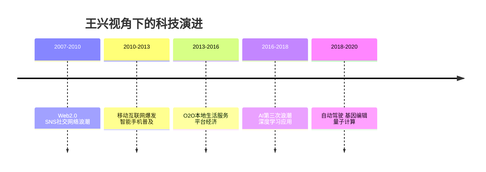

# 科技与互联网

王兴对科技和互联网的观察横跨2007年至2018年，从早期博客时代的SNS热潮，到智能手机的普及，到平台竞争的终局，再到人工智能的兴起。他的判断兼具从业者的内行视角和历史感，常在具体产品事件中发现更大的结构性规律。

## 早期互联网观察（2007-2009）

王兴最早的互联网评论集中于SNS和Web 2.0领域。2007年，他观察到大量人打算复制Facebook，但判断这批项目多数无法成立。他对当时各大平台的理解是结构性的，而非功能性的：他引用科斯的交易成本理论分析IT技术带来的社会变化，认为"最近几十年IT技术给社会带来的很多变化都可以用他的理论来分析"（2009-02-19）。

他对海外云计算服务的看法带有历史感："每次看到amazon的云计算服务推出新功能……我的心就一沉，那种感觉就像清朝末年一个留着辫子的中国人走出国门，看到人家的蒸汽机、火车、轮船。在这种革命性的科技方面，我们总是落后，而且落后很多。"（2009-03-19）

## 苹果生态的观察

苹果是王兴观察最多的科技公司之一。他对苹果的品牌战略，观察到"Think Different"是对IBM"Think"口号的针锋相对（2010-12-07）；他认为苹果的产品优势在于"软硬件结合"（2010-12-12）；他对2011年iOS设备销量超过过去28年Mac总和感到震撼（2012-02-17），视之为移动互联网"来势之迅猛"的铁证。

他对苹果的批评也同样直接：iTunes同步操作"非常不直观"；apple watch命名不符合苹果历史惯例，"完全不符合苹果以往的产品命名方式，是不利于打造品牌的"（2015-06-12）；苹果在云存储定价上"完全没有量大打折的概念"（2014-04-03）。

他与苹果联合创始人史蒂夫·沃兹尼亚克见面后发了一条帖文（2014-01-11），只记录了见面这个事实，留下空白。

## 微软的衰落与新生

王兴对微软的态度在2007年到2014年经历了从观察者到批评者的转变。他早期引用"Think Different vs. Think"的品牌对立时，语气中性；但在智能手机时代，他对微软的批评越来越直接："微软就是渣。刚才和美国的一个朋友通话，先是用skype，又不清楚又卡，基本无法沟通。换成facetime之后，声音清楚流畅，连视频都95%是流畅的。"（2014-05-07）

他认为微软的问题在于XP的历史延续性，"xp至今还是我用得最多的windows版本。这就是微软的问题之所在了吧"（2011-06-02），但对微软新CEO纳德拉提出的"A cloud for everyone, on every device"口号给予了正面评价（2014-04-14）。

## 谷歌的地图与搜索

谷歌地图是王兴使用最多、评价最多的产品之一。他既赞扬谷歌地图的便利性（把地址免费发到手机上的功能），也不吝批评其地图数据错误（"你居然相信国内的谷歌地图？"）。他对谷歌保存自己六年搜索历史的事实感到震惊："越来越觉得google掌握的个人信息确实多得吓人"（2011-08-20）。

他对谷歌的商业策略也有判断："盛大推出一个互联网投资基金是为了能赚更多钱，腾讯不推出一个互联网投资基金也是为了能赚更多钱。两者目的相同，只是所处环境不同，所以采取了不同的策略。"（2009-05-18）

## 移动互联网来临的预兆信号

王兴对移动互联网拐点到来的感知比大多数人早。他在2011年2月记录到，一架九座小飞机的副驾驶员在起飞和降落时使用iPad上的foreflight应用查看机场地图和航线信息，"比以前靠手册、地图、电话沟通方便多了"（2011-02-20）。这是行业应用已在iOS设备普及不到一年后迅速渗透的直接证据。

他在2012年初引用了一条数据让他受到震动：WhatsApp在2011年10月就已每天发送10亿条消息（2012-02-05）。同年他写道："如果你对移动互联网的来势之迅猛还有任何疑问的话，请看这条新闻：苹果在2011年一年卖掉的iOS设备数(1.56亿)超过了过去28年卖掉的Mac总和(1.22亿)。"（2012-02-17）

他观察到"传统互联网"与"移动互联网"这两种话语范式的交替出现："两个月前一个朋友的感慨至今回荡在我脑海：以前我常跟人说，你们传统行业如何如何，我们互联网行业如何如何；不知道从哪天起，越来越多人对我说，你们传统互联网行业如何如何，我们移动互联网行业如何如何。"（2012-03-14）

## 从柯达看技术颠覆

王兴在2012年对柯达破产的帖文里提供了一个简洁的自我颠覆教训："什么东西搞得柯达破产？数码相机。世界上第一台数码相机是谁造出来的？柯达的工程师在1975年造出来的，烤面包器一样大，只能拍黑白，10万像素。因为担心冲击胶卷业务，柯达没有推出数码相机，结果就被别人革了自己的命。"（2012-02-06）这一案例成为他反复援引的"创新者困境"典型例证。

## 移动互联网与平台竞争

王兴对移动互联网崛起的判断是前瞻性的。他在2011年认为微信"是有机会做成国际化产品的，现在应该不惜一切代价的投入"（2011-11-02），而当时微信尚刚刚起步。

他对2012年的全球即时通讯竞争格局有清醒的认识："日韩的LINE，中国的微信，美国的WhatsApp，期待一场精彩的世界大战。"（2012-06-06）他观察到LINE在国际市场上已达到4000万用户，是微信不可小觑的对手。

他提出一个早期物联网的观察："我有一种预感，中国:物联网 ≈ 微软:平板电脑。"（2012-01-12）事实上，这一比喻后来的确有一定准确性，物联网概念在中国多次被炒热而实际落地缓慢。

他将"billion-user-company"与"billion-dollar-company"做了高下之分："billion-user-company确实比billion-dollar-company更来劲。在新闻里看到WhatsApp宣布月活跃用户突破8亿有感。"（2015-04-20）

他对BAT三家在概念创造能力上的差异有具体评价："在造概念方面，BAT里的B也明显落后了。T提出的'互联网+'概念被李总理一说，彻底火了，连A内部也接受并使用了；A提的'从IT到DT'虽然在技术背景的人看来有点扯淡，但是政府和大众似乎还挺认的。"（2015-05-16）

他对语言与技术网络效应的类比来自日常观察："科技行业里，大家整天谈'平台'，言必称'网络效应'。我刚刚意识到，其实每一门语言本身（例如汉语、英语）都是具有极强'网络效应'的'平台'。掌握多门语言，你就'跨平台'了。"（2014-12-11）

## 对AI与新技术的判断

王兴在AlphaGo时代对AI的评论，重心放在公众讨论的质量问题上而非技术本身："很遗憾的发现很多人连基本的思考逻辑都不懂"（2016-03-09）。他对区块链/加密货币的早期反应借用刘慈欣的视角，指出这是"在科幻小说里都没出现过的东西，不像登月之类的事情凡尔纳早就写过"（2018-08-19），这既是肯定其新颖性，也是在提示其不确定性。

他对科技行业的国际竞争有清醒判断："中美以外的各国互联网市场看来要从美国一家独大进入中美G2争霸的时代了。当然，中国企业的综合实力比美国同行还是弱许多，但是，毕竟看到了希望。"（2014-07-13）

王兴对 AI 的完整观察（自动驾驶、AlphaGo Zero、无用阶级、云计算代差）详见 → [[人工智能观察]]

## 科技公司的文化产品判断

王兴在2016年写了一段颇为精辟的判断，反对科技公司对文化产业的傲慢："BAT（尤其是A）以为自己有钱有势就可以对电影创作者指手画脚，或是摆出互联网颠覆一切的姿态，那是很浅薄的。"（2016-02-08）他的依据是：只要中文存在，李白就不会被遗忘；只要人类还看电影，《教父》这种一流作品就依然牛，而那时还有多少人知道微软或谷歌"真是很难说"。这一判断将文化的长期价值置于科技公司的规模之上。
