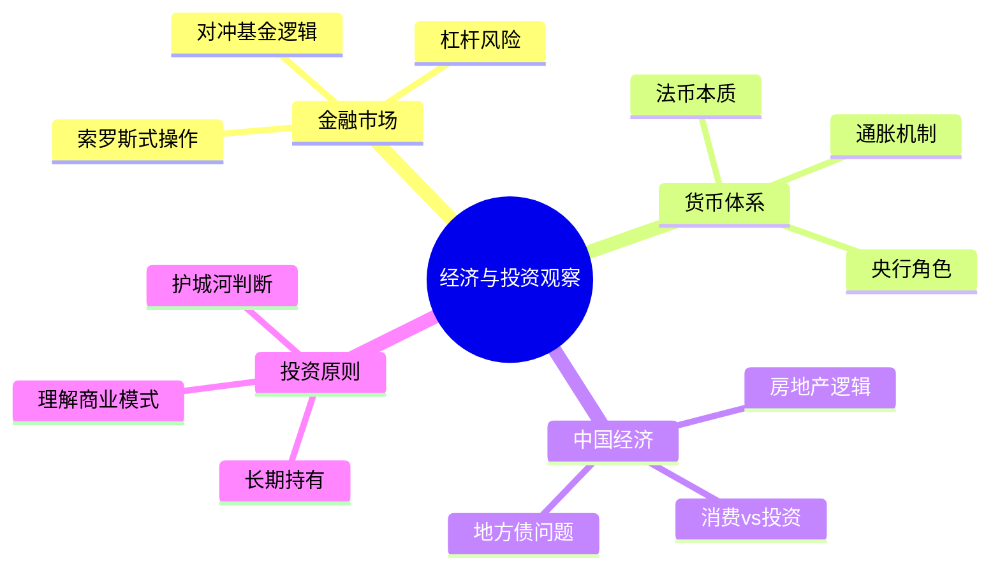

# 经济与投资

王兴对经济和金融的观察，结合了经济学学科训练、创业融资的亲身经历和普通用户的消费感知。他的帖文涉及宏观货币体系、风险投资逻辑、中国房地产市场以及企业财务分析，常以一两个数字或比较关系点出关键。

## 时间作为货币

王兴在2007年写下了一句他反复引用的话："时间是最坚挺的货币。"（2007-07-05）这不只是格言，而是他看待所有投资决策的底层框架：评估一件事是否值得做，首先要评估它对时间的消耗和回报。

## 风险投资的结构与逻辑

王兴对风险投资的观察多来自作为被投资方的亲历。他引用马克·安德森的话："我们想了一串我们愿意投资的事，如果它们失败了，我们会在三年后、六年后、九年后再试同样的事情。"（2011-06-02）他认为这揭示了一流VC的思维模式：押注规律而非个别项目。

他对红杉资本的Michael Moritz推崇，引用其投资组合"目前已占到纳斯达克总市值的5%以上"的描述，视之为真正意义上顶尖基金应有的水准（2010-11-20）。他也引用了王淮的"投资七问"（Is problem real? Is market big? Is solution smart? Is team capable? Is team passionate? Is team trustworthy? Why me?），认为值得参考（2012-05-22）。

他对Founders Fund印象深刻："他们可能真的关心改变世界大过关心财务回报"（2011-02-05）。他对风险投资行业利润集中的数据有关注："据说风险投资行业前25%的基金获取了全行业120%的利润"（2016-09-27）。

他还创造了一个新词："VC2C"："就是拿了风险投资的钱来补贴消费者，短期会很热闹，但长期有很大风险会一地鸡毛"（2018-03-09）。这是对O2O补贴大战的一个精炼批评。

## 中国房地产与宏观经济

王兴对中国房地产的观察跨越了近十年。他在2010年引用东京银座房价曾达一平米100万美元而当时仅剩1%的数据，得出判断："北京房价的疯狂很可能还远未结束"（2010-10-25）。他在2014年听说家乡龙岩"房价已经涨不动了，楼盘普遍滞销"，追问"难道传说中的拐点真的终于到来了"（2014-02-17），但随后被表弟的数据打脸。

他对货币政策有长期视野："1971年尼克松总统宣布停止美元和黄金的兑换关系后，人类社会就整体进入了一个前所未有的阶段：货币量失去物理限制了……我认为没有人真的很有把握这条路应该怎么走下去，包括各国政要和各类学霸。"（2016-06-30）

## 银行体系与金融机构

王兴对银行业的观察从日常使用体验开始，延伸至宏观数据。他对招行的不满是真实的，曾多次遭遇垃圾短信、网银故障，甚至一度扬言"每收到一条招行垃圾短信，我就给他打一次电话"（2007-07-24）。但他也在2018年听到了"关于招商银行成功故事最有说服力最理论联系实际的说法"，并认为值得记录。

他对中国银行业规模的直觉性认识来自一张图："只要把ICBC放上去，这些国外银行都成了小不点"（2009-02-17）。2012年的银监会数据（商业银行净利润1.04万亿元，同比增长36.3%）令他感慨"大公司就是大公司啊，连亏都亏得这么霸气"（2012-02-06）。

他引用了一句他多次看到的银行业格言："The best way to rob a bank is to own one"（抢银行不如开银行），认为"在今天的中国完全适用"（2013-08-19）。

## 股市与市场理性

王兴对市场的基本立场，集中体现在他转引的凯恩斯名言里："The market can stay irrational longer than you can stay solvent."（市场保持非理性的时间，可以长于你保持偿付能力的时间）（2010-10-27）。他将这句话视为在中国环境下保持清醒判断的必要警示。

他对股市与实体经济背离的现象也有记录，转载了一段幽默的解释："经济好的时候大家都出去打工，不好的时候才会聚在村口赌博"（2015-04-16），将这种悖论归结为行为金融学的直觉性比喻。

他引用的金融老鸟说法："there is no good risk or bad risk, there is only mispriced risk"（没有好风险或坏风险，只有定价错误的风险）（2015-04-04），体现了他对风险的基本认识框架。

## 互联网与传统行业的经济逻辑

王兴观察到一个他认为有趣的比喻：传统行业如刀削面（线性经济），网络经济如拉面（每拉一次面条数量倍增）（2014-12-07）。这个比喻简洁地描述了互联网商业模式的规模化逻辑。他也注意到《经济学人》将O2O与某些特定服务业结合报道，视之为经济渗透深度的一个侧面（2014-08-09）。

## 资本主义的再认识

2018年初，王兴写道："不管我们喜不喜欢，接下来几年里，更多的人会逐渐明白资本主义为什么叫资本主义。"（2018-01-18）这是他在观察到中国出生人口下滑、科技公司估值膨胀、美联储政策与全球资产价格联动等一系列现象后做出的判断，隐含着对资本驱动逻辑的警惕。

他对此后延伸讨论时说："或许也会更理解社会主义。"（2018-01-18）这一反向补充说明他的关切不在于意识形态，而在于资本深度渗透对社会结构的影响。他多次记录了对不平衡现象的关注，例如"2%和3%的差别不是一个百分点，是50%"（2019-04-22），以及对生育率下降与资本过度剥削之间关系的思考（2019-01-11）。

## 中国品牌与全球市值格局

2018年1月，他写道："谁说中国出不了奢侈品品牌？全世界最大的奢侈品公司就是茅台，今天市值突破了一万亿人民币，超越了 LVMH 和 Diageo 帝亚吉欧。"（2018-01-15）这一对比击穿了"中国无法产生奢侈品"的主流叙事，角度新颖而数据准确。

2020年初，他在饭否上做了一系列全球市值横向比较："整个日本只有一家上市公司市值超过1000亿美元：丰田。""韩国也只有一家：三星电子（约3400亿美元）。""台湾也有一家：台积电（3128亿美元）。""深圳有好几家：腾讯、平安、招商银行……还不算不上市的华为。"（2020-01-15）这一系列短帖构成了他对全球科技与制造业地理格局的直觉性比较研究。

他也注意到全球独角兽公司的整体规模："全世界所有439家独角兽公司全加起来，总的估值是1.3万亿美元，也就相当于苹果一家的市值。"（2020-01-16）

## 中国汽车与制造业格局

2020年初，他对国产车企做出了结构性梳理："中国车企格局基本是3+3+3+3角逐下两轮了，3家央企是一汽、东风、长安，3家地方国企是上汽、广汽、北汽，3家传统民企是吉利、长城、比亚迪，3家造车新势力是理想、蔚来、小鹏。"（2020-01-05）他认为理想汽车能进入下一轮，但再下一轮并不确定。他对理想ONE的战略逻辑有个比喻："假想我和聂卫平下围棋。即使他让我九子，我肯定还是玩不过他。不过，如果规则改成他每下一子，我下两子，那我有信心拼一下。"（2020-01-04）这一比喻指向理想早期采用的增程式混动技术，避开纯电动续航痛点的差异化路线。
