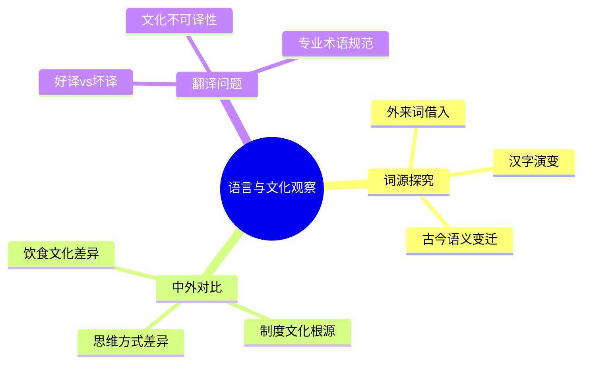

# 语言与文化

王兴对语言的兴趣兼具实用性和智识性。他既是多语言的使用者（中文、英文、日文曾学习），也是中英文词源、翻译质量和语言文化含义的持续观察者。他的语言类帖文显示出一种职业习惯：遇到一个不熟悉的词或翻译，立刻去查、去比较、去判断好坏。

## 词源与构词规律

王兴对词源有明显的兴趣。他注意到"technique/technology"和"architect"里的"tect"都来自同一词根tekt，代表"建造、结构、形式"（2012-06-13）。他在看到"report"这个词时，"突然注意到report这个词是re-port，'重新XX'"（2008-12-02）。他发现英文单词"acquire"和"hire"合体为"acqui-hire"（并购以获取人才），并认真思考了这个新词的发音（2012-02-20）。

他对中文构词逻辑同样敏感。他注意到"民主、民粹、民族主义"三词都是"民"字开头，而对应的英文democracy、populism、nationalism含义并不相近（2016-06-26）。他还指出"财务"和"金融"对应的英文都是finance，但中文语境中两词意味不同（2015-06-13）。

## 翻译的艺术与失误

王兴对品牌名称的翻译质量有持续关注。他认为"星巴克"译名"半义译半音译，简短响亮，不愧是全球老大"；而"两岸咖啡""上岛咖啡"各有得失（2013-05-10）。他认为"起泡酒"比"气泡酒"更好，"因为起泡更传神，很难得的把sparkling wine里的sparkling这种现在进行时表达出来了"（2014-02-01）。

他对"Lethe"（冥河）的中文译法也有意见，认为"忘河"没感觉，"忘川"或"厉司河"更酷（2007-07-25）。

他指出台湾将CEO称为"执行长"比大陆的"首席执行官"更简单实用（2010-12-03）。他也对"元宵节"被译成"lantern festival"（灯笼节）感到有趣，由此想起家乡元宵节彩灯游行的往事（2009-02-12）。

## 中文的多样性与复杂性

王兴在2008年第一次看到中文维基百科的语言选项时被吓了一跳，"中文居然有这么多分支？"——简体、繁体、大陆简体、港澳繁体、马新简体、台湾正体（2008-12-15）。他对中文互联网的评价是"非娱乐内容至今都相当贫瘠"，甚至"中文连web和internet/net都不太区分，统称'网络／互联网'"（2012-01-19）。

他对汉字中生僻词汇有直接的挫败感："鼩鼱"（qú jīng）——作为shrew这个英文单词的中文解释，他坦言"这俩汉字还真是不认识"（2012-03-19）。

## 日语的学习经历

王兴在2004年曾试图自学日语，但没有坚持下来（2010-12-20）。他在台湾和日本旅行时接触到大量日文，并注意到日语中"天王山之战"这一来自日本战国时期的词汇，后来如何传入围棋界，再进入中文体育媒体（2011-01-12）。他对日文中摇滚怎么说感到好奇（2016-01-30）。

## 文化比较：东西方思维方式

王兴对东西方文化差异的观察通过具体物件来呈现。他认为咖啡和茶是"东西方文化差异的一个缩影"：泡咖啡用咖啡机，"讲究的是全自动新材料高科技"；泡茶有茶道，"讲究的是人的功夫"（2010-11-19）。他在读到"科学"这个词本是日本明治时期翻译science而来，再传入中国时，感到意外（2011-02-22）。

他对外国人写中国的文章有特殊的欣赏："看老外写中国特别有意思，很多时候比我自己身在其中总结得还好。"（2016-06-29）这种从外视角获取自我认识的偏好，反映了他对认知偏见的持续警惕。

## 网络语言与新词

王兴对新词生成持有趣的记录习惯。他早年注意到"山寨"成为2008年年度词汇的候选（2008-12-12）；他引用"xxx很in"与古诗"画眉深浅入时无"里的"入"做类比，认为是一个道理（2012-11-19）；他对"创业"在国内已经"流(fan)行(lan)到一定地步了"，认为中文需要一个对应"wantrepreneur"的词（2014-07-07）。

他在2013年指出"竞争竞争，何为竞，何为争？同向为竞，相向为争"，以汉字的字义拆解揭示竞争概念的内在结构（2013-05-23），显示他对汉语词汇的哲学化解读。

## 音乐与艺术的文化感知

王兴的文化趣味显示出对东西方经典均有涉猎。他在一张路易斯·阿姆斯特朗《What a Wonderful World》的帖文后写道："人家黑人同志世世代代当了几百年奴隶培养出来的淡定超脱那不是盖的！"（2016-01-01）他对探戈名曲《Por Una Cabeza》认为"百听不厌"（2015-04-20），对贝多芬《田园》则是"得有二十多年没听过了"，偶然重听时"心血来潮"（2015-06-03）。
