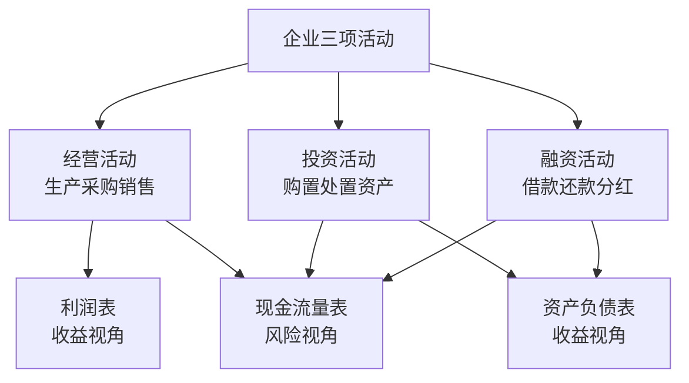

# 财务报表基础

财务报表是描述企业经济活动的语言。肖星在《一本书读懂财报》中指出，会计"既不是科学，也不是艺术，而是魔法"——它存在大量判断和选择空间，会造成截然不同的结果。理解财务报表的前提，是把数字还原为它所描述的企业运营现实。

## 三表的定位

企业一辈子只做三件事：经营、投资、融资。三张报表从两个维度描述这三项活动。

**资产负债表** 是时点数据，记录某一时刻的财务状况，是企业的"照片"。**利润表** 是时段数据，记录一段时期内的盈亏，是企业的"摄像机"。**现金流量表** 按三类活动分类记录现金流向，描述企业的生存风险。

## 资产负债表

核心等式：资产 = 负债 + 股东权益。左边说明钱去了哪里，右边说明钱从哪里来。

### 资产

流动资产按变现速度排列：货币资金（直接是钱）、应收账款（卖出未收款）、预付账款（付款未收货）、存货（原材料/在产品/产成品）。非流动资产包括长期投资、固定资产（计提折旧）、无形资产（专利、商标、土地使用权）。

**历史成本原则：** 绝大多数资产按购入时支付的金额计价。资产升值不体现，减值必须计提。历史成本下增加资产账面价值的唯一方式是发生新交易。金融资产和投资性房地产按公允价值（当前市场价格）计价，是例外。

**资产与费用的边界：** 对未来有用的支出是资产，当期消耗完的支出是费用。今天的资产是明天的费用——固定资产折旧、无形资产摊销，都是资产转化为费用的过程。

### 负债

流动负债（一年内偿还）：短期借款、应付账款、预收账款、应付工资、应交税金。非流动负债（一年以上）：长期借款、应付债券、长期应付款（融资性租赁）。

**融资性租赁** 被视为分期付款购买资产，租入资产出现在资产负债表，未来租金计入长期应付款。**经营性租赁** 属于表外业务，资产和负债均不出现在报表中。

**或有负债与表外负债** 是收购时最危险的风险：资产的风险是被高估，而负债的风险是被低估甚至隐藏。

### 股东权益

股东权益 = 资产 - 负债。股东是最后一个拿走利益的人（剩余求偿权），也是公司风险和收益的最终承担者。

- **股本（实收资本）：** 等于注册资本，决定法律意义上的股权比例
- **资本公积：** 实际投入超过注册资本的部分
- **盈余公积：** 法定不得分配（中国要求至少提取净利润的10%）
- **未分配利润：** 企业自愿留存的历年积累利润

## 利润表

利润表记录从营业收入到净利润的完整路径。

**生产成本与营业成本的关系：** 原材料、人工、制造费用构成生产成本，先进入资产负债表的存货，产品售出后才转为利润表的营业成本。未售出的存货携带着生产成本在资产负债表中等待。

**固定成本陷阱：** 扩大产量而不扩大销量，固定成本被摊薄到更多存货中，导致当期营业成本下降、毛利润虚增。这种现象在重资产行业（造纸、钢铁等）尤为突出，毛利润改善并不意味着经营改善。

**三项期间费用：** 营业费用（销售环节）、管理费用（管理环节）、财务费用（利息净额）。注意：折旧根据资产类型分别归属——厂房折旧是生产成本，门店折旧是营业费用，办公楼折旧是管理费用。

**营业外收支的本质：** 卖固定资产、收赔偿、遭处罚，都属于营业外项目。它们与日常经营无关，不可持续，不能用于预测未来盈利。净利润中营业外收入比例越高，盈利质量越低。

**利润 ≠ 现金流：**
- 有收入不等于收到现金（应收账款未收回）
- 收到现金不等于有收入（预收账款未发货）
- 有费用不等于付出现金（折旧无需付钱）
- 付出现金不等于有费用（预付房租形成资产）

**研发支出的特殊处理：** 研究阶段支出计入管理费用（会计对不确定性的谨慎态度）；开发阶段满足条件可资本化为无形资产；外购技术直接计入无形资产。企业自研的品牌价值、内部积累的技术能力，形成大量**表外资产** ，不在报表中体现。

## 现金流量表

现金流量表是货币资金增减变化的分类说明。三类现金流合计 = 资产负债表货币资金的增减变化。

**经营活动现金流：** 收到销售款、支付采购款/工资/税款。这是最稳定、最可靠的现金来源，是评判企业健康度的核心指标。

**投资活动现金流：** 购置/处置固定资产和无形资产、对外投资/收回投资及分红。通常为负数（正在投资），为正数则意味着在变现资产。

**融资活动现金流：** 借款/还款、股权融资/分红。为正表示融入资金，为负表示还款或分红。

## 三表的内在联系

净利润与经营活动现金流的差额，等于资产负债表上与经营相关的非现金资产和负债的变化（应收账款、存货、应付账款等）。三张报表共同描述同一套经济活动，只是呈现角度不同：

- 资产负债表 + 利润表：说明企业能否赚钱、赚了多少
- 现金流量表：说明企业能否活下去

未分配利润是连接利润表和资产负债表的纽带：利润表期间净利润扣除分红，余额计入资产负债表的未分配利润，实现两表在数字上的闭合。
