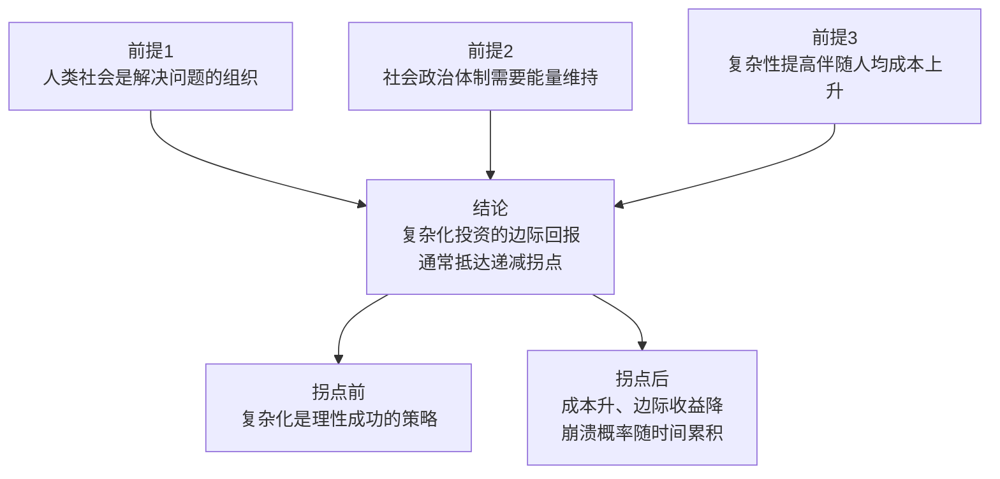
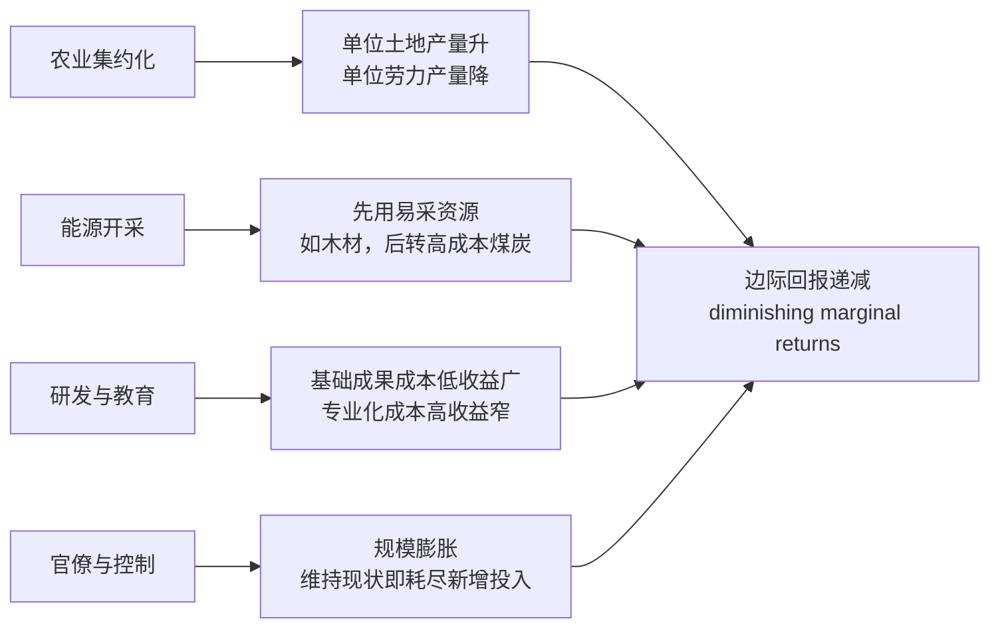
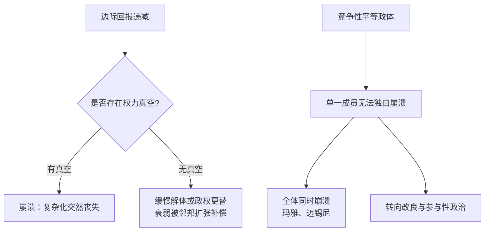

# 边际回报递减与文明崩溃

边际回报递减与文明崩溃是人类学家约瑟夫·泰恩特在《[[复杂社会的崩溃]]》（1988）中提出的分析框架。它把纷繁的文明兴衰现象还原为一个经济学问题：**社会复杂化是一种投资，投资的边际回报会递减，当递减到某个程度、且存在权力真空时，崩溃就会发生**。这一框架的价值在于用单一机制统一解释了从帝国到部落的各类崩溃，避免了道德衰败、天命循环等无法证伪的解释。

---

## 三个前提与一个结论

框架建立在四条环环相扣的命题上。前三条描述复杂社会的运作方式，第四条是由此推导的核心规律。

复杂化之所以出现，是因为它能解决问题：应对人口压力、外来威胁、资源短缺、内部冲突。问题解决时，复杂化投资就取得了成果。但社会总是先采用成本最低的方案，当廉价方案用尽，新增的复杂性只能以更高代价换取更少收益。

---

## 复杂化的成本从何而来

泰恩特用近代可量化的数据，展示边际回报递减普遍存在于复杂社会的各个组成部分。核心原因只有一个：理性的人类总是先利用最易获取、最经济的资源与组织方案。

组织性解决方案还具有**只增不减的累积特性**：税率上涨多于下降，官僚人数很少缩减，纪念性建筑需要持续维护，特权阶层的报酬极少下调。复杂化一旦增强就以指数形式发展，永远在已然膨胀的规模上继续叠加。此外，复杂社会本身会制造新问题——奥尔森指出的"钻漏洞与补漏洞"螺旋，佩罗指出的复杂系统灾难性事故几率上升——都迫使社会把越来越多的资源用于解决自身存在带来的问题。

---

## 崩溃作为经济化选择

框架最反直觉之处，是把崩溃重新定义为**理性的经济化调整**，而非灾难。由于复杂社会只是人类历史的近期现象，崩溃只是回到复杂化较低的正常生存状态。当维持复杂性的边际成本高于其收益时，抛弃复杂性能让组织化投资的边际回报回到优势状态。

这解释了看似费解的历史现象：后罗马平民支持入侵蛮族，查科人不抵抗最后的旱灾。第三章批评的"适应失败说"由此站不住脚——这些社会并非无法适应，从经济学看它们适应得恰到好处，只是不符合珍视文明成果者的价值判断。

---

## 崩溃的必要条件：权力真空

边际回报递减未必导致崩溃。泰恩特借助"平等政体"（peer polities）概念给出关键限定：

在竞争性政体体系中，任何成员的解体都会被对手兼并，因此每个成员都被迫维持与对手相当的复杂化投资，无论回报多低。崩溃只有在没有强大竞争者填补真空时才发生。这一法则解释了为什么西罗马崩溃而拜占庭只是缓慢解体，为什么玛雅各城邦几乎同时陷落，也解释了为什么排除了崩溃这一廉价选项后，欧洲会转向参与性政府、古代中国会发展出惠民与天命思想。

---

## 对当代的推论

现代工业社会依靠化石能源这一巨大补给，长期推迟了边际回报递减的后果。但整个工业化世界如今是一个单一的竞争性平等政体体系，这意味着崩溃若发生将是全球性的、同时的，而非局部的。这一推论使该框架超越历史研究，成为讨论技术复杂度失控、官僚膨胀与可持续发展的常用工具，也与[[创新者的窘境]]中"投资既有优势反致失败"的逻辑、[[系统思考]]中的反馈与延迟概念相呼应。完整论证与案例见[[复杂社会的崩溃]]。
