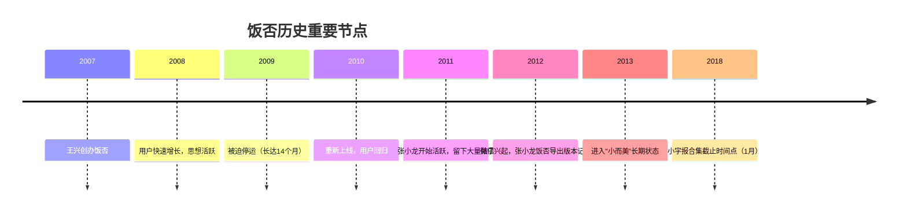
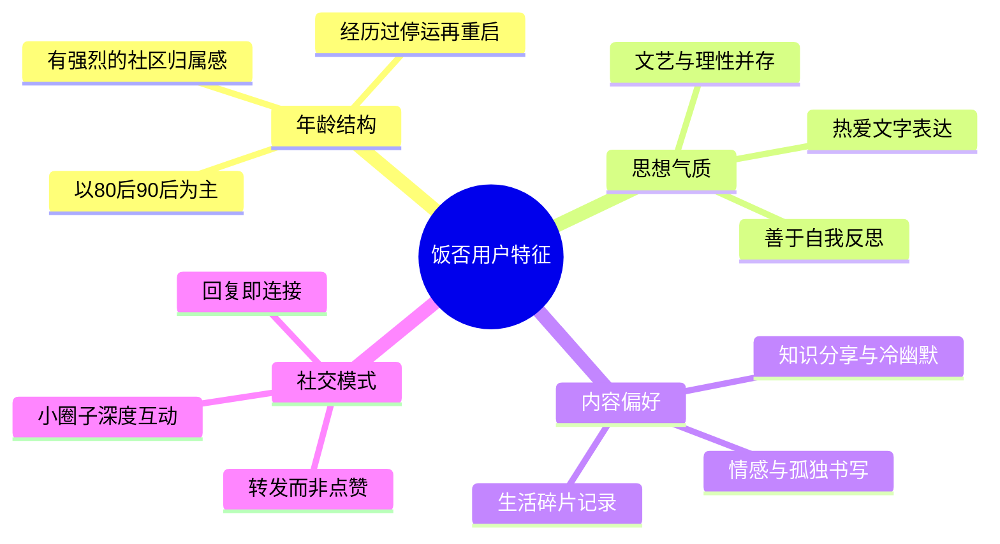
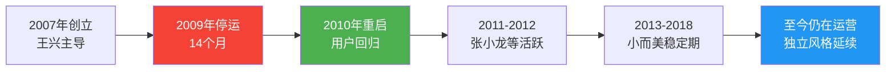
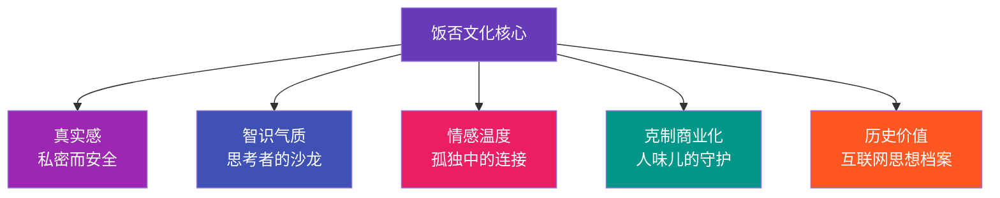

# 饭否文化与社区

**饭否**（Fanfou，fanfou.com）是中国最早的微博客产品之一，由[[王兴]]于2007年创办，2009年因特殊原因停运，2010年重启，此后以"小而美"的姿态持续运营，形成了中国互联网上最具独特气质的社区文化。饭否小字报（2009-2018合集）是这段历史的文字切片，记录了一个独特社区近十年的集体意识流。

## 饭否的社区精神

### 核心气质：私密而不孤独

《饭否小字报》中，饭否用户@萧覃含 的一句话精准概括了饭否的吸引力：

> "饭否最令人深陷的一个原因是，它让你因为私密觉得安全但又并不感到孤独。"

这与微博的"广场感"截然不同。饭否更像一个小村庄：人人都认识，但又保有各自的秘密。用户在这里说话比在微博更"放松"，更少表演性，更接近真实的内心独白。

> "如果加微信能看到跟饭否一样的我，那我还来什么饭否。"——饭否用户@萧覃含

这句话道出了饭否最核心的社区功能：**它是一个不同于微信、微博的"第三空间"，不表演，不焦虑，只是做自己**。

### 饭否的用户画像

从《饭否小字报》的内容结构来看，饭否的活跃用户呈现出鲜明的特征：

## 重要饭友：互联网人的思想沙龙

饭否的独特之处在于，它聚集了一批改变中国互联网的人：[[王兴]]、[[张小龙]]、[[张一鸣]]、和菜头等人都曾在饭否上活跃。这个平台因此成为了中国互联网思想史上最重要的"非正式档案库"。

| 饭友 | 在饭否上的角色 | 代表性内容方向 |
|------|--------------|--------------|
| [[王兴]] | 高频发帖者，知识分享者 | 商业观察、读书笔记、创业心得 |
| [[张小龙]] | 深度思考者，幽默表达者 | 产品直觉、人性观察、科技评论 |
| 和菜头 | 文化评论者，引发讨论者 | 互联网文化、内容创作、媒体观察 |
| @能鞥 | 普通用户中的优质饭友 | 生活观察，情感记录 |
| @萧覃含 | 情感表达的代表性用户 | 私密情绪、内心独白 |

## 饭否的内容生态

### 1. 生活碎片的诗意记录

《饭否小字报》大量收录的是这类内容：

> "快乐有两种。一种是外在的快乐。比如吃喝嫖赌带来的快乐。这种快乐，满足了以后就是不满足，满足了以后就是痛苦。而另一种快乐，是内生的快乐。比如听一首歌感受到的舒适，比如站在高处看山下的风景而生出的平静。人生如果真的要意义，后者就是意义。"

> "当一群人在大笑的时候，每个人都会下意识看着自己最爱的那个人。"

这类内容在微博或微信朋友圈中早已被"激励文"和"营销号"污染，但在饭否上，仍然保持着难得的真实感和情感密度。

### 2. 社会观察与知识分享

[[王兴]]在饭否上持续分享他的阅读与思考：

> "孙立平用四句话判断经济的走势与前景：短期看政策，中期看趋势，长远看文化，体制贯彻始终。"

> "杰出的品牌，有专属的颜色、形状、字体和声音。"

> "宜家创始人Ingvar Kamprad生于1926年，1943年（17岁时）创办宜家，1950年开创了可组装家具的概念……昨天去世，享年91岁。"

饭否让王兴成为中国互联网CEO中最持续输出思想的人之一，也形成了平台独特的"知识分子气质"。

### 3. 幽默与冷知识的混搭

饭否的幽默有一种特殊的质地——不是段子网站的快餐式笑话，而是带着观察力和温度的"生活现象学"：

> "中本聪绝对是科技宅们的终极偶像，他成功做到了崔健在《假行僧》里唱的：我要人们都看到我，但不知道我是谁。"

> "青少年时曾想过，我活到30岁就够了。现在年后就满30岁了，我觉得当时的自己十分有远见。"

> "初听古典的小伙伴，老司机给你们带带路：巴赫抗躁动、海顿抗抑郁、莫扎特抗失眠、贝多芬抗萎靡……"

## 停运与重启：社区的韧性

饭否停运14个月的经历，反而强化了社区的凝聚力。重启之后，用户的黏性更强，因为大家都经历过"失去饭否"的恐惧：

> "还是觉得那句'饭否不会垮'好感动哦～"——@一只鱼人

> "有喜欢的饭友赶紧要联系方式吧，饭否挂掉就找不到他了（滑稽"——@万千基佬竟同时

这种对平台存亡的集体焦虑，在2018年饭否服务器不稳定时再次爆发，用户们纷纷留下微信号，形成了"难民潮"式的互动，折射出这个社区的强烈情感依附。

## 饭否与微博的对比

| 维度 | 饭否 | 微博 |
|------|------|------|
| 用户规模 | 小众精英 | 大众平台 |
| 内容气质 | 私密、真实、文艺 | 公开、表演、娱乐化 |
| 社交模式 | 熟人+小圈子 | 粉丝经济+公众人物 |
| 算法推荐 | 无（时间线） | 有（热搜、推荐流）|
| 用户粘性来源 | 情感连接 | 信息消费 |
| 商业化程度 | 极低 | 高度商业化 |

## 饭否的历史地位

### 作为思想档案库

《饭否小字报》的历史价值远超娱乐：它保存了中国互联网第一代创业者在草根年代的真实思考。[[张小龙]]对微信产品的预演、[[王兴]]对商业逻辑的早期判断、[[张一鸣]]对移动互联网红利的认知——这些"碎碎念"后来都变成了改变中国互联网格局的决策。

### 作为社区实验

饭否是一个反商业化逻辑的社区实验：它从不追求增长数据，从不做病毒传播，从不引入算法推荐。恰恰因为如此，它在中国互联网高度商业化的浪潮中，保持了极其罕见的"人味儿"。

> "饭否不会垮。"

这句话，既是用户对平台的期望，也是对一种互联网精神的坚守——**在注意力经济的时代，还存在一个不把你的时间当资源来榨取的地方**。

## 关键词云：饭否文化核心元素

---

**相关文章**: [[王兴]] · [[张小龙]] · [[张一鸣]] · [[微信产品哲学]]
