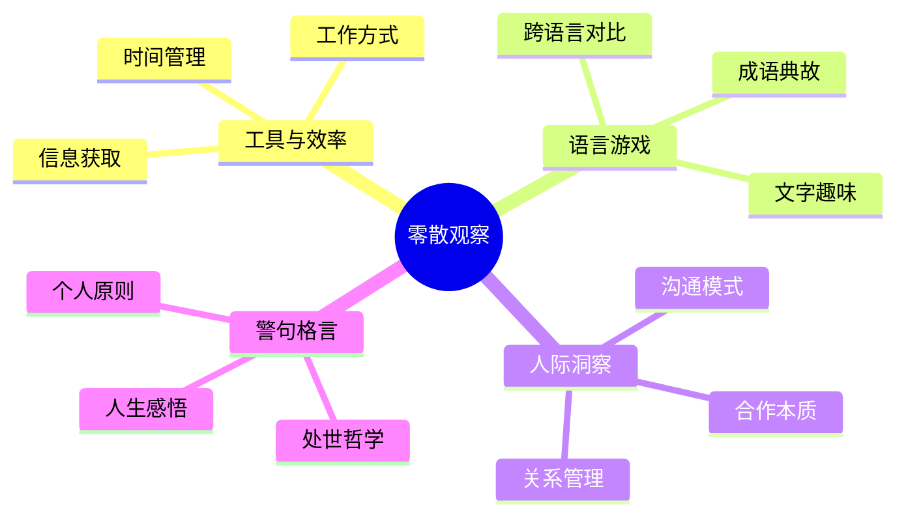

# 其他观察

这一类别收录王兴在饭否上不属于特定主题的零散观察——关于时间、关于工具、关于人际、关于城市，以及他对日常偶发事件的反应。这些帖文往往最接近他真实的性格。

## 工作与时间的态度

王兴对工作的热情在最早的帖文中已经显现。2007年，他回应一个朋友关于工作是否过多的问题："相反，我恨不得一周可以工作八天，当我看到有这么多激动人心的事情可做。"（2007-06-02）这种态度不是表演性的，而是他日常状态的真实写照。

他对时间分配有持续的自我要求。他在2008年写下"忙着找最值得忙的事情"（2008-12-01），在2009年写下"改掉了一大早看新闻的坏习惯，精力最充沛的时间应该用在更有价值的事情上"（2009-02-23）。他引用约书亚·雷诺兹的名言："为了逃避真正的思考，人们是不惜采取任何手段的。"

## 工具与设备

王兴对工具的选择有自己的标准，且持续升级。他在2007年将用了四年半的ThinkPad X23换成X60，感慨"重新装软件传数据真是超麻烦的事"。他对Aeron椅的感情长达多年，认为知识工作者的生产力工具优先级已从CPU和内存，转变为显示器、键盘鼠标，最终是椅子。他在2012年注意到"同一个液晶显示器，从VGA线换成DVI线，显示效果确实更好一些"（2012-03-06）。

他对工具的理性主义倾向是：工具服务于目的，而非工具本身是目的。他对Apple Watch戴了一个月后的评价是："功能也就是看看时间，看看各种app的通知，另外就是提醒我每个小时要起来站一会儿。但总体感觉还行，能戴住。"（2015-06-24）

## 随机的语言游戏

王兴偶尔在饭否上玩文字游戏。他注意到自己30岁生日时用"2^5岁"表达（2011-02-18）。他对"有个更委婉的说法：和其他人一样，你是独一无二的"（2010-12-13）的机智表达赞赏。他观察到"过去未去，未来已来"是一句简洁有力的总结（2010-09-06），并引用马克·吐温式的格言"History doesn't repeat itself, but it rhymes"（2015-04-16）。

## 饮食观察

王兴在饭否上留下了大量饮食细节，既有对日常食物的随手记录，也有对价值判断的折射。2007年，他每天早餐是7-11的酱肉包和酸奶，"吃得快恶心了"（2007-05-19），随后探访了五道口的希珍面吧。同年，他明确表达了对奶茶消费的价格理性："仙踪林的奶茶20块一杯，我宁可喝6杯迷你站的3块奶茶，其实味道差不多"（2007-06-02）。他对手剥笋评价极高，只是"份量太小了"（2007-06-03，外婆家）。

他在读书时联想到早年在美国时常去的一家餐厅："在美国读书时镇上一家 deer park tavern 的招牌汉堡，那牛肉的口感和麦当劳的完全不可同日而语。那家店每个星期二晚上汉堡半价，所以我们总是那天去。"（2009-10-15）2020年，他记下了一道日常家常菜："水芹炒肉丝真是一道简单却好吃的菜。"（2020-01-08）

## 旅行与见闻

王兴出行频繁，旅行笔记散落于各年帖文。2011年，他在台湾台南走过民权街——"还保留着两边的骑楼，开着各种老店小店，似乎并没有受到工业化商业文明的侵蚀"，并将其与故乡龙岩已被改造殆尽的中山街对照，感到惋惜（2011-10-05）。

2013年1月2日，他在关岛完成了人生第一次飞行驾驶："第一次开飞机，蛮刺激，一会儿就满头大汗了。开飞机和开车确实有区别：我始终觉得一个运动协调性好的男人几乎不用培训，凭本能和常识就能正常驾驶一辆汽车；而开飞机这事光靠本能和常识还真是不够。想想也对，我们祖先千百万积累下来的基因只有在陆地上奔跑的经验，并没有在空中飞翔的经验。"（2013-01-02）

2013年十一假期，他在读过弗里德曼《未来一百年》后，专程赴土耳其旅行，"有了一点感性认识"，认为"多读书多旅行还是有意义的"（2015-11-25）。2014年，他随朋友到南非，注意到当地"平均每5个人中就有一个携带艾滋病毒"（2015-06-12，描述该行程）。2014年，他走访了俄罗斯多个城市，在圣彼得堡和莫斯科参观博物馆后，对俄罗斯对人类文明的最深刻贡献做出了出人意料的总结："依然难以忘怀的是：俄罗斯方块"（2014-07-12）。

他对城市设计有功能性判断。他在回想东京涉谷的城区特点时，对照《美国大城市的死与生》的四大条件（街区要小、路网要密、功能多样、密度大），认为"北京的城市建设应该学日本而不是学美国"（2010-10-03）。他对CCTV大楼"大裤衩确实挺雄伟"（2012-03-24）的评语言简意赅，态度模糊而幽默。

## 对人际与社交的态度

王兴在早期饭否（2007—2009）上与大量朋友有直接互动，教新用户如何@提及他人，回复关于产品功能的提问。这些帖文显示他并非只是个发布者，而是真实参与了早期中文互联网社区的建设。

他对饭否平台本身有特殊的情感，2010年写道："爱生活，爱饭否。"（2010-11-14）他也明确表达了对社区的责任："作为饭否的创始人和一个至今的活跃用户，我会尽力让她活得长，如果不得已要停，我会尽力停得体面，提早通知。"（2013-03-24）

## 关于年龄与时间的感受

随着帖文时间线延伸，王兴对时间流逝的感受也更加明显。他在2008年听到《相约九八》时"突然意识到居然已经过去10年了"（2008-12-22）。他在每个节日都留下类似的提醒："每一个节日，都是'又一年过去了'的提醒。"（2014-10-31）他也将这一规律理论化："按照年纪越大日子过得越快的规律，2018年岂不是咻的一下就要来了"（2008-12-22）。

## 简短的警句

王兴在"其他观察"类别中留下了一些没有固定主题但值得记录的短句：

- "生命就是不死的欲望。"（2012-04-30）
- "我最喜欢的态度是：一边建设一边建设性的批评。"（2012-10-10）
- "Some people grow and other people swell."（2015-03-15）
- "Civilization is more than optimization."（2016-10-10）
