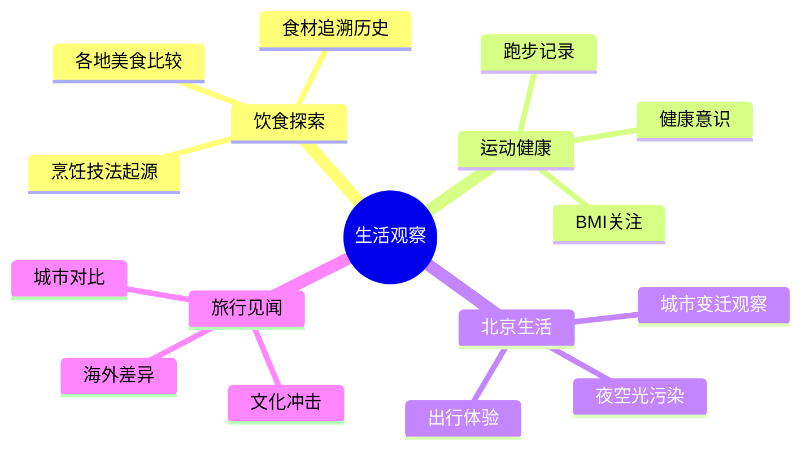

# 生活与饮食

王兴在饭否上记录的日常生活，以北京为主要舞台，以饮食观察和个人消费体验为主要内容。这些帖文展现了一个在创业压力下仍保有生活趣味的人。

## 早期北京生活（2007-2008）

王兴的早期北京生活以**五道口** 为中心。他住在五道口附近，在清华科技园附近工作，常去清华操场跑步。这一带的地标性场所构成了他的日常背景：雕刻时光咖啡馆（后改名桥咖啡）在附近、仙踪林奶茶店在楼下，最常光顾的快餐是 7-11 的酱肉包和酸奶早餐——"吃得快恶心了"（2007-05-19）。他对贵便宜有明确的务实判断："仙踪林的奶茶20块一杯，我宁可喝6杯迷你站的3块奶茶，其实味道差不多，剩下两块钱买一个7-11饭团当早点。"（2007-06-02）

手机是这一时期他生活的重要延伸。Nokia E61 全键盘智能手机让他能在通勤中持续使用饭否："诸如在地铁、在厕所、在床上" —— 他引用古人"三上"（床上、马上、厕上）之说，笑称自己全部用来手机上网（2007-05-18）。他在 2007 年 5 月开始使用饭否后不久就养成了"每天醒来第一件事是上饭否，第二件事才是起床"的习惯（2007-07-04）。

工作椅是他这一时期的执念之一。他在 2007 年就提到需要 Aeron 椅，2008 年 12 月终于"时隔5年再次拥有了一把 aeron chair"（2008-12-19），换上后"今天腰就不疼了"（2008-12-20）。他的判断："说到知识工作者的生产工具，以前我觉得是CPU和内存重要，后来是显示器、键盘和鼠标重要，现在觉得椅子更重要了。The peripheral is central."（2008-12-18）

## 咖啡与茶

咖啡在王兴的日常生活中占有重要地位。他有一次在夏威夷大岛酒店早餐后喝到的那杯咖啡令他至今难忘："好香，苦而不涩，入口很温暖但不仅仅是因为温度"——在此之前他不觉得咖啡好喝（2013-07-22）。他最常喝的是美式咖啡，虽然自认为这是"深受行家鄙视的咖啡，最没文化，就是espresso兑水"（2014-01-21）。他也尝试过"防弹咖啡"，认为整个上午确实很精神（2016-09-30）。

茶的轨迹则更能体现他的生活细节。2007年5月他每天早饭后泡茶上网；7月因堂妹警告苦丁茶对男性不宜，他迅速"改喝普洱"（2007-08-07）；此后普洱成为他的长期饮茶选择。2010年他在深夜开始工作前会先"喝越来越浓的普洱"（2010-12-01）。他总结了"瘾品三大宗：酒精、烟草、咖啡因"（2015-07-01），以知识性方式记录饮品文化。

## 美食发现

王兴通过美团认识了"马卡龙"（macaron）这种法式甜点，此后多次提起："自从三年前通过'美团'知道了'马卡龙'，这种小甜品总能带给我愉快的联想。"（2013-03-06）这个细节颇具意味——他的创业作品改变了他自己的生活。

他对家乡福建饮食有特殊情感。他觉得北京买到的荔枝"少了在福建吃到荔枝的那种鲜味"（2011-06-09）。他记忆中最赞的鱼香茄子煲，是"十四年前那个暑假在中山大学校园附近吃到的"（2016-11-21），远过于北京的所有同类菜式。

他对食品安全有清醒的认知而非焦虑。他2011年写道，鉴于国内食品安全状况，"敢吃苹果就不错了，皮还是免了吧"（2011-10-10）；他也转述了一位食品行业人士的惊悚论点：彻底打击地沟油可能导致三分之一人吃不起油（2012-09-21）。

## 酒饮

王兴对酒有平实的态度，不是资深爱好者，但有基本的鉴别力。他在家里放了几年的龙舌兰酒被老妈当料酒用掉大半，老妈评价"做菜味道不咋地"（2012-03-03）。他自认威士忌与探戈曲《Por Una Cabeza》搭配"可能不是最佳"，并好奇"阿根廷人喝什么酒"（2015-04-20）。

## 运动与身体

王兴有跑步和爬山的习惯。他在清华紫荆跑步是常态，后来在北京生活中也保持户外活动。2011年，他从鹫峰望京塔下山后膝盖不适，不得不买了登山杖和护膝，并感慨"我曾经嘲笑那些爬个小土坡都使用各式装备的人"，现在自己也成了那种人（2011-05-08）。

他对午睡的效率有精确的记录——"只花了14分钟，刷新了个人纪录"（2013-03-26）。他在测肺活量时发现"饱吹饿唱"的传统智慧确有数据支持（2012-04-25）。

## 购物与消费观

王兴对消费有强烈的实用主义倾向，但不抗拒偶尔的"奢侈"。他2008年重新拥有了一把Herman Miller Aeron椅，感慨"时隔5年"（2008-12-19）。他2014年给自己买了大疆四轴飞行器作为生日礼物，但工作太忙直到半个月后才玩上（2014-06-21）。

他对自己拥有18双鞋子但7双过去一年没穿的事实做了坦诚的盘点（2012-01-01）。他对New Balance 993的评价是，就算如此好鞋，"也没有一双合脚的拖鞋舒服"（2012-06-18）。

## 旅行中的生活观察

旅行是他生活记录的重要组成部分。他2009年的珠峰行是饭否上难得的连续叙事，"火车在绕最后一个大弯，远远的能看到拉萨第一高楼布达拉宫"（2009-05-31）。他在台湾高铁台南站感受到"整洁，比较现代化，同时又不会大到不方便"（2011-10-04）。他在2013年的缅甸旅行中，从掸邦一个网吧更新了饭否（2013-02-14）。

他喜欢在城市中登高鸟瞰全貌，记录了北京央视电视塔、上海环球金融中心、深圳地王大厦、香港太平山顶、东京铁塔等地点，"基本每到一个城市都会去登高"（2010-10-11）。
