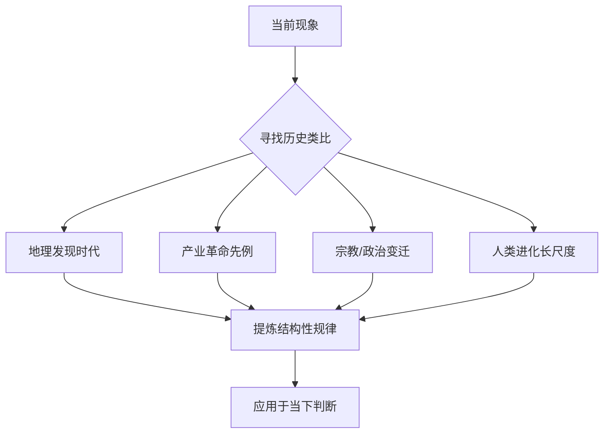

# 历史类比思维

王兴在饭否上有一种反复出现的思维习惯：用历史事件类比当下，以时间距离更远的案例来理解眼前的现象。这种习惯不是装饰性的引经据典，而是他分析问题的实际工具。

## 地理大发现与商业逻辑

王兴对郑和与哥伦布的对比是他引用最频繁的历史类比之一。他注意到郑和的航海是亏钱的而哥伦布是赚钱的，认为"这一细节对理解此后五百年世界格局至关重要"——能否形成可持续的商业模式，决定了探索行为能否持续并改变历史走向。

2020年，他进一步解构了哥伦布的神话：哥伦布的路演"确实漏洞百出"，但他"从1485年开始就拿着商业计划书辗转各国融资，七年后才终于时来运转拿到西班牙王室的天使投资"（2020-01-13）。哥伦布的意义不在于航海技术卓越，而在于锲而不舍与清晰目标："哥伦布首航之后，那条航海线路立刻就变得很常规了，因为已经有一个清晰目标。"（2016-08-03）

## 华盛顿与乾隆：同年而终，殊途而行

王兴多次提及美国开国总统华盛顿与清朝乾隆帝死于同年（1799年）这一历史巧合，并由此感慨中美发展路径的分岔。这个细节不只是历史知识，而是他理解中美之间深层结构差异的一个入口。

## 宗教竞争即商业竞争

2015年，他在讨论免费策略时，将天主教的"什一税"收费模式与马丁路德宗教改革相类比，指出"新教开创者马丁路德站出来：不要鸟他，我也能救你，而且我免费！"（2015-05-17）他由此论证，免费作为一种竞争策略历史悠久，并非互联网的发明。这一类比将商业竞争嵌入了数百年的宗教史脉络。

## 产业集中化的历史先例

2014年，他在阅读时注意到20世纪初美国汽车公司从1800家减少到3家的过程，并将其与中国"千团大战"直接对应："听起来也和'千团大战'差不太多嘛。只是速度稍微慢一点。"（2014-10-28）他也援引戴姆勒-奔驰的前身案例，指出"著名的戴姆勒-奔驰公司就是一百多年相互竞争不相伯仲的两家公司合并而成的"（2015-12-13）。

2020年，他对中国新能源汽车格局的"3+3+3+3"判断，是这一历史思维的延续：他预判这12家车企将再经历两轮淘汰，最终格局将类似历史上的产业集中化规律。

## 古登堡印刷与互联网

2020年，王兴明确提出互联网与古登堡活字印刷是同等量级的文明变革，并系统梳理了印刷术带来的连锁反应：宗教改革、大航海、科学、启蒙运动、殖民主义、民族国家兴起、一战二战（2020-01-15）。他认为这一历史框架可以直接用来预测互联网时代的走向："我大概知道古登堡在欧洲搞出活字印刷之后世界发生了何等巨变……但直到最近半年我才把这二者联系起来并意识到这意味着什么。"

## 技术代际差距的历史感

2017年，他用"清朝末年一个留着辫子的中国人走出国门，看到人家的蒸汽机、火车、轮船"来描述国内科技企业面对 Amazon 云计算时的冲击感（2017-01-12）。这一比喻将当下的技术差距置入了一百五十年的历史纵深。

2009年，他在饭否发过一条问题："时光倒流到1909年，当你发现自己身处马鞭行业时，你该怎么办？这个看似荒谬的问题其实是很多人应该想却拒绝想的。历史的潮流是无情的，不管你个人多聪明。"（2009年，2020年再次转引）

## 这一习惯的形成

这一思维模式可以部分追溯到他中学时玩《文明》（Civilization）游戏的经历。他在2013年写道："越来越意识到小时候玩过的游戏《文明civilization》对我世界观的影响。"（2013-11-08）这款游戏要求玩家在数千年历史跨度中管理文明，使他早年就建立了从长时段视角看待竞争与技术的习惯。

他对历史读物的广泛涉猎也强化了这一倾向，包括马歇尔传记、林登·约翰逊传记、《美国种族简史》、《The Prize》（石油史）以及塔奇曼的《八月炮火》。

## Backlinks

- [[王兴]]
- [[哲学与认知]]
- [[历史与文明]]
- [[创业与商业]]
