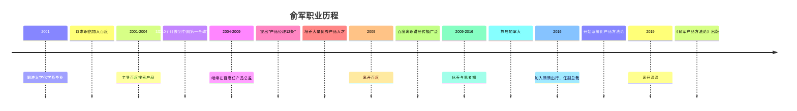
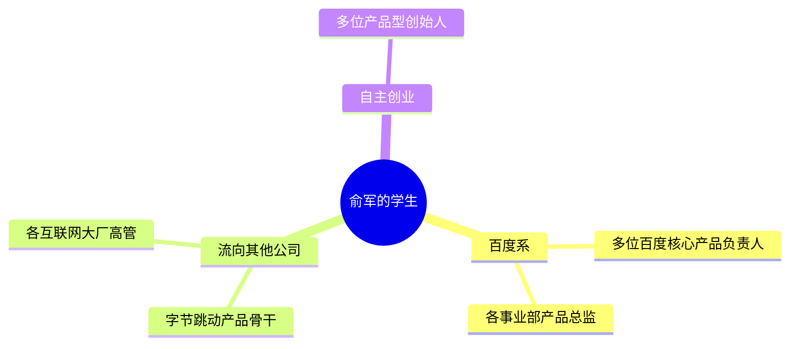
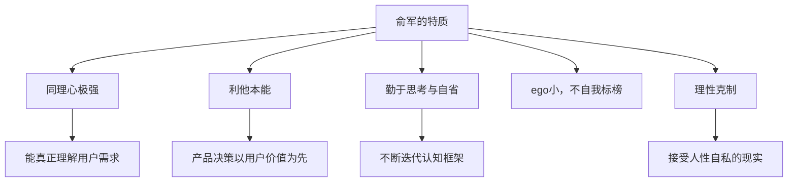

# 俞军


> "我理解的滴滴，就是把未被满足的出行需求和闲置的汽车资源高效匹配，为用户创造价值。值得干。"
> ——俞军，在与滴滴程维的第一次会面中

俞军是中国互联网产品经理职业化的奠基人之一。他以一封求职信加入百度，主导建立了百度搜索的产品体系，培养了一批后来改变中国互联网格局的产品经理，晚年在滴滴将方法论系统化，著成《[[俞军产品方法论]]》。

## 人物简介

| 项目 | 内容 |
|------|------|
| 毕业院校 | 同济大学化学系（五年制） |
| 籍贯 | 上海 |
| 百度任职 | 2001年加入，产品总监（7级产品经理） |
| 百度成就 | 主导百度搜索在3年10个月内成为中国第一、全球第五 |
| 滴滴任职 | 2016年加入，副总裁 |
| 离职时间 | 2019年离开滴滴 |
| 代表作 | 《俞军产品方法论》（2019年出版） |

## 加入百度：那封求职信

俞军以一封求职信闻名于互联网圈，信的开头是：

> "搜索引擎9238，男，26岁，上海籍，同济大学化学系五年制，览群书，多游历。"

这封信打动了百度，因为它展示的不是学历，而是对搜索引擎的理解。俞军在加入百度之前，已经自学了大量搜索相关知识，写下了多篇研究文章。



## 在百度的岁月（2001-2009）

俞军加入百度时，互联网在中国还是新鲜事物。他主导了百度搜索产品的核心设计，将用户需求置于一切决策的中心。

百度网站从2001年9月上线，在**3年零10个月** 内做到网站流量**中国第一、全球第五** 。这一过程中，海量的产品实践几乎全部集中在俞军一个人身上，形成了极为深厚的产品直觉和方法论积累。

> 百度工程师文化奠基人、首任CTO刘建国评价："俞军，是我见到的最锐利、最有思想的产品专家。"

在百度，俞军总结了著名的**"产品经理十二条"** ，这成为中国互联网界广为流传的产品方法论雏形。后来他觉得12条太复杂，将其精炼为一个公式：

```
用户价值 = 新体验 - 旧体验 - 替换成本
```

## 百度"黄埔军校"

俞军在百度期间培养了大量优秀产品人才，这批人后来成为中国互联网产品领域的中坚力量，包括：



## 滴滴时期（2016-2019）：方法论的升级

2016年，程维和张博专程飞赴加拿大，在一家快餐厅请俞军加入滴滴。第一次欢迎分享会座无虚席，连走廊都站满了人。

> 俞军穿了条短裤，说他在百度总结了12条产品方法论，还是太复杂，现在简化成了一个公式：**用户价值＝新体验－旧体验－替换成本** 。

在滴滴，俞军深入接触了"海量、实时、动态的交易市场"这一全新场景，这让他意识到仅靠用户体验设计是不够的。交易市场产品需要经济学思维：

> "现在做交易市场产品经理，需要懂经济学，这样才能设计出好的机制，而不仅仅是把交互做好，大家都要看经济学的书。"

在滴滴三年，俞军的方法论经历了数次重大迭代：

| 阶段 | 理论 |
|------|------|
| 阶段一 | 用户价值 = 新体验 – 旧体验 – 替换成本 |
| 阶段二 | 产品是约束条件下的效用组合 |
| 阶段三 | 完整的交易模型理论（引入经济学框架） |

## 性格与思想特质

张一鸣（字节跳动创始人）评价俞军：

> "俞军是认真投入产品研究的人，接地气，ego小，同理心强……他不蒙人，不神话产品和产品经理，解释清楚了什么是产品经理，为什么要注重用户体验，怎么样算是一个好的产品经理。"

俞军的核心性格特征：



他自述自己的优势仅来自三个方面：
1. 对感兴趣领域能做到勤奋和自省
2. 天赋是"利他"：替众人着想是本能
3. 在百度和滴滴获得了极高强度、极广广度的产品实践机会

## 认知转变：接受人的自私

俞军思想中一个关键的成熟节点，是接受了"人是自私的"这一现实：

> "我曾经一心想着'一切为了用户'，后来却发现有太多的冲突和取舍困难。直到几年前发现了（其实是接受了）人是自私的——每个用户是自私的，企业中、组织中的每个人是自私的……于是不再讨好地与世界相处，能平等坦然地看待世界了。"

这一认知转变让他将经济学引入产品思维，用自利假设和激励机制来理解用户行为和产品设计。

## 在中国产品界的地位

俞军被视为"互联网产品经理职业化的奠基人"之一，原因在于：

1. **实践先驱** ：在中国互联网产品方法论几乎空白时期，通过实践建立了系统框架
2. **教育传播** ：在百度培养了第一批专业产品经理，通过内部讲座传播方法论
3. **理论贡献** ：提出用户价值公式、交易模型等可操作的分析框架
4. **跨越周期** ：从搜索到出行，在截然不同的领域验证并升级了方法论

## 著作

《[[俞军产品方法论]]》（2019）

本书并非俞军独自完成，而是他与滴滴快捷出行产品团队共同整理的成果。团队将他数年的内部讲话汇集梳理，加上自己的理解和案例，俞军本人再加入修改补充。

## 参见

- [[俞军产品方法论]]：其方法论体系详解
- [[用户价值模型]]：核心公式深度解析
- [[产品思维]]：更广泛的产品方法论
- [[王兴]]：同时代互联网产品人的思考
