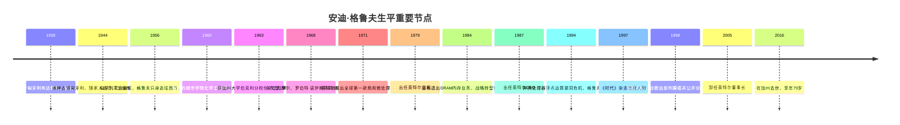
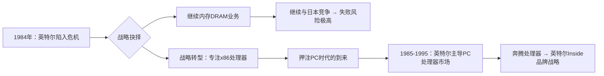
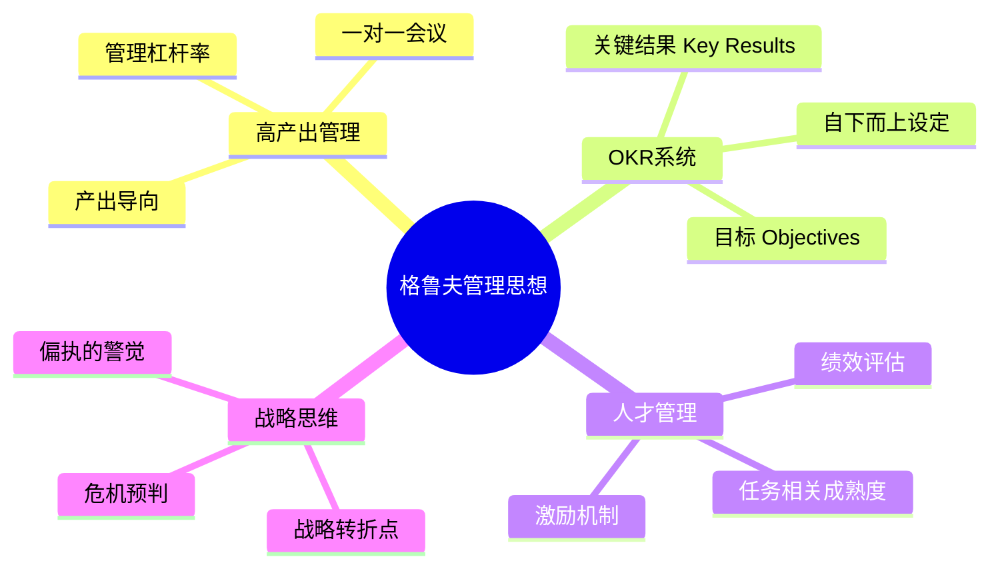

# 安迪·格鲁夫

> "只有偏执狂才能生存。"
> ——安迪·格鲁夫，英特尔第三任CEO

安迪·格鲁夫（Andy Grove，1936-2016），原名安德鲁·伊斯特凡·格罗夫（András István Gróf）。他带领英特尔从一家专注内存芯片的公司转型为全球最主要的处理器制造商，发明了[[OKR]]（目标与关键结果）管理方法，对谷歌、亚马逊等科技公司的管理文化产生了持续影响。

---

## 生平时间轴

---

## 早年经历与成长背景

### 童年创伤与逃亡

格鲁夫1936年生于匈牙利布达佩斯一个中产犹太家庭。1944年，纳粹德国占领匈牙利，8岁的他随家人东躲西藏，以假身份证躲过了集中营。战后，匈牙利落入苏联势力范围，1956年匈牙利革命失败后，20岁的格鲁夫只身越境逃往奥地利，一无所有地来到美国。

这段经历塑造了他终身的人格底色：**对危险的高度警觉、对现状绝不满足、永远为最坏情况做准备** 。

> "我一生中学到的最重要的事情是：在危险到来之前，你必须先感知到它。"

### 求学与加入英特尔

在美国，格鲁夫靠奖学金在纽约城市学院学习化学工程，1963年获得UC伯克利博士学位，随即加入仙童半导体公司（Fairchild Semiconductor）。1968年，他与戈登·摩尔（Gordon Moore）、罗伯特·诺伊斯（Robert Noyce）共同创立了英特尔（Intel）。

---

## 英特尔的关键转型

### 从内存到处理器：战略转型

20世纪80年代初，日本半导体企业（东芝、NEC等）以更低成本大规模进入DRAM内存市场，英特尔的内存业务岌岌可危。

1984年，格鲁夫与摩尔进行了那次著名的对话：

> 格鲁夫问摩尔："如果我们被炒鱿鱼，新来的CEO会怎么做？"  
> 摩尔回答："他会放弃内存业务。"  
> 格鲁夫说："那为什么我们不自己做呢？"

这次战略转型被视为硅谷历史上最成功的战略枢纽（Strategic Inflection Point）之一，也是格鲁夫在《只有偏执狂才能生存》中的核心案例。

### 奔腾处理器危机

1994年，发现奔腾处理器存在浮点运算错误，格鲁夫最初低估了用户的反应，公司股价暴跌。最终英特尔花费**4.75亿美元** 召回并更换所有缺陷处理器。

这一事件教训：**互联网时代，信息传播的速度和广度已经彻底改变了企业危机管理的规则** 。

---

## 管理哲学与贡献

### OKR的诞生

格鲁夫在英特尔内部发展了一套名为**iMBO（Intel Management by Objectives）** 的管理系统，这就是后来被约翰·杜尔（John Doerr）带入谷歌、并传播至全球的**OKR（Objectives and Key Results）** 。

| 传统目标管理 | 格鲁夫的OKR |
|------------|------------|
| 自上而下分配 | 员工可自行设定约50%目标 |
| 以完成率为考核标准 | 达成70%即为优秀，100%说明目标太低 |
| 年度周期 | 季度滚动 |
| 保密 | 全员公开透明 |
| 与薪酬强绑定 | 与薪酬部分解耦 |

### 领导英特尔的关键数字

| 指标 | 数据 |
|------|------|
| 任职CEO时间 | 1987-1998年（11年） |
| 任期内英特尔市值增长 | 约**24倍** （从数十亿到近2000亿美元） |
| 英特尔峰值市值 | 约**5000亿美元** （2000年） |
| 奔腾芯片召回成本 | **4.75亿美元** |

---

## 著作与遗产

| 著作 | 核心主题 |
|------|---------|
| 《格鲁夫给经理人的第一课》（High Output Management，1983） | 中层管理者的实战手册，OKR雏形 |
| 《只有偏执狂才能生存》（Only the Paranoid Survive，1996） | 战略转折点理论，企业危机管理 |
| 《游泳过大西洋》（Swimming Across，2001） | 个人传记，从匈牙利到美国的成长故事 |

> 《格鲁夫给经理人的第一课》被谷歌、亚马逊、LinkedIn等公司列为必读书目。

---

## 人物评价

> "安迪是我认识的最好的管理者，没有之一。"
> ——比尔·盖茨

> "英特尔的成功在很大程度上取决于安迪·格鲁夫的领导力。"
> ——戈登·摩尔

1997年，格鲁夫被《时代》杂志评为**年度人物** ，成为极少数在硅谷之外广为人知的科技高管。

---

## 影响与传承

格鲁夫的遗产体现在多个层面：

1. **OKR方法论** ：通过约翰·杜尔传入谷歌，成为硅谷标准管理工具
2. **战略转折点理论** ：帮助无数企业识别和应对颠覆性变革
3. **中层管理教育** ：《高产出管理》让中层经理人有了真正的管理圣经

更多管理框架详见 → [[高产出管理]]
