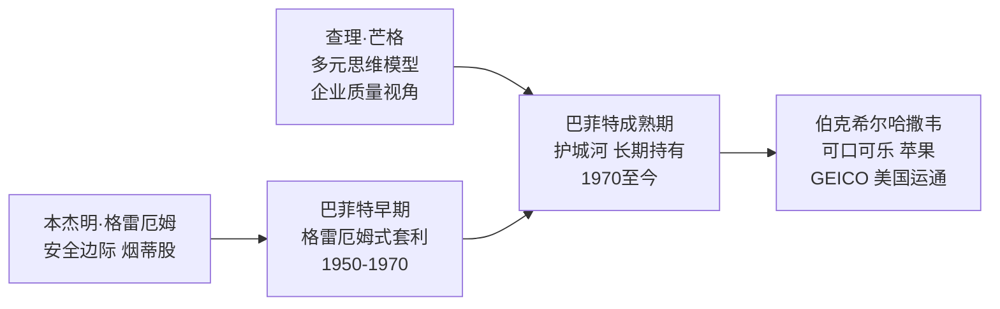

# 巴菲特

沃伦·爱德华·巴菲特（Warren Edward Buffett，1930年生于美国内布拉斯加州奥马哈）是美国投资家，伯克希尔·哈撒韦（Berkshire Hathaway）的董事长兼首席执行官。他是[[本杰明·格雷厄姆]]（Benjamin Graham）在哥伦比亚大学商学院的学生，将格雷厄姆的安全边际原则与定性分析结合，发展出以护城河和企业质量为核心的长期价值投资体系。截至2020年代，伯克希尔·哈撒韦是全球市值最大的企业之一，巴菲特多次跻身全球首富榜单。

## 早年与学习经历

巴菲特自幼对数字和商业有强烈兴趣，11岁时用零花钱第一次购买股票（Cities Service 优先股），高中时已通过送报和经营小型商业积累了约9000美元。1950年，他就读于哥伦比亚大学商学院，师从格雷厄姆。格雷厄姆的《聪明的投资者》（*The Intelligent Investor*）被他称为"有史以来最好的投资书籍"。1954年，他加入格雷厄姆的投资合伙公司 Graham-Newman，直接参与实践。

1956年，格雷厄姆退休，巴菲特回到奥马哈，以10万美元起步建立"巴菲特合伙公司"（Buffett Partnership Ltd.），十年间年化回报超过30%，远超道琼斯指数。1965年，他取得纺织公司伯克希尔·哈撒韦的控制权，将其逐步转型为多元化投资控股公司。

## 从格雷厄姆到芒格：投资哲学的演变

格雷厄姆的方法侧重于买入"烟蒂股"——价格极低、资产被严重低估的公司，即使公司本身平庸。这种方法在统计上有效，但需要大量分散持有和频繁交易。查理·芒格（Charlie Munger，1924—2023）在1970年代成为巴菲特的长期合伙人，引入了一个关键转变：**以合理的价格买入优秀的公司，胜过以便宜的价格买入平庸的公司**。

这一转变使巴菲特的持仓从短期套利转向长期持有，从资产视角转向企业质量视角。

芒格对伯克希尔的贡献不仅是投资理念，还包括跨学科思维框架，详见 [[穷查理宝典]]。

## 核心投资理念

### 护城河

护城河（Economic Moat）是巴菲特用来描述企业竞争优势持久性的核心概念，借用中世纪城堡防御工事作比喻：护城河越宽，竞争对手越难渗透，企业的超额利润持续时间越长。

| 护城河类型 | 典型案例 |
|-----------|---------|
| 品牌溢价 | 可口可乐、茅台 |
| 转换成本 | 企业软件、微信生态 |
| 网络效应 | Visa、美国运通 |
| 成本优势 | 盖可保险（GEICO） |
| 无形资产 | 专利、监管壁垒 |

他对可口可乐的长期持有（1988年买入，至今未售）是护城河理论最典型的实践案例：即使公司增长速度放缓，只要护城河维持，依然是值得持有的资产。

### 能力圈

能力圈（Circle of Competence）是巴菲特反复强调的边界原则：只在自己真正理解的领域内做投资决策，拒绝在边界之外行动。他在互联网泡沫期间（1990年代末）拒绝投资科技股，遭受外界批评，但此后纳斯达克崩溃印证了他的判断。他的表述是："我们不需要比别人更聪明，我们只需要在能力圈之内比别人更有纪律。"

详见 [[价值投资]] 中对能力圈原则的系统阐述。

### Mr. Market 与反市场情绪

巴菲特继承了格雷厄姆的 Mr. Market 比喻：市场是一个情绪化的报价机器，每天给出价格，但你不必接受它的报价。价格与价值之间的偏离是机会，而不是信号。

> "在别人贪婪时恐惧，在别人恐惧时贪婪。"

这与 [[价值投资]] 中安全边际的核心逻辑一致：市场恐慌时正是价格偏离内在价值最大的时候，是建仓的窗口。

### 复利与长期持有

巴菲特将自己的财富积累大部分归因于时间和复利，而非单次的高明决策。他的投资格言"我最喜欢的持有期是永远"（My favorite holding period is forever）体现了他对摩擦成本（税收、交易费用）和频繁决策错误概率的厌恶。他在62岁时拥有的财富中，超过95%是62岁之后积累的——这个数据他常用来说明复利的非线性效应。

## 与查理·芒格的合作

巴菲特与芒格的合作从1960年代开始，两人性格互补：巴菲特更偏向定量分析和格雷厄姆的安全边际框架，芒格更偏向定性分析和跨学科思维。芒格的多元思维模型（物理学、生物学、心理学等各学科的核心框架）帮助伯克希尔在企业文化评估、管理层判断和行业结构分析上超越了纯数字驱动的方法。两人共同治理伯克希尔超过半个世纪，每年的股东大会被称为"资本主义的伍德斯托克"。

[[穷查理宝典]] 是芒格思想的核心文集，其中关于心理偏误和激励机制的分析，是理解伯克希尔长期决策逻辑的重要背景。

## 段永平与午餐拍卖

2006年，中国企业家 [[段永平]] 以620,100美元拍得与巴菲特共进午餐的机会，在当年创下该慈善拍卖的历史记录。段永平在午餐上带去了黄峥（拼多多创始人），两人与巴菲特的对话围绕价值投资哲学展开。

段永平此后通过网络广泛传播价值投资理念，将巴菲特体系与中国商业语境结合，发展出以"本分"为核心筛选器的投资框架。他是巴菲特哲学在中国最重要的传播者之一。

详见 → [[段永平]]、[[价值投资]]

## 年度股东信

伯克希尔·哈撒韦每年发布的致股东信是巴菲特系统阐述投资哲学的主要渠道。从1965年至今，这些信件覆盖护城河分析、管理层评估、资本分配原则、保险业务逻辑等核心主题，被视为现代价值投资最重要的原始文献之一。

## 主要持仓与重大决策

| 年份 | 决策 | 备注 |
|------|------|------|
| 1965 | 收购伯克希尔·哈撒韦 | 转型为控股公司的起点 |
| 1967 | 收购 GEICO 汽车保险 | 低成本浮存金模式的核心 |
| 1988 | 买入可口可乐 | 护城河理论的典型实践 |
| 1990年代 | 拒绝投资科技股 | 坚守能力圈，避开互联网泡沫 |
| 2011 | 买入 IBM（后撤出） | 公开承认判断失误 |
| 2016 | 大规模买入苹果 | 重新理解科技消费品的护城河 |

详见 → [[价值投资]]、[[穷查理宝典]]、[[段永平]]
