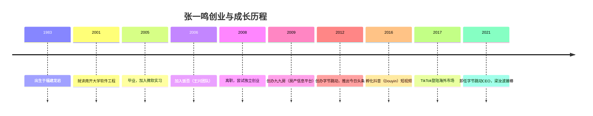
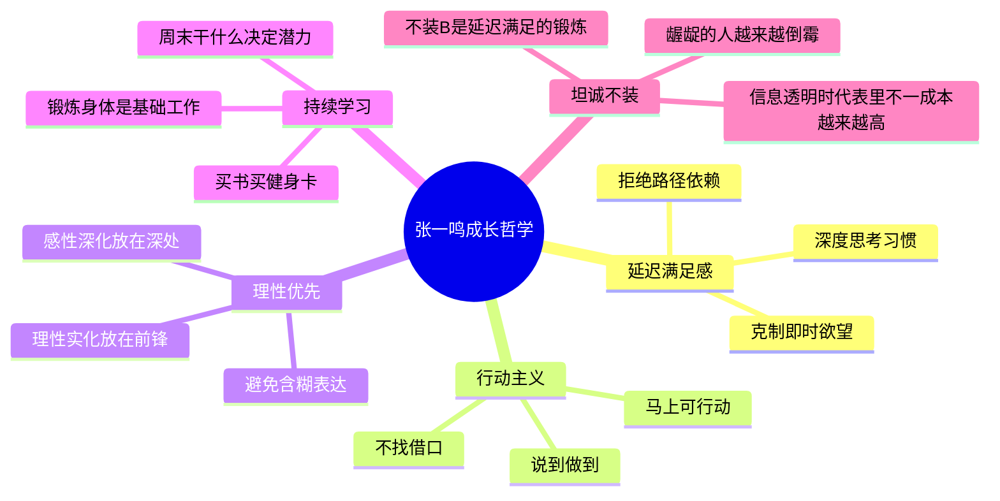
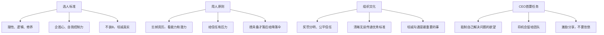

# 张一鸣

张一鸣（1983年—），[[字节跳动]]（ByteDance）创始人，今日头条（Toutiao）、抖音（Douyin）、TikTok的缔造者。他的崛起轨迹以"算法"为主线，以"延迟满足感"为精神内核，是中国新一代互联网创业者中最具影响力的代表之一。

## 背景与成长

张一鸣毕业于南开大学，妻子是大学同班同学。毕业后他先后在微软短暂工作，后加入[[王兴]]主导的饭否团队，接触了早期互联网创业的实战氛围。

他在微博上坦言，在北京六年换了六个居所："回龙观，双榆树，知春里，和平里，惠新西街，西土城"——这是一名程序员跌跌撞撞寻找方向的草根岁月。

> "如果给过去5年的自己一个建议，就是激进再激进一点。"

他的早期项目是**九九房**——类似安居客或贝壳找房的房产信息平台。这段经历积累了对移动互联网分发模式的深度理解，最终引导他在2012年创办字节跳动，以算法推荐重新定义新闻资讯消费方式。

## 核心思想体系

### 延迟满足感（最高频关键词）

在张一鸣的微博中，"延迟满足感"出现频率最高，被他视为拉开人与人差距的根本因素：

> "延迟满足感程度在不同量级的人是没法有效讨论问题的，因为他们愿意触探停留的深度不一样。"

> "延迟满足感和坚决告别惰性是'优秀'的最重要两块基石。"

他认为，延迟满足感体现在方方面面：克制冲动、保持耐心、拒绝安于现状、不急于当下的结果而专注长期积累。

### 自我修炼与成长哲学

### 行动派与执行力

张一鸣反复强调"行动"的力量：

> "马上有什么可行动，你是行动派吗？很多问题它不会消失，不动（犹豫/抱怨/感叹）肯定是错误，行动就有力量，哪怕是行动的准备行动，唯有行动才能改变事情。"

> "牛逼的人找方法，傻逼的人找借口。"

他将执行力定义为"说到做到，不找借口，完成别人都能完成的事"——而更强的人，是"完成别人完不成的事"。

### 理性做事，感性做人

> "做个理性人，很多事情就不必做。感性做人，理性做事的态度有其意义。"

> "应该让肾上腺素和理智一起发挥作用。"

他从德州扑克中归纳出人性弱点与应对之道：
- 贪玩（烂牌不fold）
- 侥幸（等待低概率事件）
- 不能舍（因过去付出不放弃）
- 过度概括（一个例子就下结论）

对应正确策略：理解不确定性、专注有可能的事情、理智评估概率、能舍才能得。

## 管理思想

### 团队管理语录

> "坦诚沟通是公司团队管理的主要问题。"

> "一个公司最强的敌人是什么？韦尔奇说，是'坦率'。深表认同。幸好，坦率是可以培育的。"

> "当你给一个人足够的信任和压力的时候，他总能比原来做的更好。"

团队淘汰顺序（据多家公司统计）：
| 批次 | 类型 |
|------|------|
| 第一批 | 明显缺陷者、众人厌恶的说谎者 |
| 第二批 | 不愿交流者、不合群者 |
| 第三批 | 有能力但慵懒者、坐享其成者 |
| 第四批 | 居功自傲者、蔑视同僚者 |

## 学习与阅读观

| 主题 | 张一鸣的观点 |
|------|-------------|
| 传记 | "不知道让小孩阅读什么，最适合的就是传记" |
| 读书速度 | "问题不在看书速度，而在知易行难，实践的速度赶不上所知的要求" |
| 时间管理 | "人的差别在于业余时间，命运决定于晚上8点到10点之间" |
| 学习状态 | "爱学习的人和相反的差距，互联网拉得更大" |
| 阅读方法 | "阅读应该是有自我要求的、主动的状态" |

他反复引用《如何阅读一本书》，强调主动阅读与被动消费的本质差异。他认为，关于学习，最重要的态度是"卓有成效的秘诀就是善于集中精力"（德鲁克语）。

## 乔布斯饥渴理论的升华

张一鸣在微博中对乔布斯"Stay Hungry"的解读独具一格：

> "乔布斯说stay hungry，我以为饥渴有三个层次：贪婪、成就动机、好奇心。三者分别关注：瞬间的结果，持续的过程，和远大的未知。三者也恰好对应了三种人：卑劣的投机者，艰辛的攀登者，与幸福的探索者。"

## 人生态度

> "现在年轻人部分流行把三四十岁退休作为理想，我不认同，我觉得理想是一直有机会创造、实现想法，有机会学习、修炼、创造到老。"

> "平庸有重力，需要逃逸速度。"

> "台风来的时候，猪都会飞起来。所以，真的飞起来时一定要清楚的知道是因为自己能飞，还是外力使然。靠台风飞起来的猪迟早是会掉下来的。"

## 与王兴的交集

张一鸣早年曾追随[[王兴]]在饭否工作，他在微博中也提到："今天听王兴演讲的比喻：人生，和谁一起在路上，看什么风景。"两人同属中国互联网创业第一梯队，都以知识型创业者闻名，都在饭否平台留下了大量思想记录。

---

**相关文章**: [[产品与算法思维]] · [[王兴]] · [[饭否文化与社区]]
