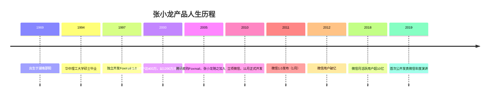
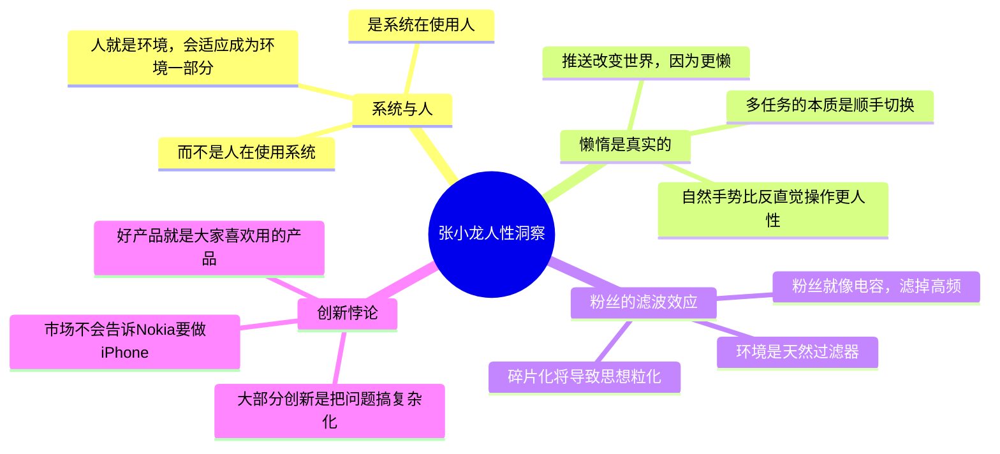
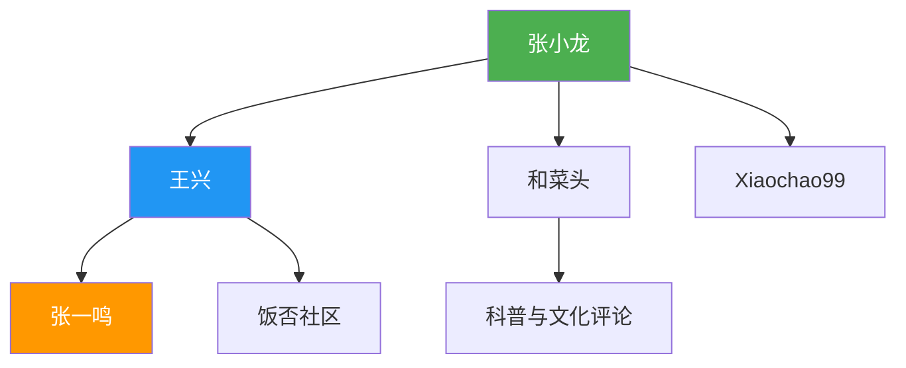

# 张小龙

张小龙，微信（WeChat/Weixin）产品负责人，腾讯高级副总裁。他是中国互联网史上最具传奇色彩的产品经理之一——以一人之力创作Foxmail，后主导微信成为全球最成功的移动社交产品。他在饭否上的发言，构成了理解微信产品哲学最原始、最真实的文本。

## 饭否：一位内向天才的表达出口

张小龙的饭否帖文（2012年导出版本）共268页，时间跨度从2011年至2012年。不同于一般创业者的正能量分享，他的帖文充满了对产品细节的高密度观察、对人性的反直觉洞察，以及大量IT极客式的日常碎碎念。

王兴在饭否上曾转发："看到和菜头爆料腾讯，那个张什么龙貌似牛X闪闪啊，有空要去拜访一哈"——这条被张小龙本人转发的帖子，是早期互联网圈对他的典型评价。

## 产品哲学核心

### 反功能主义

> "需要说明书的产品不是好产品。需要弹tip告知用户如何使用的功能不是好功能。"

> "每天都有很多产品发布或升级，介绍都是罗列功能指标。用户又不是按功能来付费的，你列那么多新功能去完成KPI没有问题，去糊弄用户就不对了。"

> "软件的'What's New'向导都是错的。不应该介绍功能，应该做成一个虚拟发布会。不应罗列功能，应告诉用户你给他们带来什么。带来的和功能是不同的。"

### 推送即未来

张小龙在2012年发出了一段堪称预言性的产品思考：

> "人是环境的反应器。微博像是一个环境，但它不会主动刺激人，所以是个伪环境。到微博看东西是不人性的，哪有到环境里逛逛再决定做什么的，那不叫反应。而是当环境发生了点什么事情刺激到人了，人做出的行动才叫反应。所以，微博之后，将是推送。"

> "推送改变世界。因为更懒。"

这段话发布于2012年，恰恰是微信公众号推出的那一年。张小龙在饭否上预演了他后来在微信中实践的核心逻辑：**系统主动触达用户，而不是用户主动寻找内容** 。

### 偏执与好奇心

> "好奇心和发现是最值得珍惜的品德。"

> "中国的教育是扼杀好奇心的完美历程。"

> "偏执需要权力的辅佐才能进行到底。"（他引用格鲁夫《唯有偏执狂才能生存》）

> "说不总是对的。因此对于别人的提议，我一般说不。"

## 对人性的观察

> "猿人撬不开果子时就拿石头猛砸，延续至今，电脑前的人打不开网页就猛砸Enter键。所以苹果的'轻触'是多么的文明和远离习性啊。"

> "人和猴子的区别是，人更感性，猴子更理性。"

> "放下手头的事情两天，第三天这事情的重要性就降低了一半。可见事情本不重要，是做了才重要。"

## 极简美学

张小龙对产品形态有高度审美洁癖：

> "我偏爱所有金属边框的产品。"

> "要比较两台机器的做工，你只需按动一下按钮，体验一下按钮的手感，就高下立分了。"

> "暴力拆开MX后盖再装好，发现一个小螺丝移位了。它不再完美。"

这种近乎苛刻的完美主义，直接体现在微信极简的设计语言中：无广告、无推荐内容流、克制的功能入口。他在饭否上说：

> "大部分的所谓创新，都是把问题搞复杂化而已。"

## 个人性格画像

| 维度 | 特征 |
|------|------|
| 社交风格 | 内向，极少公开演讲，饭否是最接近内心的出口 |
| 读书偏好 | 乔布斯传记、产品设计理论、人类行为学 |
| 技术态度 | 崇尚简单方案，反对过度工程化 |
| 竞争观 | "市场不会告诉Nokia说你们要做iPhone" |
| 幽默感 | 干燥、自嘲、常用短句制造转折 |
| 信息观 | "我以为我掌握了很多信息可以看到真相，其实只是看到了微博窗口里几百个字描述的画面而已。窗口就是真相。" |

## 关于微信的原初构想

张小龙在饭否上多次流露出微信开发前后的状态：

> "还是要做阅读。做人人都要的阅读。"（2011年11月，彼时微信已内测）

> "释放每个人心中被压制的摄影狂荷尔蒙。"（谈到相册/图片功能的驱动力）

> "脸部识别是高技术，将来对着一个美女拍个照，就可以加她微信号了。"（功能预测）

对"推送"的洞察直接决定了微信公众号的订阅推送逻辑；对"人性懒惰"的理解决定了微信一键语音消息的成功；对"粉丝滤波"的担忧决定了微信朋友圈永远不做算法推荐时间流。

## 与同时代人的对话

张小龙饭否的互动对象揭示了他的思想圈层：

他与[[王兴]]多次互动转发，与"和菜头"进行大量关于写作、产品和互联网文化的对话。在那个时代，饭否是中国最有思想密度的社交网络——张小龙、王兴、张一鸣，这三位改变中国互联网的人，都曾在这个平台上思考和表达。

## 代表性金句

> "写文章，做网站，写代码，要求的能力都是一样的，就是条理。"

> "碎片化狂潮席卷互联网，照此下去，最终会变成，每个人举着只包含一个bit的思想玩对对碰。"

> "微博看多了，会对人类的判断力失去信心。"

> "IBM是面镜子，让Apple看到了反方向就是正确的方向。"

---

**相关文章** : [[微信产品哲学]] · [[饭否文化与社区]] · [[王兴]] · [[张一鸣]]
