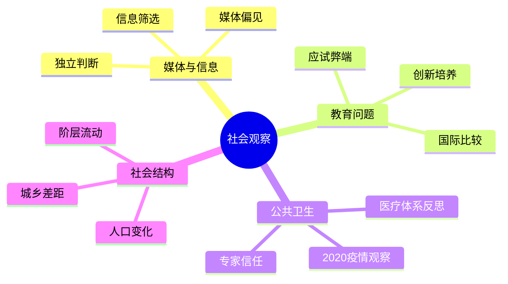

# 时事与社会

王兴在饭否上的社会观察保持着相对克制的表达方式。他对中国社会问题的判断多通过具体事件和数据呈现，少见激烈的情绪宣泄，但清醒的批判性思维贯穿始终。

## 媒体与信息

王兴对媒体的功能定位有一个来自书本的判断："The media doesn't tell us what to think; it tells us what to think about."（媒体不告诉我们该怎么想，而是告诉我们该想什么。）——伯纳德·科恩，1963年（2010-10-07）。这一引语之后，他将"改掉了一大早看新闻的坏习惯"视为正确决策（2009-02-23）。

他对新闻有一个广为流传的类比："想到新闻只是历史时钟的秒针"（2009-04-13，转引）。他认为互联网时代"想彻底封锁消息确实比较难"（2010-10-14），但对信息的丰富并不无条件乐观，因为"中文互联网的非娱乐内容至今都相当贫瘠"。

## 教育的问题

王兴对教育制度有结构性批评。他认为历史教育没有让他"明白人类这一万来年的文明史是多么野蛮残酷，'亡国灭种'是多么常见"（2013-05-12）。他对中学政治课本的"商品的价值是凝结在商品中的无差别的人类劳动"的表述做了逻辑性反驳，认为"艺术的价值就是那差别"（2008-12-28）。

他转述了中戏/北影的状况："择校费已高达两三百万，已经被土豪娶美女后诞生的'长相随爹、头脑随妈'的富二代们占领"（2015-07-05），担忧这一现象对演艺业人才质量的长期影响。他也引用章太炎在1919年的话警示年轻人："现在青年第一弱点，就是把事情太看容易，其结果不是侥幸，便是退却。"（2015-08-29）

## 公共卫生与食品安全

食品安全是王兴持续关注的民生议题之一。他记录了对国内食品安全的不信任（2011-10-10），转述了食品行业人士的惊悚论断（地沟油与食用油价格的悖论），并转发了鸡场尽职调查者的亲历调查（2010-12-04），态度是信息性的而非煽情性的。

他在南非旅行时写道，"在这个平均每5个人中就有一个携带艾滋病毒的国家，出门确实得当心"（2015-01-20），折射了他对公共健康地理分布的关注。

## 政府与制度

王兴对政府服务效率的批评直接而节制。他在去办护照时写道："政府部门还是完全没有服务意识。去办个护照还是跟孙子一样。"（2011-01-06）他对国内网银需要插件才能使用的设计，感慨"国内的网络环境真的有这么险恶吗？"（2010-12-22）

他在技术层面也记录了制度的奇特性，例如"较大的市"居然是一个正式的法律概念，是他"见过的最口语化的正式称呼"（2011-03-25）。

他对政治的总体态度是节制的距离感。他引用凯恩斯的话说明思想的力量："那些相信自己在智力上不受影响的实干家往往是那些已经过世的经济学家的奴隶"（2016-01-20），强调经济思想对政策的隐性影响。他也直接引用《教父3》的台词："Finance is a gun. Politics is knowing when to pull the trigger."（2016-05-10）

## 社会转型与变革

王兴在2013年写下了对中国未来十年的预感："想到中国未来二十年很可能要经历一场社会大变革，我就突然有一种冲动，想去电影院把《悲惨世界》再看一遍。"（2013-03-22）他在半年后看完《了不起的盖茨比》时也有类似感触，认为当下的中国"像极了故事背景里的美国1920年代：X国梦，浮躁，新钱老钱……"（2013-09-04）

他对社会急功近利风气的消退有一个结构性判断："一个社会摆脱急功近利风气的速度可能会比很多人估计的更快。倒不是大众的水平会突然跃升，而是当一个社会的转型期趋于结束，人们逐渐发现即使是'急功'的行为也不再能带来'近利'。"（2016-02-18）

## 对中国创业环境的辩护

王兴在2013年对媒体将"恨在中国创业"的标题套在他身上做了明确反驳："我爱中国，不然我会想办法离开这里；我爱创业，不然我不会依然在做此事；我爱在中国创业，因为有激动人心的机会和激情四射的团队。"（2013-07-05）他既不回避中国商业环境的复杂，也不接受悲观叙事的框定。

他也转述了一句他认为在中国经营适用的格言："在中国这么复杂的环境下，我窃以为，最有良心的公司大概也只有脸说'Don't be TOO evil'"（2013-03-19），以现实主义而非理想主义的眼光看待企业道德。
