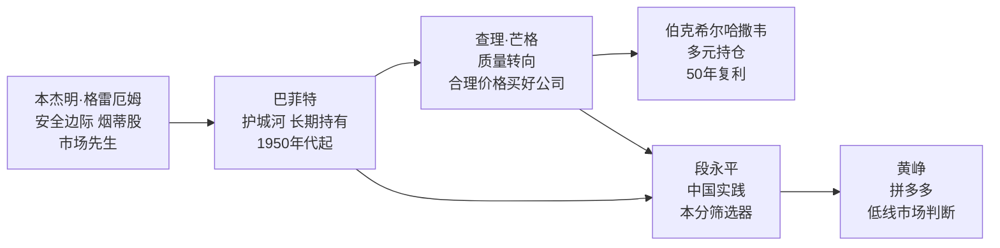

# 本杰明·格雷厄姆

本杰明·格雷厄姆（Benjamin Graham，1894—1976），美国经济学家、投资人，哥伦比亚大学商学院教授，被称为"价值投资之父"。他在20世纪30至40年代奠基了[[价值投资]]的理论框架，将股票分析从投机性猜测转变为以内在价值为基础的系统化方法。[[巴菲特]]是他在哥伦比亚大学最著名的学生，称其代表作《聪明的投资者》为"有史以来最好的投资书籍"。

## 生平

格雷厄姆1894年生于英国伦敦，幼年随家人移居美国纽约，9岁时父亲去世，家道中落。1914年以最优生荣誉毕业于哥伦比亚大学，随后进入华尔街。1929年股灾令他管理的基金损失惨重，此后数年他系统重建分析框架，形成以量化财务指标估算内在价值、回避投机的方法论。1934年与大卫·多德（David Dodd）合著《证券分析》（*Security Analysis*），1949年出版面向普通投资者的《聪明的投资者》（*The Intelligent Investor*）。他在哥伦比亚大学商学院执教数十年，1956年退休。

## 核心概念

### 安全边际

安全边际（Margin of Safety）是格雷厄姆最核心的贡献：以显著低于内在价值的价格买入，为判断失误和未来不确定性预留缓冲空间。他认为这是**投资** 与**投机** 的本质分界线。

> "股票不仅仅是一张可以买卖的凭证，它代表着对一家真实企业的部分所有权。"

[[价值投资]]中对安全边际有系统阐述；[[段永平]]将其简化为"买股票就是买公司的未来现金流折现"。

### 烟蒂股

烟蒂股（Cigar-Butt Investing）是格雷厄姆早期核心策略：寻找价格被极度低估、仍有最后利润空间的公司，买入后等待价值回归即卖出，分散持有大量此类标的。这一策略不依赖公司未来成长，只依赖当前资产的低估程度。

[[巴菲特]]早期严格遵循这一策略，后在[[穷查理宝典]]作者查理·芒格的影响下转向"以合理价格买入优秀公司"，逐步摆脱纯粹的烟蒂股思维。

### 市场先生

市场先生（Mr. Market）是格雷厄姆设计的比喻：将股票市场想象成一个情绪不稳定的合伙人，每天给出一个报价，但投资者永远不必接受它。价格的剧烈波动是机会而非信号。[[巴菲特]]继承并广泛传播了这一比喻，用于解释为何市场短期非理性不应影响长期价值判断。

---

## 思想影响链

从格雷厄姆到[[黄峥]]，[[价值投资]]理论历经约90年传承：格雷厄姆奠定量化分析基础，[[巴菲特]]加入护城河与企业质量视角，芒格引入跨学科分析框架，[[段永平]]在中国商业语境中内化为"本分"文化维度，黄峥则将这套思想应用于对被忽视市场的战略判断。

---

## 主要著作

| 著作 | 年份 | 核心贡献 |
|------|------|---------|
| 《证券分析》（与多德合著） | 1934 | 系统化股票内在价值分析方法 |
| 《聪明的投资者》 | 1949 | 安全边际与市场先生概念，面向普通投资者 |

## 与巴菲特的师生关系

1950年，[[巴菲特]]就读于哥伦比亚大学商学院，在格雷厄姆课堂中获得唯一的A+成绩。1954年加入格雷厄姆的投资合伙公司 Graham-Newman，直接参与实践。格雷厄姆1956年退休后，巴菲特回到奥马哈独立创业，将格雷厄姆的安全边际原则与此后芒格的质量视角融合，形成了现代价值投资的核心范式。

详见 → [[价值投资]]、[[巴菲特]]、[[穷查理宝典]]、[[段永平]]
