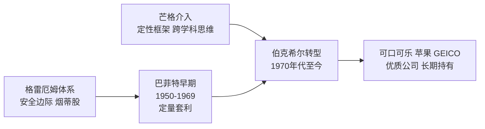
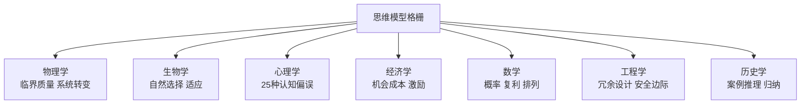

# 查理·芒格

查理·托马斯·芒格（Charlie Thomas Munger，1924年1月1日生于内布拉斯加州奥马哈，2023年11月28日辞世，享年99岁），美国律师、投资家，伯克希尔·哈撒韦（Berkshire Hathaway）副董事长。他与[[巴菲特]]合作逾半世纪，是伯克希尔投资哲学中定性分析框架的核心贡献者。他的思想文集[[穷查理宝典]]（2005年首版）收录其11篇演讲，是理解其多元思维模型与认知偏误体系的一手文献。

## 生平概要

芒格早年就读于密歇根大学数学系，后入读加州理工学院，二战期间以气象学员身份服役。1948年，他从哈佛法学院以优异成绩毕业（未取得本科学位直接入读），此后在洛杉矶建立芒格、托尔斯律师事务所。1962年，他开始兼营投资合伙公司，1978年正式出任伯克希尔·哈撒韦副董事长，直至辞世。

## 与巴菲特的合作

芒格与[[巴菲特]]首次见面于1959年，两人经由奥马哈共同人脉相识。1970年代芒格逐步深度介入伯克希尔，带来了一个关键转变：将格雷厄姆式的定量套利框架扩展为以企业质量为中心的长期持有策略。

巴菲特公开表述，芒格说服他从"以合理价格买普通公司"转向"以合理价格买优秀公司"。两人共同治理伯克希尔超过半个世纪，每年股东大会被称为"资本主义的伍德斯托克"。

## 多元思维模型格栅

芒格将单一学科视角导致的判断失误称为"铁锤人综合症"，解法是从各主要学科提取核心模型，构建协同运作的认知格栅（Latticework of Mental Models）。他从未发布标准版清单，研究者从其演讲归纳出超过100个分析变量，涵盖竞争格局、成本结构、管理层激励与护城河可持续性等维度。

逆向思维（Inversion）是芒格援引最频繁的工具之一：与其问"如何成功"，先问"如何确保失败"，再系统规避那些路径。这一方法在投资实践中体现为"先想为什么不能投"的负面清单逻辑，详见[[穷查理宝典]]。

## 25种认知偏误

芒格在演讲《关于人类误判心理学》中系统列举了25种认知偏误，是其将行为心理学纳入商业分析的集中体现。核心包括激励扭曲、社会认同、喜爱偏误、厌恶损失、可得性偏误、沉没成本与过度自信。

多个偏误同方向叠加时，芒格将其称为"Lollapalooza效应"，合力远超各偏误独立作用之和，是历史上重大灾难性决策的根源。[[价值投资]]中对心理偏误的防范正是基于这套分析框架。

## 对段永平的影响

[[段永平]] 是中国最早系统践行芒格体系的企业家投资人之一。

> "知道自己不知道什么，比知道自己知道什么更重要。"

这一原则在[[段永平投资哲学]]中转化为三条具体操作铁律：**不懂不碰** 对应能力圈边界；**本分** 评估对应芒格的管理层激励分析；**不为清单** （Stop Doing List）对应逆向思维中先排除失败路径的方法论。黄峥（拼多多创始人）亦通过段永平间接接受了芒格体系的影响。

## 遗产

芒格辞世于2023年11月，距百岁寿辰不足六周。他对[[价值投资]]体系的核心贡献是为格雷厄姆安全边际框架引入定性维度：心理学分析、跨学科推理、逆向思维和管理层激励判断，使其演变为更完整的决策体系。

详见 → [[穷查理宝典]]、[[巴菲特]]、[[价值投资]]、[[段永平]]、[[段永平投资哲学]]
