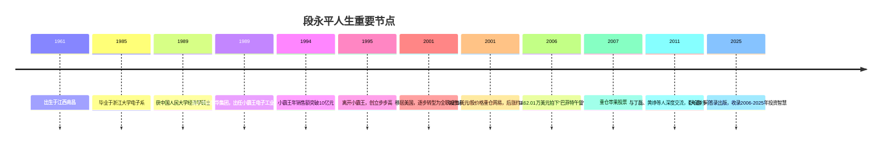
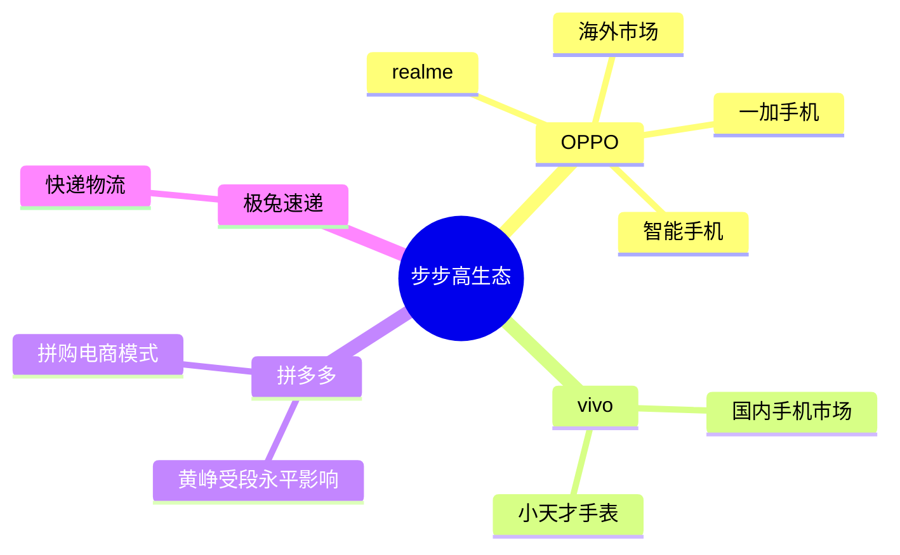
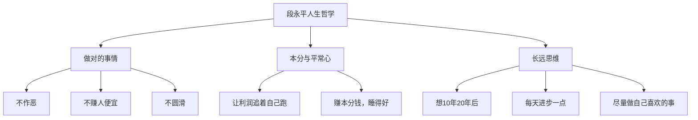

# 段永平

> "做对的事情，把事情做对。"
> ——段永平的核心人生信条

段永平（1961年生于江西南昌），是中国最具传奇色彩的企业家兼投资者之一。他既是消费电子帝国的缔造者，又是中国最早践行巴菲特价值投资理念的先行者。他的名字与小霸王、步步高、OPPO、vivo、拼多多等一系列成功品牌紧密相连。

---

## 人生历程

### 早年与求学

段永平1961年生于江西南昌。1985年毕业于浙江大学电子系，1989年获中国人民大学经济学硕士学位。凭借工科与经济学的双重背景，他对产品与商业均有深刻理解。

### 小霸王时代（1989-1995）

1989年，段永平加入中山市怡华集团小霸王电子工业公司，出任总经理。当时公司年销售额不足千万，他接手后以"学习机"和游戏机为核心产品，迅速打开市场。

| 年份 | 小霸王销售额 | 关键事件 |
|------|------------|---------|
| 1989 | <1000万元 | 段永平出任总经理 |
| 1991 | ~2亿元 | "小霸王，其乐无穷"广告全国热播 |
| 1993 | ~5亿元 | 学习机市场领先地位确立 |
| 1994 | >10亿元 | 达到巅峰，与任天堂合作 |

然而，由于股权结构问题，段永平无法获得与贡献相符的回报，最终选择离开，并带走了多位核心团队成员。

### 步步高时代（1995-2000年代）

1995年，段永平在东莞创立步步高。他确立了"本分、平常心"的企业文化，并在产品上坚持"差异化"策略：

- **步步高VCD/DVD**：进入家庭影音市场
- **步步高无绳电话**：国内最大的无绳电话品牌之一
- **步步高点读机**："哪里不会点哪里"广告家喻户晓

更重要的是，他孵化并培育了日后独当一面的品牌生态：

### 移居美国与全职投资（2001年至今）

2001年，段永平移居美国，逐步退出企业日常运营，转型为全职投资者。他以雪球账号"大道无形我有型"著称，持续在网络上分享投资心得。

**经典投资案例：**

| 投资标的 | 时间 | 简评 |
|---------|------|------|
| **网易** | 2001年 | 以约1美元/股买入，后涨约160倍，"以铜价买金子" |
| **苹果** | 2007年前后 | 重仓持有，认为苹果生态系统无可比拟 |
| **贵州茅台** | 多次买入 | "茅台生意模式强大" |
| **伯克希尔哈撒韦** | 长期持有 | 巴菲特的信徒 |
| **腾讯控股** | 长期持有 | "通过社交媒体将流量货币化" |

---

## 巴菲特午餐（2006年）

2006年，段永平以**62.01万美元**拍下与巴菲特共进午餐的机会，并带上了当时创业的黄峥（后来拼多多的创始人）。

> "我在巴菲特这里学到的最重要的东西就是生意模式。以前虽然也知道生意模式重要，但往往是和其他很多重要的东西混在一起看的。当年巴菲特特别提醒我，应该首先看生意模式，这几年下来慢慢觉得确实应该如此。"

这顿午饭对段永平的影响：
1. 强化了"生意模式第一"的思维框架
2. 加深了对护城河与长期价值的理解
3. 确立了"不做空、不借钱、不懂不碰"的铁律

---

## 人格特质与人生哲学

他的人生格言包括：
- "得到你想要的，珍惜你得到的"
- "越是迷惘的时候，越是要往远处看"
- "为创业而创业的人，多数很难成功"
- "受教育是自助的最好办法"

---

## 公益与教育

段永平是一位慷慨的慈善家，累计向多所高校捐赠近**20亿元人民币**：

| 捐赠机构 | 用途 |
|---------|------|
| 浙江大学 | 学院冠名、奖学金 |
| 中国人民大学 | 教育基金 |
| 南昌工程学院 | 发展支持 |

---

## 影响力

段永平以"用生命影响生命"著称：他培养了黄峥（[[王兴]]的挚友、拼多多创始人），影响了丁磊（网易），其企业文化理念也深刻塑造了整个步步高系。他与巴菲特、芒格的思想脉络，构成了中国价值投资圈的重要精神源泉。

更多投资框架详见 → [[段永平投资哲学]]
