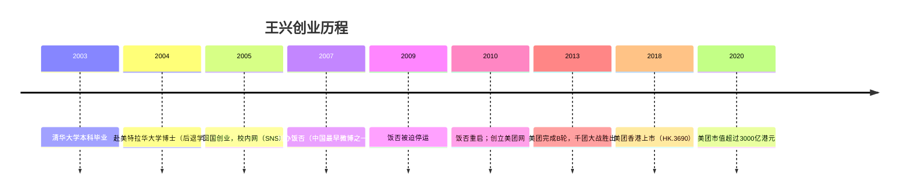

# 王兴

王兴，[[美团]]点评（美团）联合创始人兼CEO，连续创业者，[[饭否文化与社区|饭否（Fanfou）]]创始人。其饭否帖文从2007年延续至2020年，构成一份横跨十三年的思想档案，记录了他从早期创业者到互联网巨头掌舵人的完整演变。

## 背景与经历

王兴1979年生于福建龙岩，2001年毕业于清华大学电子工程系，随后赴美国特拉华大学攻读计算机科学博士。2003年，他在论文尚未完成之际选择回国创业。他在饭否上描述过那个时刻："5年前的今夜，我在收拾行李，准备第二天上飞机，回国创业"（2008-12-25）。博士学业的中止并非失败，而是他在博士期间想清楚了一件事：互联网上有太多激动人心的事情可做。

回国后，王兴先后创办校内网（后更名人人网）、饭否、海内网等多个项目。[[张一鸣]]曾是饭否的早期团队成员之一。2010年3月，他与[[王慧文]]联合创立美团网，切入团购市场，此后经历"千团大战"，美团最终突围并持续扩张至本地生活服务平台。2018年，美团在香港上市。

王兴对自己的福建背景和家族历史有明显的认同感。他的曾祖父二十年代曾下南洋至印尼棉兰，奶奶的兄弟姐妹1949年去了台湾，这种散居各处的家族史令他对华人移民和近现代历史格外敏感。

**张亮** 是王兴在饭否早期最频繁互动的人之一，两人的对话横跨篮球统计、音乐、科技评论等广泛话题。张亮向王兴引荐了约书亚·雷诺兹那句"为了逃避真正的思考，人们是不惜采取任何手段的"（2008-12-21），这句话此后被王兴多次转引。张亮后来成为苹果报道媒体 Apple4.us 的发起人；王兴在帖文中坦言自己宣传朋友的方式是"逢人就夸张亮这小伙子才貌双全"（2008-12-22）。

## 知识性格：博览与系统思考

在饭否上，王兴的阅读量和知识广度是最鲜明的特征之一。他在kindle上购买大量书籍，涉及历史、经济学、传记、科幻、科技等领域，并常在阅读后随手发帖分享感想。他不局限于商业读物，对文学作品（莫言、王小波、菲茨杰拉德）、历史著作（马歇尔传记、林登·约翰逊传记）以及科普书籍均有涉猎。

他对历史有一种结构性的兴趣，喜欢找不同文明、不同时代之间的对应关系。例如，他注意到郑和航海是亏钱的而哥伦布是赚钱的，认为这一细节对理解此后五百年世界格局至关重要；他也观察到美国开国总统华盛顿与乾隆帝死于同年，并由此感慨中美发展路径的分岔。

他的知识偏好带有明显的系统论倾向。他引用科斯的交易成本理论分析IT行业变化，引用罗尔斯《正义论》框架思考社会公平，引用梅因定律和进化论阐释人类行为。

他对电子游戏的早期经历也构成了一部分世界观基础。2013年11月，他在饭否上写道："越来越意识到小时候玩过的游戏《文明civilization》对我世界观的影响。"（2013-11-08）这款策略游戏涵盖文明兴衰、军事、科技、外交等维度，与他此后对历史、国家竞争的理解高度呼应。2015年，他再次以《文明》为喻，将某种政治体制下周期性的大型仪式比作"当你的文明发展到一定地步，就需要花费不低的成本定期举行隆重仪式以增强稳定性"（2015-08-23）。2018年，他描述《文明》的两种胜利方式：灭掉其他文明，或率先发射飞往半人马座的飞船，"两种打法在游戏的前90%是看不出差别的"（2018-10-08）。

> "科技进步让'行千里路'变得易如反掌，'读万卷书'的工作却依然无可替代。" （2010-11-12）

## 创业者性格：长期主义与直接

王兴在饭否上展现出对长期主义的一贯坚持。2015年美团五周年时，他引用了那句著名的比尔·盖茨式判断："人们总是高估两年能发生的变化，总是低估五年能发生的变化。" 他不止一次在帖文中提到"对未来越有信心，对现在越有耐心"。

他对当时热闹但不靠谱的商业现象保持冷静距离。2007年，已有大量人打算复制Facebook的商业模式，他直接评价："非死不可啊非死不可"。2014年，他认为"创业"在国内已经"流(fan)行(lan)到一定地步了"，表达了对创业热过度泡沫化的不满。

他对竞争有清醒的认知，并能从汉字本身提炼出哲学："竞争竞争，何为竞，何为争？同向为竞，相向为争"（2013-05-23）。他推崇的战略原则是"战略上打持久战，战术上打歼灭战"（2015-11-28）。

## 个人风格：干燥的幽默与自我审视

王兴的帖文语言简练，少用感叹词，但不时流露出干燥的幽默。他2011年三十二岁生日时写道"我2^5岁了"，用程序员式的表达庆祝了自己的生日。在看到美团员工数据时，他写道"数据显示，在美团网的所有员工里，我比96.3%的人更年长。这说明什么？"——留白而不自答，令人发笑。

他也不回避对自身的批评性观察。他承认自己不是典型的大众用户，"手机首屏app里常年有一个英文词典"；他在美团之星评选后写下，大多数候选人"在各自岗位上的表现都比我在CEO这个岗位上的得分高"；他坦承对某件事"没有达到我妈的善良标准"。

## 核心信念

通贯王兴帖文的几项核心信念：

**一是用户价值高于商业模式。** 他早年在饭否产品上就强调"不贰过"（不让用户在同一地方重复受挫），后来在美团将这一原则扩大为运营准则。

**二是市场与团队不可偏废。** 他认为，创业领域"市场和团队哪个更重要"的问题与哲学上"唯物和唯心哪个更正确"一脉相承，没有简单对错，只是看问题的角度不同。

**三是文明的价值高于优化。** 他在2016年写下的一句话浓缩了他对科技与文明关系的基本判断："Civilization is more than optimization."

**四是对信息和历史保持长时段视野。** 他认为新闻"只是历史时钟的秒针"，自律性地减少每日新闻的阅读量，将精力用于读书和深度思考。

**五是对技术代际冲击的持续关注。** 他在2017年观察到 Amazon 云计算服务的扩张，用"清朝末年一个留着辫子的中国人走出国门，看到人家的蒸汽机、火车、轮船"来形容国内科技差距带来的焦虑（2017-01-12）。2020年，他将互联网比作古登堡活字印刷，认为两者都是"IT方面最大的变革"，并由此预测互联网将引发类似宗教改革、大航海、科学革命那样量级的连锁文明变迁（2020-01-15）。

## 代表性言论

> "我恨不得一周可以工作八天，当我看到有这么多激动人心的事情可做。" （2007-06-02）

> "对未来越有信心，对现在越有耐心。" （2015-03-09，引自高中毕业纪念册中自己写下的话）

> "Civilization is more than optimization." （2016-10-10）
