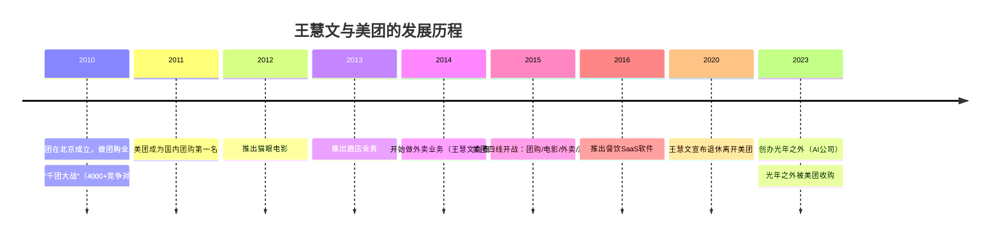
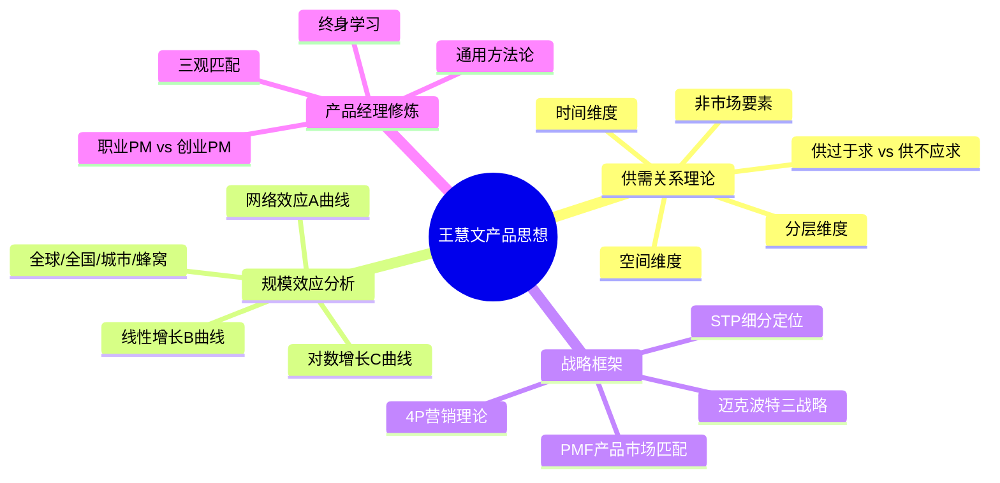
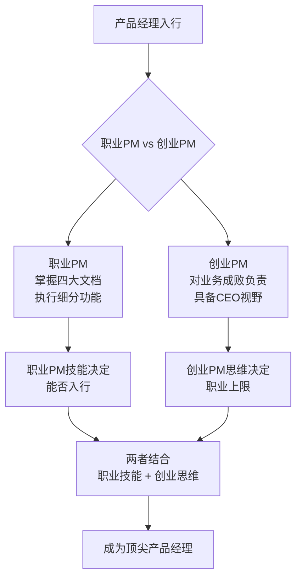

# 王慧文

王慧文（Wang Huiwen），清华大学校友，[[王兴]]的大学同学，美团（Meituan）联合创始人、前高级副总裁（SVP）。他长期负责美团的产品与技术方向，被业界公认为中国互联网最顶尖的产品经理之一。

> "产品经理是CEO的学前班。"——王慧文

---

## 人物简介

| 属性 | 信息 |
|------|------|
| 教育背景 | 清华大学本科 |
| 职业身份 | 产品经理、创业者、投资人 |
| 代表公司 | 美团（Meituan） |
| 离开美团 | 2020年5月 |
| 后续动态 | 2023年创办光年之外（AI公司），后被美团收购 |
| 社交账号 | 饭否（Fanfou）活跃用户 |

---

## 早年经历与求学

王慧文毕业于清华大学，在校期间与[[王兴]]相识，结下深厚情谊。两人均对互联网和产品有浓厚兴趣，这段同窗情谊后来成为共同创业的基础。王慧文自述大学时成绩并不突出，"部分原因是不知道这些课有啥用，尤其是线性代数"，但学得最好的一门课是微波工程——"因为教授讲清楚了微波工程与手机通讯和探索宇宙的关系"。

这段经历后来成为他在清华讲课时的重要引子：好的教育应该让学习者明白知识的用途与意义。

---

## 美团创业历程

2010年，王慧文与[[王兴]]共同创办美团，在千团大战中凭借技术优势脱颖而出。美团率先为商家提供"随时结款且算账清楚"的系统，大幅提升了商家信任度，这成为千团大战胜出的关键。

2014年，美团进入外卖市场，王慧文主导外卖业务的产品与运营战略。他提出了著名的"蜂窝型规模效应"理论来解释外卖业务的地面战特性——每一个配送网格都需要独立攻克，与全国型规模效应完全不同。

---

## 产品理念与思维框架

王慧文最核心的产品思想体系可以概括为以下几个层次：

### 供需关系是第一原理

王慧文认为，**供需关系决定一切**，尤其在商业产品领域。他提出三个常见错误：
1. 不主动判断供需情况，导致工作缺乏重点
2. 认为供需之间相互影响因而判断不清
3. 即便给了正确判断，却不按供需状况指导工作

> "供需决定一切，和供需相关的事情基本都会影响战略。"

### 规模效应的深度分析

王慧文将规模效应分为三种曲线：
- **A曲线（指数型）**：网络效应，如微信、电话网
- **B曲线（线性型）**：如淘宝，每多一用户线性增值
- **C曲线（对数型）**：双边网络且同边有负效应，如外卖、打车

同时，他指出规模效应还有**作用范围（Scope）**之分：全球型、全国型、城市型、蜂窝型——这直接决定了竞争格局和市场结构。

---

## 对产品经理职业的见解

**职业产品经理 vs 创业产品经理**（王慧文自创概念）：
- **职业PM**：负责细分功能，需要掌握四大文档等基本技能
- **创业PM**：对整个业务的成败负责，如美团外卖业务总PM

王慧文认为，即使是初级职业PM，也应该从第一天起具备创业PM的思维方式：
> "职业产品经理技能可能决定了你能否进入这个行业，但是创业产品经理技能决定了你在这个职业上的上限。"

---

## 推荐书单与学习观

王慧文在清华课程中推荐以下书单：

| 书名 | 推荐原因 |
|------|----------|
| 《支付战争》(The PayPal Wars) | 内部人视角，真实记录，PayPal黑帮成员传奇 |
| 《引爆流行》(The Tipping Point) | 例子鲜活，解释产品为何能流行 |
| 《精益创业》 | 互联网时代快速迭代的核心理念 |
| 《创新者的窘境》 | 从硬盘行业案例看颠覆式创新规律 |
| 《定位》 | 营销与心智占领的经典理论 |

---

## 2020年后的动态

2020年5月，王慧文宣布退休，离开奋斗了十年的美团。2023年初，他高调宣布投身AI赛道，创办**光年之外**，致力于大语言模型研究与应用。该公司后被美团收购，王慧文的AI探索之路引发行业广泛关注。

---

## 评价与影响

王慧文被誉为"中国最懂产品的人之一"，他的产品课讲稿广泛流传于互联网从业者之间，被反复研读。他的最大贡献不仅在于美团的产品建设，更在于他系统性地将经济学、战略学与产品设计融合，形成了一套实战性极强的方法论体系。

他曾说过一句广为流传的话：

> "如果这门课啥都没记住，就记住一句话就行了：产品经理是CEO的学前班。"

---

## 相关条目

- [[王兴]] — 美团创始人，王慧文的大学同学与创业伙伴
- [[王慧文产品课]] — 他在清华大学开设的产品管理课程详解
- [[供需关系与产品设计]] — 其核心理论框架深度解析
- [[俞军]] — 另一位中国顶级产品经理，前百度产品副总裁
