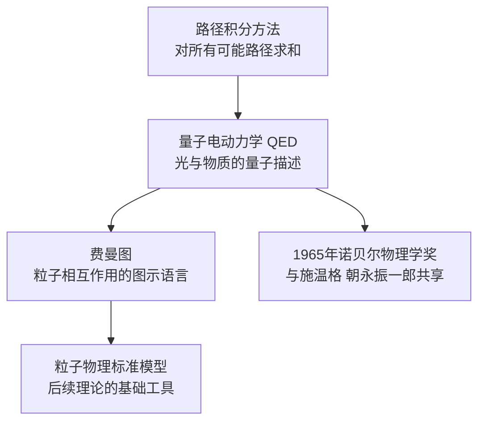
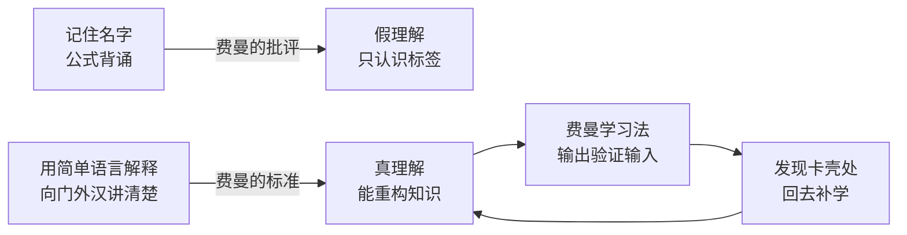

# 理查德·费曼

理查德·菲利普斯·费曼（Richard Phillips Feynman，1918—1988）是美国理论物理学家，1965年诺贝尔物理学奖得主，因量子电动力学贡献与朱利安·施温格、朝永振一郎共同获奖。他在学界以费曼图和路径积分方法闻名；在大众文化中，他以幽默直率的个性和将复杂物理用日常语言解释清楚的能力广为人知。

## 生平与学术经历

费曼出生于纽约市皇后区法洛克威（Far Rockaway），父亲是工厂制服销售员，母亲的鼓励与父亲对自然世界的好奇心共同塑造了他早年的求知态度。他在麻省理工学院完成本科，后在普林斯顿大学师从约翰·惠勒（John Wheeler），1942年获得博士学位。

第二次世界大战期间，费曼参与曼哈顿计划，在新墨西哥州洛斯阿拉莫斯（Los Alamos）实验室担任理论组成员，时年仅24岁。战后先后任教于康奈尔大学和加州理工学院（Caltech）。他在 Caltech 度过了职业生涯的大部分时光，直至1988年因肾癌去世，享年69岁。

## 物理学贡献

费曼最重要的物理学贡献集中在量子电动力学（Quantum Electrodynamics，QED）——描述光与物质相互作用的量子场论。他提出的**路径积分** 方法将量子力学重新表述为对所有可能路径求和，提供了与矩阵力学框架等价但计算上更灵活的新方式。

**费曼图** （Feynman Diagrams）是他最广为人知的工具贡献：用线段和顶点表示粒子之间的散射过程，将复杂的微扰展开计算可视化。这套图示语言不仅加速了 QED 的计算，也成为此后粒子物理学的标准表达方式。

此外，费曼在超流氦的理论、弱相互作用的 V-A 理论（与盖尔曼合作）以及部分子模型（解释质子内部结构的前身概念）上也有重要贡献。

## 教学哲学

费曼在 Caltech 的授课以清晰著称。他相信，如果一个概念无法用简单语言向门外汉解释清楚，则说明讲者自身尚未真正理解。这一理念是 [[费曼学习法]] 的核心原则。

1961—1963年，费曼为 Caltech 本科生开设基础物理课程，后整理出版为《费曼物理学讲义》（*The Feynman Lectures on Physics*），至今仍是物理学教育的经典参考。他批评当时的教育过度依赖记忆与公式背诵，认为这只是"知道事物的名字，而非理解事物本身"。

1964年，他在英国广播公司（BBC）录制了七集《物理定律的本性》（*The Character of Physical Law*）系列讲座，以大众易懂的语言讲述物理学的核心规律，成为科学传播的典范文本。

他的个人传记《别闹了，费曼先生》（*Surely You're Joking, Mr. Feynman!*，1985年）以第一人称口述的方式记录了他的成长、求学与研究历程，在科学爱好者群体中广泛流传。

## 挑战者号事故调查

1986年，美国"挑战者号"航天飞机发射73秒后爆炸，七名宇航员遇难。费曼被任命为总统调查委员会成员。

他在公开听证会上做了一个简单的实验：将一小段 O 形密封圈（O-ring）浸入冰水，取出后用手指轻轻捏压，展示其在低温下失去弹性。这一演示将复杂的工程故障原因以直觉可理解的方式呈现。费曼在调查报告附录中写道：

> "对于成功的技术，现实必须优先于公共关系，因为自然界不能被愚弄。"

他批评 NASA 的决策文化将政治压力置于工程判断之上，风险评估存在系统性失真。这一事件常被援引为"不能以权威替代独立判断"的案例，与 [[学会提问]] 所倡导的批判性思维立场一致。

## 知识观：两种理解的根本区别

费曼对"假理解"有强烈的警觉。他曾批评巴西的物理教育：学生能背诵光的折射公式，却无法解释为何筷子插入水中看起来弯折。他将这种状态称为"认识词语但不认识事物"的陷阱。

他的父亲曾告诉他：看到一只鸟时，即使知道它的名字，也不代表了解它。名字是人赋予的标签，不是鸟本身的属性——它如何辨别方向横跨整个大陆，没有人知道。这个童年故事支撑了他终生对形式主义的怀疑。

他的学习观强调：真正的理解必须能够重新生成，而非仅仅检索。如果只能检索而不能重新生成，遇到稍微不同的问题时就会失效。这与 [[学会提问]] 中对"论证结构"而非"结论记忆"的强调出于同一逻辑。

他去世后，人们在他 Caltech 办公室的黑板上发现了一句手写的话，被视为他知识观的最简洁表达：

> "What I cannot create, I do not understand."（我不能创造的，我就不理解。）

## 与费曼学习法的关系

[[费曼学习法]] 并非费曼本人提出的系统框架，而是后人从他的教学实践和言论中归纳总结的学习方法论。其核心步骤——选定概念、用简单语言解释、发现卡壳处、回去补学——直接来源于他对"真正理解"的标准。该方法与 [[学会提问]] 中对假设和论证结构的质疑态度高度呼应：两者都把主动检验置于被动接受之上。

## 主要著作

| 著作 | 年份 | 内容 |
|------|------|------|
| 《费曼物理学讲义》 | 1964 | Caltech 基础物理课程讲义，三卷本 |
| 《物理定律的本性》 | 1965 | BBC 讲座文字版，科学传播经典 |
| 《QED：光和物质的奇妙理论》 | 1985 | 向大众解释量子电动力学 |
| 《别闹了，费曼先生》 | 1985 | 口述传记，科学家的个人风格记录 |
| 《你好，我是费曼》 | 1988 | 关于好奇心与科学探索的演讲集 |

详见 → [[费曼学习法]]、[[学会提问]]
