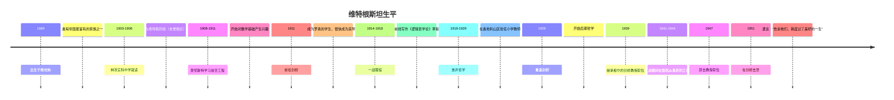
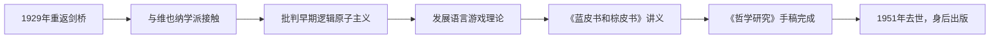
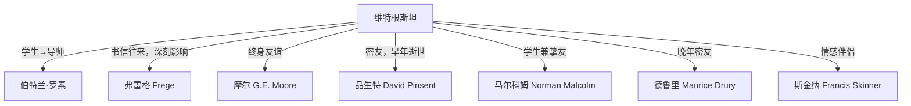

# 路德维希·维特根斯坦（Ludwig Wittgenstein，1889-1951）

> "称我为真之寻求者，我就满意了。"
> ——维特根斯坦致其姐姐的信

路德维希·维特根斯坦是20世纪最具影响力、最神秘莫测的哲学家。他的一生是一场与自己本性不断搏斗的战争，他的哲学历经两次根本性的转变，形成了两种截然不同却同样深刻的思想体系。传记作者瑞·蒙克（Ray Monk）将其一生定性为"天才之为责任"——对维特根斯坦来说，做哲学不是职业选择，而是道德义务。

## 生平年表

## 家族背景：维也纳贵族的孩子

维特根斯坦出生于维也纳一个极为富裕和有文化的家庭。他的父亲卡尔·维特根斯坦是奥匈帝国最成功的实业家，掌控着欧洲钢铁工业的核心。维特根斯坦家族的沙龙汇聚了时代最耀眼的艺术家和音乐家：勃拉姆斯、马勒、克林姆特都是常客。

> 维特根斯坦家共有八个孩子，其中三个兄弟（汉斯、鲁道夫、库尔特）先后自杀，这一家族悲剧笼罩了路德维希整个童年。他本人也长期与自杀冲动搏斗。

| 家庭成员 | 备注 |
|---------|------|
| 父亲卡尔 | 奥匈帝国钢铁大亨，家族财富的缔造者 |
| 母亲利奥波迪内 | 音乐爱好者，家中频繁举办音乐会 |
| 兄长保罗 | 著名钢琴家，一战中失去右手后继续演奏 |
| 兄弟汉斯、鲁道夫、库尔特 | 先后自杀 |
| 路德维希 | 最小的男孩，获得父亲全部遗产后散尽 |

## 人生第一阶段（1889-1919）：从工程师到哲学天才

### 曼彻斯特时期

维特根斯坦最初在曼彻斯特学习航空工程，但对数学基础的痴迷将他引向了弗雷格（Gottlob Frege）的著作，进而于1911年前往剑桥，拜见伯特兰·罗素（Bertrand Russell）。

罗素对这位年轻的奥地利人印象极为深刻。仅仅一个学期后，他对维特根斯坦的判断就从"学生"变成了"天才"。有一个著名的故事：维特根斯坦曾问罗素，他究竟是不是个蠢货——如果是，他就去当飞行员；如果不是，他就做哲学家。罗素让他写一篇文章，读完后，罗素告诉他：不必去当飞行员了。

> "维特根斯坦是我所见过的最完美的哲学天才典型，是热情、深刻、强烈以及主宰一切的智识真诚。"
> ——伯特兰·罗素

### 挪威的独居

1913年，维特根斯坦独自前往挪威，在峡湾边的小屋中生活了近两年，全身心投入逻辑问题的思考。这种对孤独的渴望成为他一生中反复出现的主题——他无法在城市和社交圈中进行真正的思考。

### 一战：前线的哲学家

1914年，维特根斯坦主动从军，服役于奥匈帝国军队，先后在东线和意大利前线作战。即使在炮火中，他也持续写作，完成了日后出版的《逻辑哲学论》（Tractatus Logico-Philosophicus）的主体内容。

被俘后，他将手稿辗转寄给罗素，并最终于1921年出版。

## 人生第二阶段（1919-1929）：放弃哲学

《逻辑哲学论》出版后，维特根斯坦认为自己已经解决了所有哲学问题，于是彻底放弃哲学。他将父亲留给他的全部遗产分给了兄弟姐妹（而非捐给穷人，因为他认为将钱给富人，富人才不会被金钱腐蚀），前往奥地利山区，在维克舍尔山的偏远村庄担任小学教师。

这一时期被他的传记作者称为"一个纯农村的岗位"。他对自己的学生极为严苛，这种教学方式最终导致了冲突和他的辞职。但在这十年中，他也参与设计了他姐姐的房子——一座至今仍在维也纳的现代主义建筑杰作。

## 人生第三阶段（1929-1951）：重返剑桥与后期哲学

### "第二次到来"

1929年，维特根斯坦重返剑桥，带来了全新的哲学视野。他提交《逻辑哲学论》作为博士论文，答辩委员会是罗素和摩尔——两位最著名的哲学家。答辩结束时，他拍了拍两人的肩膀说："别担心，我知道你们永远不会理解它的。"

### 哲学成熟期

1939年，维特根斯坦继承摩尔（G.E. Moore）的剑桥教授职位，但他的教学方式极为与众不同——他从不照稿讲课，而是在学生面前进行真实的哲学思考，有时沉默良久，有时大声斥责，有时走到黑板前画图。学生们觉得这是最深刻也最令人煎熬的课堂体验。

### 战时工作

二战期间，维特根斯坦主动要求从事实际工作，在盖斯医院担任药剂师助理，后在纽卡斯尔皇家诊所工作。他拒绝了哲学教授的"高高在上"，坚持认为做具体的实际工作更有价值。

### 晚年与死亡

1947年，维特根斯坦辞去教授职位，先后旅居爱尔兰、美国（访问康奈尔大学），最终回到剑桥。1951年4月，他在朋友贝文医生家中去世，死于前列腺癌。

他去世前的最后一句话是："告诉他们，我度过了美好的一生。"（Tell them I've had a wonderful life.）

## 重要关系

| 关系 | 人物 | 特点 |
|------|------|------|
| 哲学恩师 | 弗雷格（Frege） | 通信中给予重要启发 |
| 早期导师/学生 | 罗素（Russell） | 关系从学生翻转为导师 |
| 终身挚友 | 摩尔（Moore） | 继承其剑桥教授职位 |
| 战前密友 | 品生特（Pinsent） | 一战中阵亡，维特根斯坦深受打击 |
| 遗稿保管人 | 冯·赖特、安斯康姆、里斯 | 管理其身后出版事宜 |

## 性格特征

维特根斯坦的性格极为复杂，充满矛盾。他是一个不留情面的诚实者，对自己和他人同样严苛。他无法忍受虚伪、做作和平庸。

> "我不能理解一个孩子的单纯值得赞扬，除非他是为之拼争而得——出自天然的免于诱惑，那是毫无价值的。"
> ——维特根斯坦

他一生多次经历剧烈的人格转变，每次危机都以"根源在于他自己"为出发点，试图通过彻底改变生活方式来解决精神困境。他散尽财富、当农村教师、在医院当药剂师——每一次都是对自我的克服与超越。

## 影响与遗产

维特根斯坦对20世纪哲学的影响是双重而矛盾的：

- **前期哲学** 影响了逻辑实证主义的维也纳学派，虽然维特根斯坦本人后来否定了这种解读
- **后期哲学** 影响了日常语言哲学、语用学、心灵哲学和认知科学

他的著作在学术圈以外同样具有魅力：有写他的诗、有受他启发的绘画、有为他著作谱的曲，还有以他为主角的小说。

## 参见

- [[维特根斯坦哲学]] — 他的哲学思想详解
- [[哲学与认知]] — 更广泛的哲学主题
- [[逻辑思维框架]] — 逻辑与语言的关系
