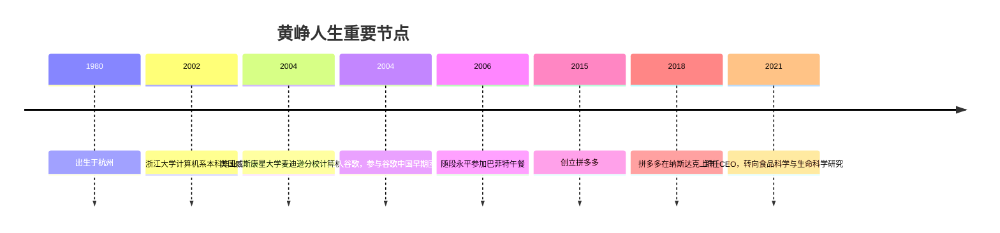

# 黄峥

黄峥（Colin Huang，1980年生于杭州），拼多多（Pinduoduo）创始人兼前首席执行官。他是[[段永平]]的门生。2015年创立拼多多，以"拼购"社交电商模式切入被主流平台忽视的低线城市及价格敏感用户群体，五年内发展为中国第三大电商平台。

---

## 早年与求学

黄峥1980年生于杭州。本科毕业于浙江大学计算机系，后赴美国威斯康星大学麦迪逊分校取得计算机科学硕士学位。毕业后加入谷歌，参与谷歌中国早期业务建设，期间与[[段永平]]保持密切联系。

## 与段永平的关系

黄峥是[[段永平]]"用生命影响生命"哲学的代表性实践对象。2006年，段永平以62.01万美元拍得与[[巴菲特]]共进午餐的机会，特意携年仅26岁的黄峥同行。这次午餐使黄峥深入接触格雷厄姆、巴菲特式的商业分析思维，尤其是"生意模式第一"的判断框架。

[[段永平]]在多个公开场合认为，黄峥深度理解并内化了[[价值投资]]的底层逻辑，并将其应用于商业决策。

## 拼多多：被忽视市场的切入

2015年，黄峥创立拼多多。核心创新是将社交裂变（微信拼团分享）与低价消费品结合，精准定位淘宝、京东忽视的低线城市及中老年用户群体。这一策略与[[价值投资]]的逻辑在结构上相通：找到市场定价错误的领域，在低竞争区域建立规模优势。

| 年份 | 里程碑 |
|------|--------|
| 2015 | 创立拼多多 |
| 2018 | 纳斯达克上市，市值约240亿美元 |
| 2019 | 年活跃买家超过5亿 |
| 2020 | 年活跃买家超越京东 |
| 2021 | 黄峥卸任CEO，公司市值一度超越阿里巴巴 |

## 退出与转型

2021年，黄峥主动卸任拼多多CEO及董事长，将相当部分股票收益用于食品科学与生命科学研究。在致股东信中他表示，商业成功后更应关注解决底层社会问题。

> "我是一个平凡的人，我想做的事情是那些能够更多地帮助普通人的事情。"

---

详见 → [[段永平]]、[[价值投资]]
