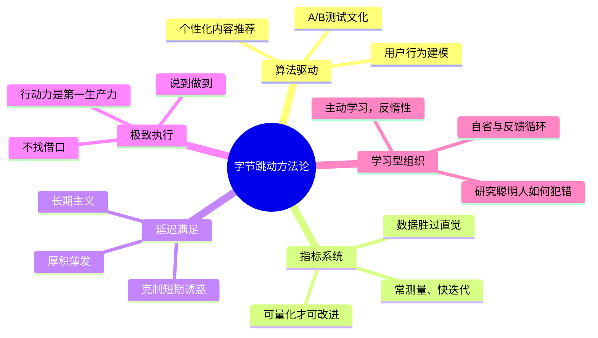

# 产品与算法思维

**产品与算法思维** ，是以[[张一鸣]]为代表的字节跳动方法论核心。与[[微信产品哲学]]以"克制与极简"为主线不同，[[字节跳动]]的产品逻辑以**信息分发效率** 和**机器学习推荐** 为中轴，强调数据、指标、反馈闭环，以及对人性欲望的精准响应。

## 思想起源：从饭否到今日头条

张一鸣曾追随[[王兴]]参与早期饭否的运营，这段经历让他近距离观察了信息流社交的原型形态。2010年之后，他注意到：

> "人欲望太强的时候就容易短视，太自我中心的时候就容易盲目。"

> "互联网让会学习爱学习的人和相反的差距拉的更大，这并不仅限于互联网行业。"

这两个判断——**人性的欲望结构** 与**信息获取的不均衡** ——构成了他创办今日头条的两个根基。


## 算法思维的核心主张

### 1. 指标系统是行动的保障

张一鸣的核心观点之一：

> "为什么刷牙不能坚持认真刷，为什么在跑步机上能坚持跑步？有许多事情不容易做好和不被重视的原因，就是因为没有指标系统。比如，如果健康有准确方便度量的指标，那么大家的身体素质一定会提高。但是指标不见得好提炼，提炼指标的过程，本身是分解事物特征的过程。而且指标要常测量。"

这一思想直接影响了字节跳动的产品开发文化：**每个功能必须可量化，每个实验必须有指标，数据胜过直觉** 。

### 2. 算法是延迟满足感的技术实现

张一鸣将"延迟满足感"这一个人修炼哲学，扩展到了产品设计层面：

> "很多复杂问题是更高维度简单问题的投影，比如说打篮球动作变形、速度慢、配合差是很多时候体力不行；写程序烂、bug多、时间长是抽象分解问题做的不好。"

算法推荐正是这种"降维求解"思想的产品化：**不需要用户主动搜索（高认知负担），让机器学习用户行为，自动推送最匹配的内容** 。

### 3. 用户需求的三层结构

```mermaid
graph TB
    subgraph 浅层["浅层需求（用户能说出来的）"]
    A[我想看科技新闻]
    end
    subgraph 中层["中层需求（用户行为数据揭示的）"]
    B[用户对娱乐八卦的<br/>停留时间更长]
    end
    subgraph 深层["深层规律（算法挖掘出的）"]
    C[特定情绪状态下<br/>内容偏好的规律]
    end
    A --> B --> C
    
    style 浅层 fill:#1e3245,color:#cdd6f4    style 中层 fill:#4a3e1a,color:#cdd6f4    style 深层 fill:#4a1e2a,color:#cdd6f4```

张一鸣认为，用户往往"不知道自己真正想要什么"，这正是算法的价值所在：通过海量行为数据的拟合，逼近用户真实偏好，而不依赖用户的主观申报。

## 字节跳动方法论框架

| 维度 | 字节跳动做法 | 传统产品做法 |
|------|------------|------------|
| 内容分发 | 算法推荐（个性化） | 编辑策划（统一） |
| 用户理解 | 行为数据建模 | 用户访谈调研 |
| 产品迭代 | A/B测试驱动 | 产品经理直觉 |
| 组织决策 | 数据优先，去中心化 | 层级审批，主观判断 |
| 内容生产 | 开放平台（UGC+PGC） | 专业内容团队 |

## 学习方法论：主动输入与知识密度

张一鸣将学习方法论同样用量化思维来审视：

> "读书学习也很类似（锻炼）。系统地运动锻炼需要抗身体的惰性，锻炼久了之后不但身体好而且锻炼的积极性也好容易启动养成习惯。"

> "聪明的人，研究聪明人如何犯错误，回报率很高。聪明人易犯错误包括：1）嫉妒他人成功；2）自命不凡；3）过于相信自己判断；4）停止学习；5）认为世界是静止的，生活在过去荣耀中；6）任何事情都有自己一套言之有据、且深信不疑的说法和理论。"

这种"研究错误模式"的元认知方法，在字节跳动的产品文化中体现为：**不停地做对照实验，主动寻找数据中反常的地方** 。

## 信息论视角下的产品观

### 信息过滤与注意力经济

张一鸣早在创业初期就表达了对"注意力"的深刻理解：

> "注意力也可以开源节流的，欲望和杂念分散注意力要节流，锻炼身体和注意力训练是开源。"

这个框架——注意力是稀缺资源，需要主动管理——后来成为今日头条整个产品逻辑的基础：**在有限注意力窗口内，让最匹配的内容出现在正确的时间** 。

### 移动互联网红利的早期判断

张一鸣很早就认准了两件事：

1. **移动互联网的红利期** ：他在2010年前后的微博中多次提到，要在移动端找到属于自己的赛道；
2. **信息聚合与推荐的价值** ：他相信内容消费会从"主动搜索"转向"被动推送"。

> "台风来的时候，猪都会飞起来。所以，真的飞起来时一定要清楚的知道是因为自己能飞，还是外力使然。靠台风飞起来的猪迟早是会掉下来的。"

这句话是他对自己的警醒：即便在红利期成功，也要清楚成功的结构性原因。

## 产品思维对比

```mermaid
graph LR
    subgraph 张小龙产品哲学
    ZXL1[克制功能]
    ZXL2[用户尊重]
    ZXL3[去算法，保隐私]
    ZXL4[社交关系链驱动]
    end
    
    subgraph 张一鸣产品哲学
    ZYM1[极致算法]
    ZYM2[数据驱动]
    ZYM3[个性化推荐]
    ZYM4[内容兴趣图谱驱动]
    end
    
    ZXL1 -.对立.- ZYM1
    ZXL2 -.互补.- ZYM2
    ZXL3 -.对立.- ZYM3
    ZXL4 -.差异.- ZYM4
```

两种哲学代表了中国互联网产品设计的两种极端路径：
- **微信路径** ：基于社交关系信任，产品克制，用户主动；
- **今日头条路径** ：基于兴趣数据，算法主动，内容驱动。

## 组织层面的算法思维

张一鸣将算法思维延伸到了组织管理：

> "对组织而言需要把优秀的标准清晰无误的传递且不断精进。含糊和混淆其实是牺牲。"

字节跳动后来以"[[OKR]]+透明文化+高密度信息同步"著称，正是张一鸣微博时代"量化、精准、不含糊"的组织哲学的放大版。

## 核心方法论总结



---

**相关文章** : [[张一鸣]] · [[微信产品哲学]] · [[王兴]] · [[饭否文化与社区]]
