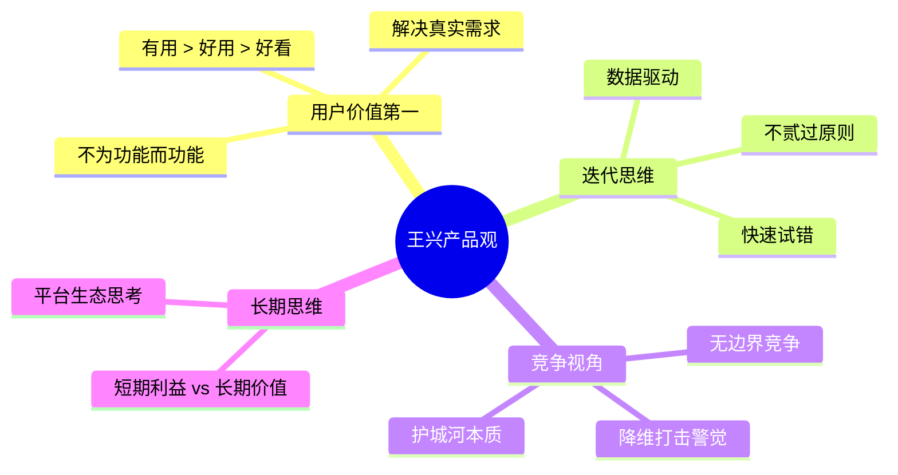

# 产品思维

王兴对产品设计与用户体验有贯穿十余年的持续思考。他既是饭否、美团等产品的创始人，也是各类互联网产品的深度用户，其观察兼具从业者的内行视角和普通用户的直接感受。

## 用户情境切换能力

王兴对产品经理能力的核心判断，来自早年的一句比喻。2007年他写道："一个好的产品经理就像脑子里装了vmware，可以随时切换到不同的用户情境中去。" 这一判断在他后来观察产品时反复被印证：他注意到苹果的iTunes同步操作"非常不直观"，注意到iOS的手势习惯会被无意识带到macOS上（看完长网页想往顶端标题栏点回页首），还注意到触屏键盘上元音字母qwerty排列不合理、容错性差。

他对用户研究的态度是：产品设计者必须成为真实的用户，而不仅仅是设计的执行者。2009年他在饭否上提到，为了了解大众用户的实际处境，"设计产品时还是要考虑多数用户，所以自己最好也用多数人用的软件"。

## "不贰过"原则

王兴在产品上最看重的质量是"不贰过"，即不让用户在同一缺陷处重复受挫。他早在2007年饭否还在初创期时就写下："'不贰过'太难了。一个网站要是能做到这一点，一定会迅速成为比youtube还nb还贰的网站。看到因为饭否设计有缺陷，不同用户在同一个地方反复受挫，我痛心疾首。" 这一原则的本质是对用户时间和信任的尊重，也是他后来在美团强调"靠谱"这一品牌特质的起点。

## 有用优先于好用

王兴对产品价值的判断有一个清晰的优先级排序。他在2012年写道："一个产品，'有用'比'好用'重要得多。如果是许多人'急用'，那就更好了。" 他观察到许多产品在用户界面的精致上投入过多，却忽视了核心功能的实际价值。这一原则也反映在他对UME影城网站改版的赞赏上："没有一丝一毫的浪费，直切主题，非常清楚访问者想要什么"（2010-10-17）。

他对"易用"的期待有边界。引用计算机先驱恩格尔巴特的话："如果易用是唯一的需求，那我们大家都还在骑三轮车。"（2013-07-04）。产品的价值最终来自它能解决的真实问题，而非操作门槛的高低。

## 对竞争产品的审视

王兴对市面上各类产品保持着大量的直接体验和批评性观察。他早年对苹果的产品既有赞赏也不回避批评，指出iTunes的同步逻辑"非常不直观"；他观察到iOS的某些交互惯例会与macOS产生认知冲突；他对腾讯微信在国际化时机上给予高度期望，认为"微信是有机会做成国际化产品的，现在应该不惜一切代价的投入"（2011-11-02）。

他对苹果的品牌战略观察细致，注意到"Think Different"这个广告语有意与IBM的"Think"口号针锋相对（2010-12-07）；他也指出apple watch的命名方式"完全不符合苹果以往的产品命名方式，是不利于打造品牌的"（2015-06-12）。

## 命名与传播

王兴对品牌名称和产品命名的关注，反映了他将语言视为产品设计一部分的思维方式。他在2013年对北京各咖啡品牌的中文命名做了一番横向比较，认为"星巴克"译得有水平，"半义译半音译，简短响亮"；而"两岸咖啡""上岛咖啡"等本土品牌的命名得失各有分析。他也指出中文零售领域尚缺少"merchandising"这个概念的贴切翻译，视之为行业成熟度的一个信号（2014-03-21）。

## 设计哲学

他在2012年用一句极简的话总结了产品设计的核心原则："设计应该支持变化。"（2012-05-22）他对上帝作为产品经理的比喻，也揭示了他对产品需求阶段的理解："上帝还是个产品经理，因为《圣经》一开头他就嚷嚷着提需求：要有光，要有天，要有地……"（2013-04-24）。

## 与其他产品方法论的关系

王兴的产品观以观察和直觉为基础，重实践感受轻系统框架。相比之下，[[俞军产品方法论]] 提供了更结构化的工具，尤其是"用户价值 = 新体验 - 旧体验 - 替换成本"的公式，与王兴"有用 > 好用"的优先级排序在底层逻辑上一致——两者都把**解决真实问题** 置于体验精致之前。[[用户价值模型]] 将这一逻辑进一步量化，把用户决策分解为价值感知和成本对比，可以视为王兴直觉判断的操作化版本。

[[微信产品哲学]] 中张小龙对"克制"的强调——不做不必要的功能——与王兴"不贰过"原则异曲同工：两者都将减少对用户的打扰视为产品品质的核心指标，而非功能堆砌。王兴2011年对微信国际化的期待，反映了他对张小龙产品能力的高度认可。
