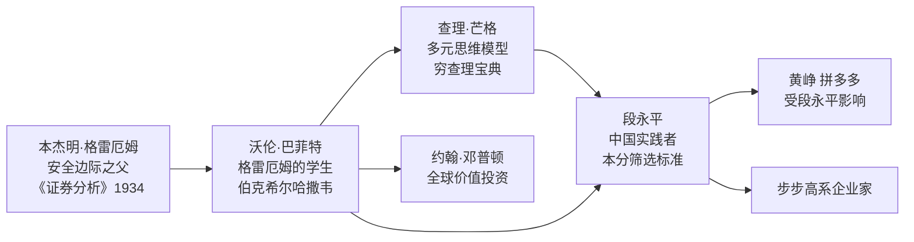
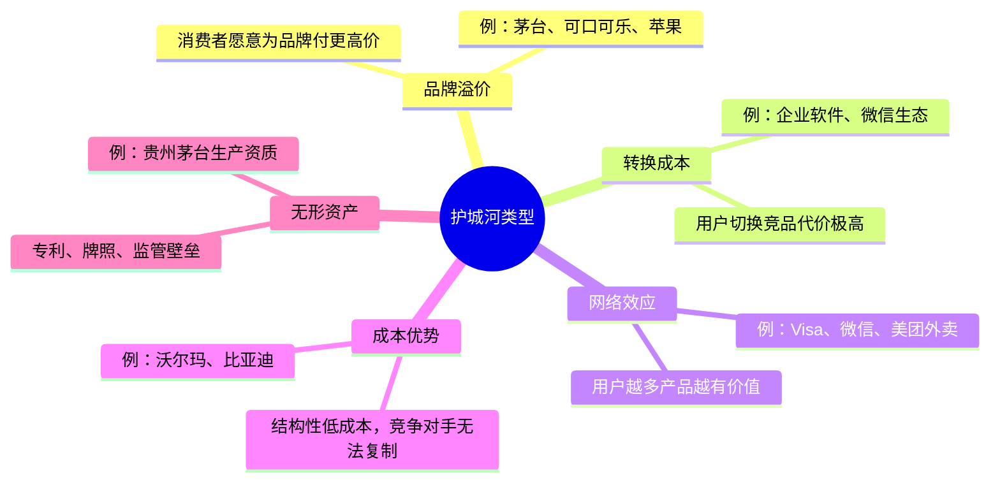

# 价值投资

价值投资（Value Investing）是一套以企业内在价值为锚点的投资哲学，由本杰明·格雷厄姆（Benjamin Graham）在20世纪30年代奠基，经[[巴菲特]]（Warren Buffett）与[[穷查理宝典]]作者查理·芒格（Charlie Munger）发展为系统性框架，并由[[段永平]]等中国实践者在本土商业环境中深化演绎。其核心命题是：**买股票即买公司，买公司即买其未来现金流的折现总和**。

---

## 理论基础：三位奠基人的思想脉络

格雷厄姆的贡献在于将投资从投机中分离，提出以"安全边际"买入被市场低估的资产。[[巴菲特]]在此基础上引入"护城河"概念，从关注资产低估转向关注企业质量。[[穷查理宝典]]中，芒格则以多元思维模型（心理学、物理学、生物学等）构建了更宽广的投资分析框架。[[段永平]]在中国的实践是这一思想链的延伸，并加入了独特的"本分"文化评估维度。

---

## 核心概念一：能力圈

能力圈（Circle of Competence）是[[巴菲特]]与芒格反复强调的投资边界原则：**只在自己真正理解的领域内做投资决策，拒绝在能力边界之外行动**。

能力圈的关键不在于"圈"有多大，而在于投资者是否清楚边界在哪里。芒格的表述是：

> "知道自己不知道什么，比知道自己知道什么更重要。"

[[段永平]]将能力圈具体化为两个操作原则：
- **不懂不碰**：无法用简单语言解释这家公司商业模式的，一律不投
- **认知不对称时回避**：与管理层或行业内部人相比处于明显信息劣势时，承认劣势并退出

---

## 核心概念二：护城河

护城河（Economic Moat）是[[巴菲特]]提出的竞争优势持久性概念，借用中世纪城堡防御工事作为比喻：**护城河越宽，竞争对手越难渗透，企业的超额利润持续时间越长**。

[[段永平]]在评估护城河时特别强调管理层文化的作用：一家拥有宽护城河但管理层不"本分"的公司，护城河会被从内部侵蚀；而一家管理层诚实守信、长期主义的公司，即便护城河暂时较窄，也会持续加宽。

---

## 核心概念三：安全边际

安全边际（Margin of Safety）是格雷厄姆的核心贡献：**以低于内在价值的显著折扣买入，为判断失误和未来不确定性预留缓冲空间**。

价值投资者需要完成两步：

1. **估算内在价值**：将企业未来自由现金流，按合理折现率折算为当前现值之和（DCF模型）
2. **等待安全边际出现**：只在市场价格显著低于内在价值估算时买入，通常要求30%—50%的折扣

[[段永平投资哲学]]对安全边际有独特的简化表达："买股票就是买公司的未来现金流折现，如果你看不清楚未来10年的现金流大方向，就说明你不理解这家公司。"

---

## 段永平的本土化演绎："本分"作为筛选器

[[段永平]]将价值投资框架与中国商业语境结合时，最重要的本土化贡献是将**管理层"本分"程度**纳入投资决策的核心维度。

| 价值投资经典框架 | 段永平的本土化补充 |
|-----------------|-----------------|
| 护城河分析 | "本分"的管理层才能守住并加宽护城河 |
| 安全边际 | 管理层诚信是最重要的"隐形安全边际" |
| 长期持有 | "做对的事情，把事情做对"——企业价值观对齐 |
| 能力圈 | 从产业经营中培养的行业理解是最深的能力圈 |

他的三条铁律——"不做空、不借钱、不懂不碰"——可以视为在格雷厄姆、[[巴菲特]]理论框架下，针对个人投资者风险管理的最简化版实践规范。

更多段永平的具体投资案例与操作框架详见 → [[段永平投资哲学]]
