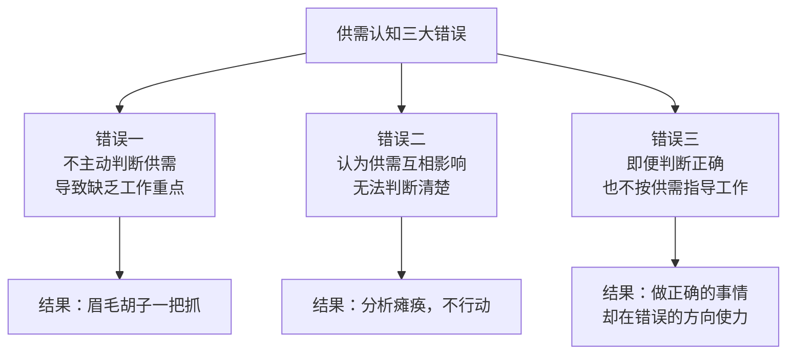
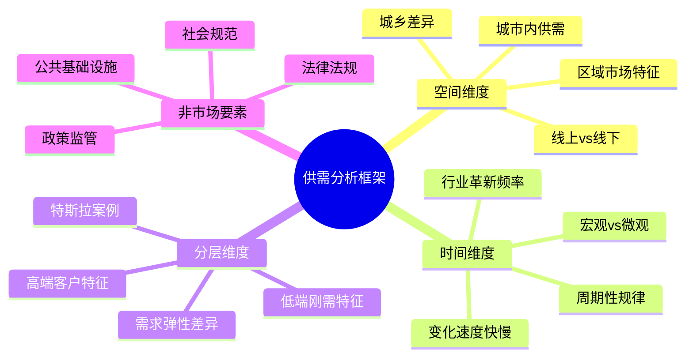
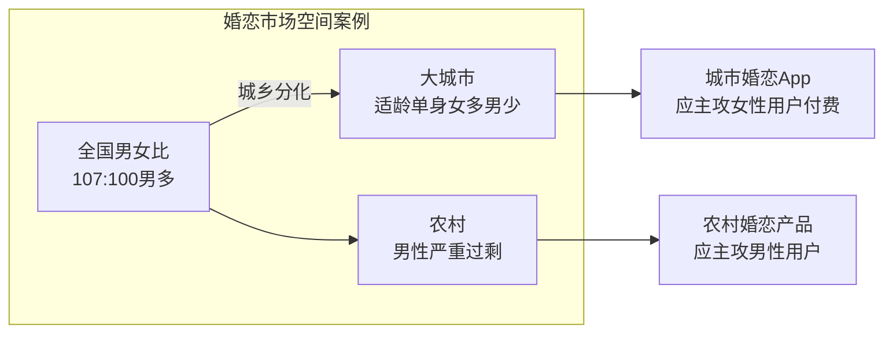
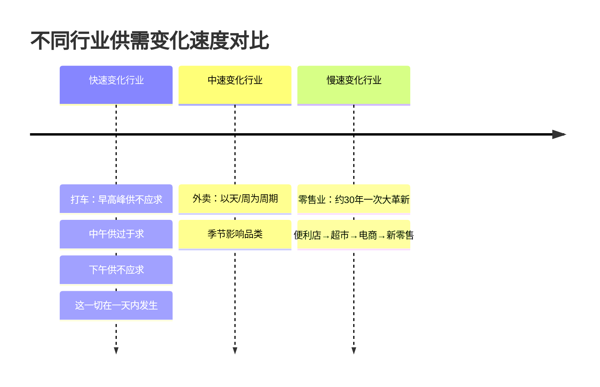
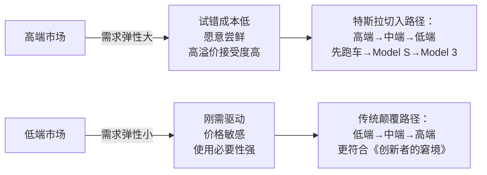
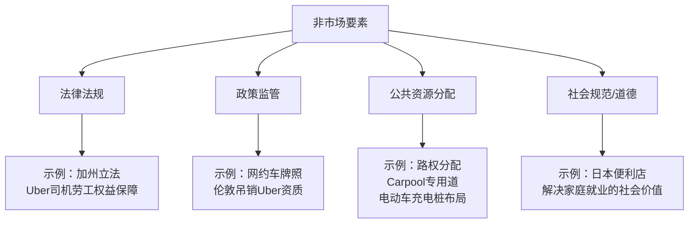
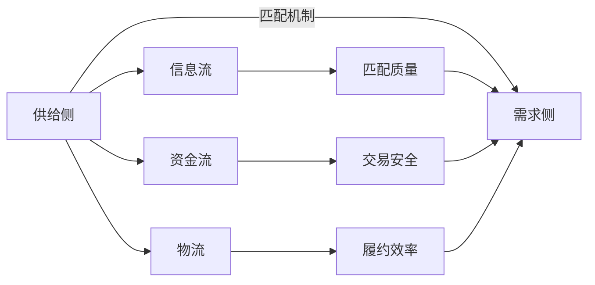
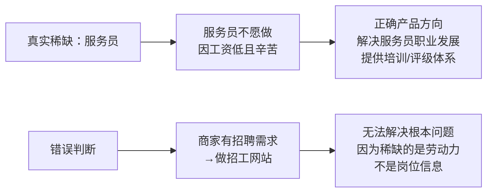
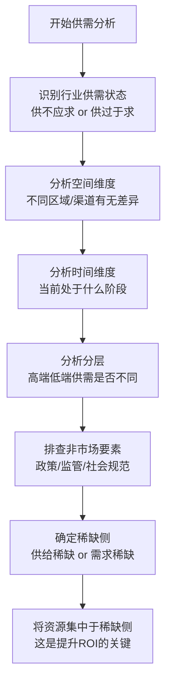
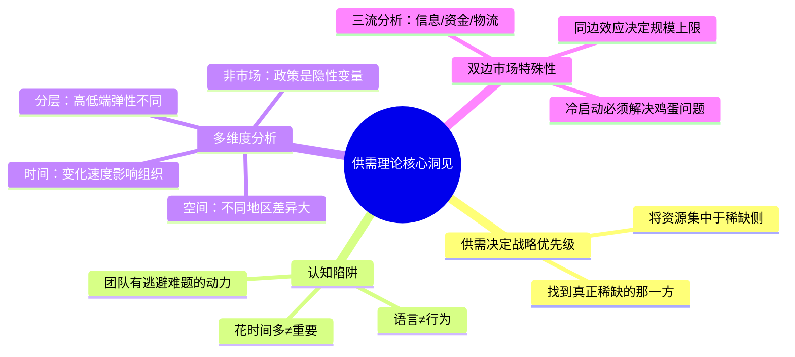

# 供需关系与产品设计

供需关系（Demand and Supply）理论是[[王慧文]]产品思想体系的核心框架，来源于他在美团十年的实战经验。他认为：**在商业产品领域，供需决定一切——和供需相关的事情基本都会影响战略** 。

> "供需决定一切，和供需相关的事情基本都会影响战略。但理解供需很难，虽然只有供过于求和供不应求这两种状态，但任何一个时间点都很难识别现在处于哪种状态。"——王慧文

---

## 供需关系为何至关重要

在实际工作中，团队常见的三大供需认知错误：

更危险的是**主动搞反供需方向的心理动机** ：

> "如果处于供大于求的状态，本该在需求端做很多工作，却对着供给端猛发力……因为供给方更迫切，所以团队在和供给方打交道的时候如沐春风，而和需求方打交道的时候就很难受，所以团队就会有逃避的动力。"

---

## 供需分析的四个维度

---

## 维度一：空间因素

不同地域的供需状态可能完全相反，产品策略因此截然不同。

### 线上与线下的供需差异

线上平台的兴起从根本上改变了供需的空间结构：

| 维度 | 线下市场 | 线上市场 |
|------|---------|---------|
| 地理范围 | 受物理距离限制 | 全国乃至全球覆盖 |
| 信息透明度 | 低，信息不对称严重 | 高，价格和评价可比较 |
| 切换成本 | 高（需要移动） | 低（一键切换） |
| 竞争格局 | 地域性垄断常见 | 全国性竞争激烈 |
| 供需平衡速度 | 慢 | 快 |

---

## 维度二：时间因素

**供需在时间上的变化速度，决定了组织能力建设的策略。**

### 变化速度与组织能力

王慧文通过分析沃尔玛 vs 传统零售商，揭示一个关键结论：

> "如果行业变化慢，养商分团队（数据分析）和研发团队的ROI是很低的……当行业发生突变时，公司内长期不养这些人，就很容易导致公司被颠覆。"

| 行业变化速度 | 推荐组织策略 |
|------------|------------|
| 快速变化 | 内建研发、商分、产品团队，持续迭代 |
| 慢速变化 | 可外包咨询；但须防范突变风险 |
| 正在加速 | 立即启动内部能力建设，不可依赖外包 |

---

## 维度三：分层因素

供需在不同价格层级上表现不同，忽视分层会导致战略误判。

### 特斯拉案例：高端切入的供需逻辑

王慧文分析特斯拉为何从高端切入：

1. ** 高端客户需求弹性大**：只要有一个合理理由（如"彰显环保身份"），他们就愿意购买
2. ** 高端容忍度高**：续航不足、配套不完善也可接受
3. ** 形成品牌资产**：高端定位建立品牌后，向下延伸更容易
4. ** 反哺成本下降**：高端利润支撑研发，推动成本下降，再打开大众市场

> "高端的供需弹性大，低端供需弹性小（刚需）。高端客户有钱，对于买错一个东西试错成本低，客户可以买各种各样的东西。"

---

## 维度四：非市场要素

> "非市场要素在经营中不经常起作用，但一起作用影响就很大。"

典型案例——** 路权是供需的隐性调控器**：
- 宽道路 → 利于汽车出行 → 便利店辐射范围缩小 → 便利店密度下降
- 路权分配（步行、自行车、公交优先）→ 直接影响线下零售的供需结构

---

## 双边市场中的供需博弈

[[王慧文]]在美团的实战中，深刻总结了** 双边市场**（平台型业务）的供需特殊性：

### 双边市场的三流分析

以[[美团]]外卖为例：

| 流 | 供给侧（商家）对应 | 需求侧（消费者）对应 |
|---|-----------------|------------------|
| ** 信息流** | 菜单、图片、评价展示 | 浏览、搜索、比较 |
| ** 资金流** | 及时收款、对账清晰 | 支付、退款、优惠券 |
| ** 物流** | 接单、出餐时间管理 | 配送时效、实时追踪 |

### 同边效应的差异

| 平台类型 | 同边效应 | 规模效应类型 | 案例 |
|---------|---------|------------|------|
| 社交网络 | 强正效应（朋友多→更有价值） | A曲线（指数） | 微信 |
| 电商平台 | 弱负效应（商家间竞争，但用户间无影响） | B曲线（线性） | 淘宝 |
| 打车平台 | 强负效应（司机抢单，乘客抢车） | C曲线（对数） | 滴滴 |
| 外卖平台 | 中等负效应（配送员拼单有弹性） | C曲线偏B | 美团外卖 |

---

## 供需判断在实战中的应用

### 案例一：零售业——谁才是真正稀缺的？

王慧文访谈便利店和超市老板，问"供给和需求哪个更重要"，所有老板都说"供给重要"，但行为却是老板亲自负责选址——而** 选址本质上是对需求的判断**。

分析矛盾的原因：
1. 老板不能打击下属信心，所以强调供给的价值
2. 供给工作细节多、耗时多，容易让人误以为它更重要
3. ** 花时间多≠重要**，需要找到真正稀缺的那一方

### 案例二：二手车——人人车 vs 瓜子二手车

> "最近人人车把供需关系就搞反了，人人车的团队很懂消费者心理，所以对需求端做了很多设计，用户体验很好，但二手车行业是一个供不应求的行业。"

- ** 二手车真正稀缺**：优质货源（卖方）
- 人人车：过度优化用户体验（需求侧），忽视了货源获取（供给侧）
- 瓜子二手车：大量经营活动面向卖方，获得供给优势，最终胜出

### 案例三：招聘市场——美团服务员招工平台

内部团队提案"商家有招聘需求，做招工平台"——这是典型的** 供需方向判断错误**：

---

## 供需框架与产品设计决策

### 何时应该侧重供给侧？

- 行业处于供不应求状态（供给稀缺）
- 新兴市场，生产能力尚未形成
- 平台早期，需要"冷启动"招募供给方

### 何时应该侧重需求侧？

- 行业供过于求（需求稀缺）
- 成熟竞争市场，差异化来自体验
- 用户留存是核心问题

### 供需判断的实操方法

---

## 供需理论与平台商业模式

在双边或多边平台（如美团、淘宝、滴滴）中，供需理论有更丰富的应用：

| 平台发展阶段 | 供需特征 | 核心策略 |
|------------|---------|---------|
| 冷启动期 | 双侧都稀缺 | 先解决鸡蛋问题，通常先拉供给 |
| 供给建设期 | 需求>供给 | 大力招募供给方，降低供给门槛 |
| 需求增长期 | 供给>需求 | 转向需求侧，优化用户体验 |
| 成熟竞争期 | 供需相对平衡 | 精细化运营，提升匹配效率 |
| 行业整合期 | 格局趋稳 | 通过供需壁垒建立护城河 |

---

## 核心洞见总结

> "只有识别那些重要的事，把时间花在最重要的事上，才能提高ROI，这一定是供需里更稀缺的那一方。"——王慧文

---

## 相关条目

- [[王慧文]] — 供需理论的提出者，美团联合创始人
- [[王慧文产品课]] — 完整的产品方法论课程
- [[王兴]] — 美团创始人，供需理论的实践环境
- [[推荐系统概论]] — 平台匹配机制的技术实现
- [[协同过滤算法]] — 供需匹配算法的核心技术之一
